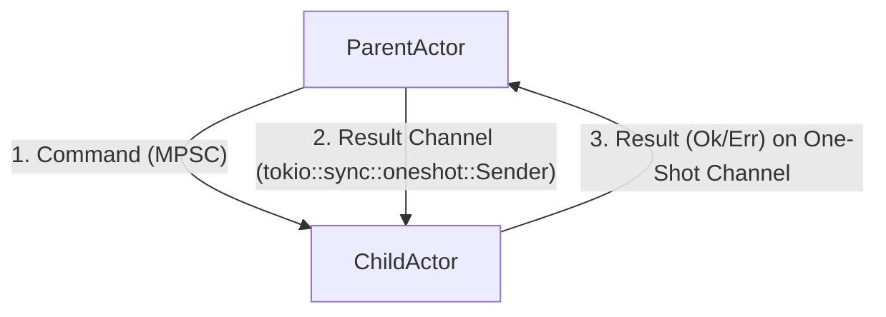
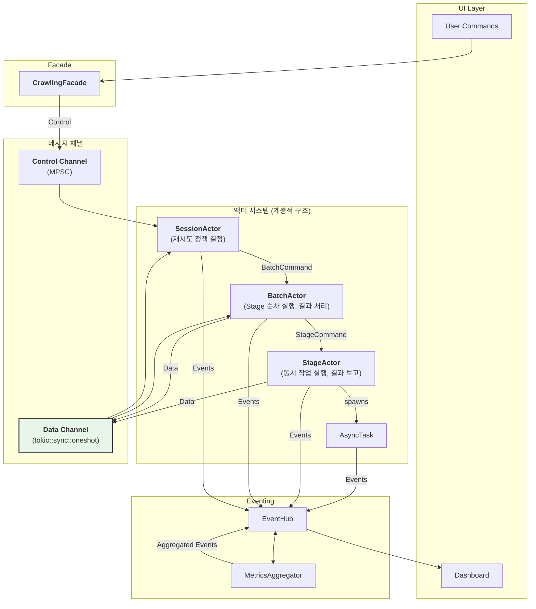

# 최종 실행 계획 v5: 회복탄력성(Resilience)과 데이터 흐름을 통합한 아키텍처

> 본 문서는 `re-arch-plan2.md`의 액터 모델 설계를 기반으로, 구현 단계에서 반드시 마주칠 오류 처리, 재시도, 데이터 전달 문제를 구조적으로 해결하여, 회복탄력성(Resilience)을 갖춘 완성형 아키텍처를 제시합니다.

## 1. 현 설계의 구조적 틈새(Gap) 분석

`re-arch-plan2.md`는 훌륭한 제어 흐름을 제시했지만, 실제 크롤링 시나리오에서 발생하는 다음과 같은 구체적인 문제들을 간과하고 있습니다:

### 1.1 주요 문제점

1. **데이터 흐름의 부재**: BatchActor가 StageActor를 순차적으로 실행할 때, 이전 스테이지의 성공 결과(예: 수집된 URL 목록)를 다음 스테이지로 어떻게 전달하는가?에 대한 명확한 메커니즘이 없습니다.

2. **오류 처리 정책의 부재**: StageActor나 AsyncTask에서 오류가 발생했을 때, 이 실패가 상위 액터(BatchActor, SessionActor)에 어떻게 보고되며, 시스템은 "부분 실패를 용납하고 다음 단계로 나아갈지, 아니면 전체를 중단할지"를 어떻게 결정하는가?에 대한 정책이 없습니다.

3. **재시도 전략의 부재**: 일시적인 네트워크 오류 등으로 실패한 작업을 언제, 몇 번, 어떤 간격으로 재시도할지에 대한 전략이 아키텍처 수준에서 정의되지 않았습니다.

이러한 틈새들은 구현 단계에서 개발자의 임의적인 판단에 맡겨지게 되며, 이는 곧 시스템의 일관성을 깨뜨리고 예측 불가능한 동작을 유발하는 원인이 됩니다.

## 2. 해결책: 명시적인 데이터 채널과 오류 처리 정책 도입

### 2.1 핵심 아이디어: 제어 채널과 데이터 채널의 분리

기존의 단일 명령 큐(MPSC)를 "제어 채널"로 유지하되, 작업의 결과를 전달하기 위한 "데이터 채널"을 명시적으로 추가합니다:

- **제어 채널 (MPSC Sender)**: 부모가 자식에게 작업을 '지시'하기 위해 사용합니다. (Command 전송)
- **데이터 채널 (One-Shot Channel)**: 자식이 부모에게 작업의 '결과'(성공/실패)를 단 한 번 보고하기 위해 사용합니다. `tokio::sync::oneshot` 채널이 이 목적에 완벽하게 부합합니다.



이 구조는 "요청-응답(Request-Response)" 패턴을 액터 모델에 명확하게 구현하여, 데이터 흐름과 오류 전파를 체계적으로 만듭니다.

### 2.2 회복탄력성을 위한 StageResult와 재시도 정책

모든 StageActor는 자신의 작업을 마친 후, 성공 결과물 또는 실패 원인을 담은 StageResult를 `oneshot` 데이터 채널을 통해 부모(BatchActor)에게 보고합니다.

```rust
// in new_architecture/domain/results.rs

// 모든 Stage의 실행 결과를 담는 열거형
#[derive(Debug)]
pub enum StageResult {
    // 목록 수집 스테이지의 성공 결과
    ListCollection(ListCollectionOutput),
    // 상세 수집 스테이지의 성공 결과
    DetailCollection(DetailCollectionOutput),
    // 복구 가능한 오류 (e.g., 타임아웃, 일시적 네트워크 문제)
    RecoverableError { error: anyhow::Error, attempts: u32 },
    // 복구 불가능한 오류 (e.g., 파싱 로직 실패, 치명적 서버 에러)
    FatalError { error: anyhow::Error },
}

pub struct ListCollectionOutput {
    pub collected_urls: Vec<String>,
    pub failed_pages: Vec<u32>,
}
// ...
```

BatchActor는 이 StageResult를 받고, 사전에 정의된 재시도 정책(Retry Policy)에 따라 다음 행동을 결정합니다:

```rust
// in BatchActor::run()

// ...
let (tx, rx) = tokio::sync::oneshot::channel(); // 데이터 채널 생성
list_stage_actor.run(tx).await; // 자식에게 채널의 Sender 전달

// 자식의 결과가 올 때까지 비동기적으로 대기
match rx.await {
    Ok(StageResult::ListCollection(output)) => {
        // 성공! 다음 스테이지로 결과 전달
        let (detail_tx, detail_rx) = tokio::sync::oneshot::channel();
        let detail_stage_actor = DetailCollectionStageActor::new(...);
        detail_stage_actor.run(output.collected_urls, detail_tx).await;
        // ...
    }
    Ok(StageResult::RecoverableError { error, attempts }) => {
        // 재시도 정책 확인
        if attempts < self.context.config.retry_policy.max_attempts {
            // 재시도 간격만큼 대기 후, 동일 스테이지 다시 실행
            tokio::time::sleep(self.context.config.retry_policy.delay).await;
            self.run_list_stage_again(attempts + 1).await;
        } else {
            // 최대 재시도 횟수 초과, 최종 실패 처리
            self.report_failure_to_session_actor(error).await;
        }
    }
    Ok(StageResult::FatalError { error }) => {
        // 치명적 오류, 즉시 실패 처리
        self.report_failure_to_session_actor(error).await;
    }
    Err(_) => { /* oneshot 채널 자체가 닫힌 경우의 오류 처리 */ }
}
```


## 3. 최종 아키텍처: 데이터 흐름과 회복탄력성이 통합된 설계

### 3.1 전체 시스템 아키텍처 v5



### 3.2 구현을 위한 최종 체크리스트

이 설계는 이제 구현에 바로 착수할 수 있을 만큼 구체화되었습니다:

- [x] **역할과 책임**: 모든 액터의 역할이 명확히 정의되었는가?
- [x] **제어 흐름**: 명령 큐(MPSC)를 통한 하향식 제어 흐름이 명확한가?
- [x] **데이터 흐름**: `oneshot` 채널을 통한 상향식 데이터/결과 전달 흐름이 명확한가?
- [x] **오류 처리**: StageResult를 통한 회복 가능/불가능 오류 처리가 정의되었는가?
- [x] **재시도 정책**: 재시도 횟수와 간격에 대한 정책이 아키텍처에 반영되었는가?
- [x] **UI 피드백**: 독립적인 이벤트 발행과 MetricsAggregator를 통한 집계 메커니즘이 존재하는가?
- [x] **즉시 취소**: tokio::select!를 통한 즉각적인 취소 메커니즘이 존재하는가?

## 4. 결론: 이제, 구현을 시작할 수 있다

이번 설계를 통해 우리는 `re-arch-plan2.md`의 구조적 틈새를 모두 메웠습니다. 명시적인 데이터 채널과 회복탄력성 설계를 추가함으로써, 이제 아키텍처는 단순한 아이디어를 넘어, 실제 프로덕션 환경의 복잡성과 불확실성을 견뎌낼 수 있는 견고하고 구체적인 청사진이 되었습니다.

더 이상 구조적으로 크게 변경될 만한 요소는 보이지 않습니다. 이제 이 최종 계획(`guide/re-arch-plan-r-gem.md`)을 바탕으로, 세부적인 디테일은 구현을 통해 결정하며 나아가도 좋을 충분한 상태에 도달했습니다.