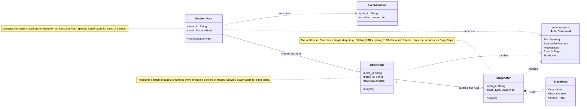
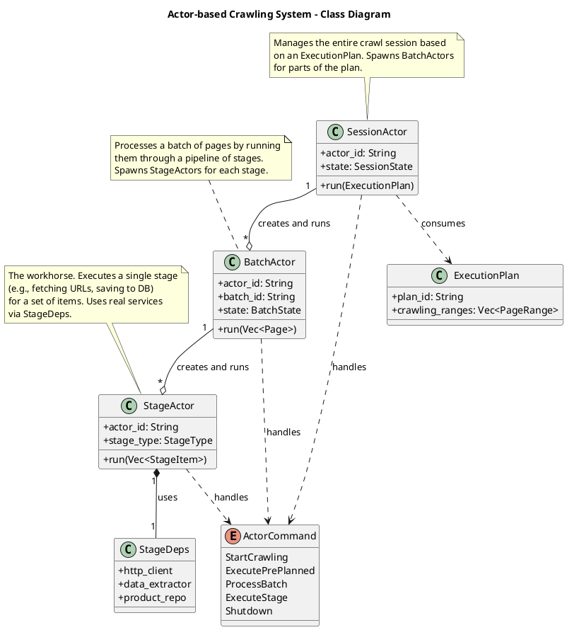

# 백엔드 아키텍처 다이어그램

이 문서는 rMatterCertis 애플리케이션의 백엔드 아키텍처를 시각화하기 위한 다이어그램을 포함합니다. Mermaid와 PlantUML 두 가지 형식으로 제공되어 시인성을 비교할 수 있습니다.

---

## 1. 전체 아키텍처 (PlantUML)

### 1.1. C4 시스템 컨텍스트 다이어그램

이 다이어그램은 시스템의 최상위 뷰를 제공하며, 사용자와 외부 시스템과 어떻게 상호작용하는지 보여줍니다.

```plantuml
@startuml C4_System_Context
!include https://raw.githubusercontent.com/plantuml-stdlib/C4-PlantUML/master/C4_Context.puml

title System Context diagram for rMatterCertis

Person(user, "User", "A user managing and monitoring e-commerce product crawling.")
System_Ext(ecommerce, "E-commerce Websites", "External websites providing product data.")
System(rmatter, "rMatterCertis", "Desktop application for crawling and managing product information from e-commerce sites.")

Rel(user, rmatter, "Views dashboards, starts/stops crawls, and manages data")
Rel_R(rmatter, ecommerce, "Crawls product data (HTTP/S requests)")

@enduml
```

### 1.2. C4 컴포넌트 다이어그램

이 다이어그램은 `rMatterCertis` 시스템 내부를 상세히 보여주며, 주요 내부 컴포넌트들과 그 상호작용을 나타냅니다. UI, Rust 백엔드의 여러 계층, 그리고 데이터베이스의 역할을 명확히 합니다.

```plantuml
@startuml C4_Component
!include https://raw.githubusercontent.com/plantuml-stdlib/C4-PlantUML/master/C4_Component.puml

title Component diagram for rMatterCertis

Person(user, "User", "Manages and monitors crawling.")
System_Ext(ecommerce, "E-commerce Websites", "Provides product data.")

System_Boundary(app, "rMatterCertis") {
    Component(ui, "SolidJS UI", "Webview", "Provides the user interface for monitoring and control.")
    Component(commands, "Tauri Commands", "Rust Module", "Exposes backend functionality to the UI via Tauri's IPC.")
    Component(app_layer, "Application Layer", "Rust Module", "Manages application state and orchestrates use cases.")
    Component(engine, "Crawl Engine", "Rust Module", "The core actor-based system for crawling websites.")
    Component(domain, "Domain Layer", "Rust Module", "Contains core business logic, entities, and rules, independent of infrastructure.")
    Component(infra, "Infrastructure Layer", "Rust Module", "Implements external concerns like database access and HTTP requests.")
    ComponentDb(db, "SQLite Database", "Database", "Stores all application data, including products, crawl status, etc.")
}

Rel(user, ui, "Uses")

Rel(ui, commands, "Sends commands/queries (Tauri IPC)")
Rel(commands, app_layer, "Uses")
Rel(commands, engine, "Invokes")
Rel(commands, domain, "Uses")

Rel(app_layer, domain, "Uses")
Rel(app_layer, infra, "Uses")

Rel(engine, domain, "Uses")
Rel(engine, infra, "Uses")

Rel(infra, db, "Reads/Writes data to", "SQL")
Rel_R(infra, ecommerce, "Crawls data from", "HTTPS")

@enduml
```

---

## 2. 핵심 로직: Actor 크롤링 시스템

### 2.1. 클래스 다이어그램 (Mermaid)



### 2.2. 클래스 다이어그램 (PlantUML)

