# 아키텍처 문서 (v3, 2025-09-05)

이 문서는 rMatterCertis 프로젝트의 아키텍처를 설명합니다. `BatchActor`가 제거되고 `ExecutionPlan` 기반의 오케스트레이션이 강화된 최신 아키텍처를 기준으로 작성되었습니다.

## 1. 전체 아키텍처

시스템의 주요 컴포넌트와 데이터 흐름을 한눈에 볼 수 있는 최상위 다이어그램입니다.

- **핵심 변경사항**:
  - **BatchActor 제거**: `SessionActor`와 `StageActor` 사이의 중간 액터 계층이 사라져 아키텍처가 단순화되었습니다.
  - **ExecutionPlan 역할 강화**: `CrawlingPlanner`가 생성하는 `ExecutionPlan`이 전체 크롤링 세션의 실행 흐름(스테이지 순서, 작업 항목 등)을 모두 정의합니다.
  - **SessionActor의 오케스트레이터 역할**: `SessionActor`는 `ExecutionPlan`을 해석하여 필요한 `StageActor`를 직접 생성하고 관리하는 핵심 오케스트레이터(Orchestrator) 역할을 수행합니다.

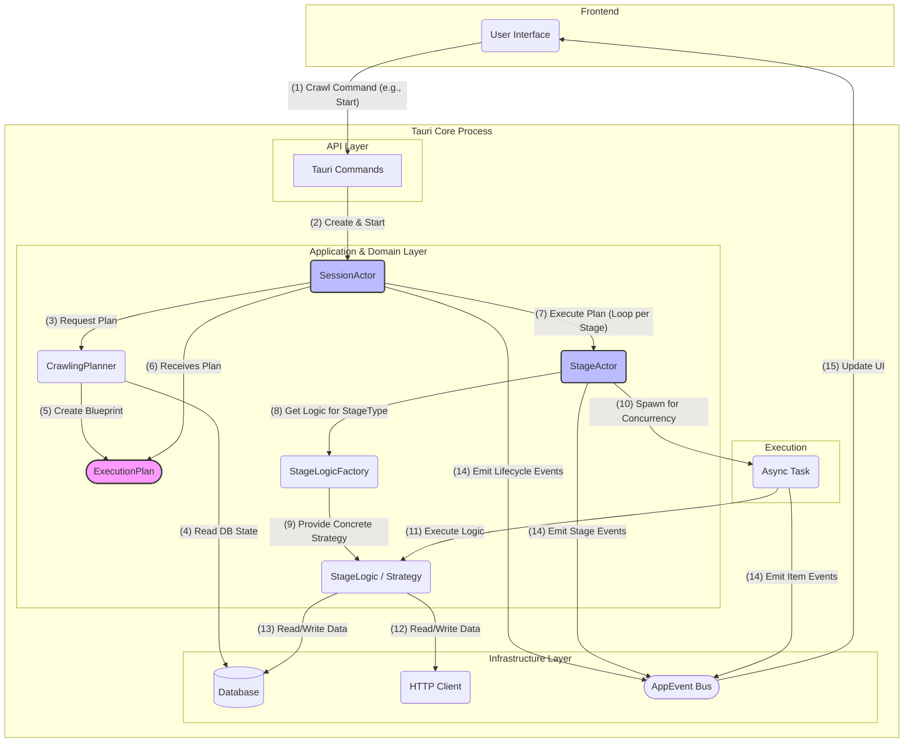

---

## 2. 핵심 로직 다이어그램

### 2.1. Actor 크롤링 시스템 (컴포넌트 관계도)

`SessionActor`와 `StageActor` 간의 단순화된 관계와 `ExecutionPlan`을 통해 작업이 전달되는 과정을 보여줍니다.

#### Mermaid 버전
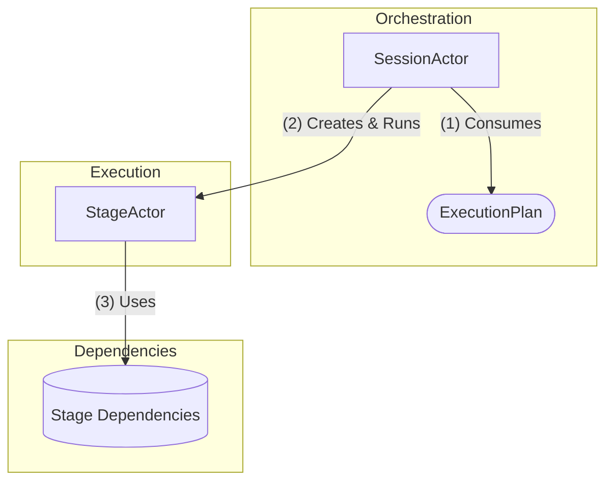
> note for SessionActor "Manages the entire crawl session based on an ExecutionPlan. Spawns StageActors for each stage in the plan."
> note for StageActor "The workhorse. Executes a single stage (e.g., fetching URLs, saving to DB) for a set of items. Uses real services via StageDeps."

#### PlantUML 버전
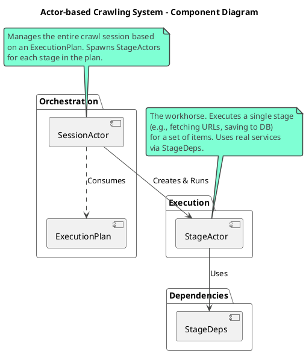

### 2.2. Crawl Engine 서비스 (플래닝 과정)

`CrawlingPlanner`가 `PlanningStrategy`를 사용하여 어떻게 `ExecutionPlan`을 생성하는지, 그 과정에서 어떤 의존성을 갖는지 보여줍니다.

#### Mermaid 버전
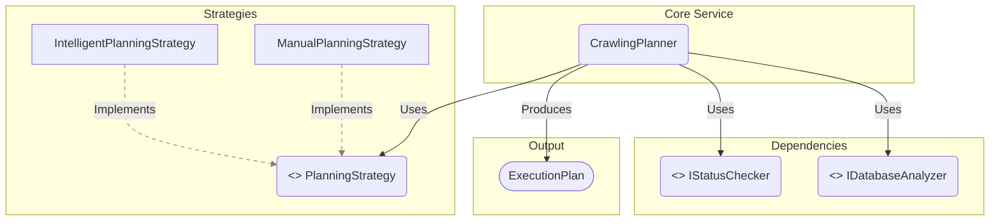

#### PlantUML 버전
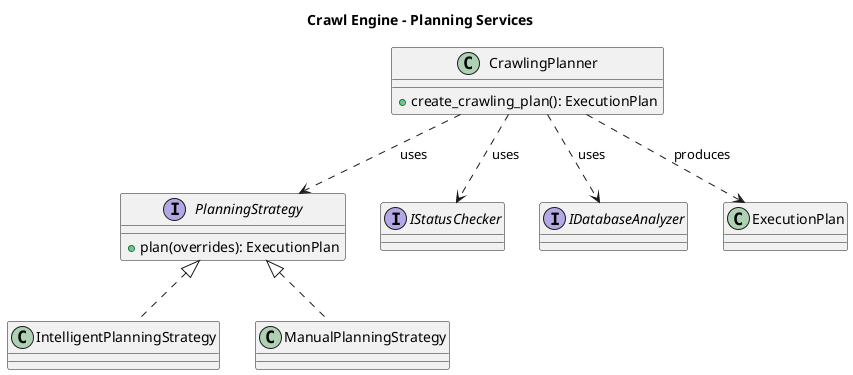

### 2.3. 도메인 모델 (클래스 다이어그램)

시스템의 핵심 데이터 구조인 `ProductUrl`, `ProductDetail` 등의 관계를 보여줍니다.

#### Mermaid 버전
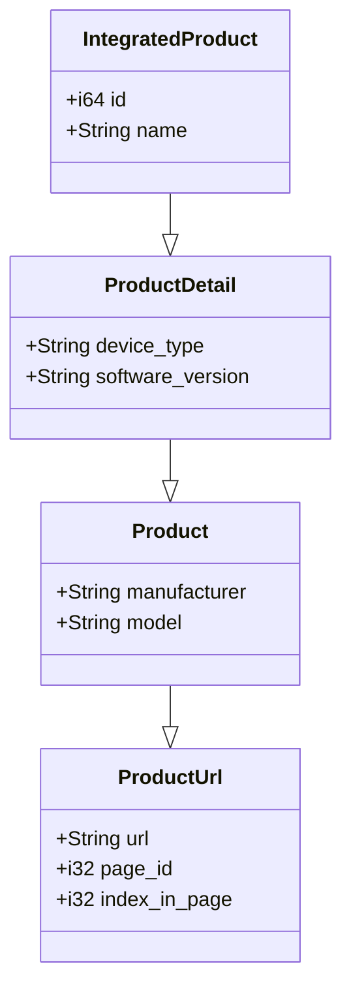
> note for IntegratedProduct "The central data model, combining all product information for database storage."

#### PlantUML 버전
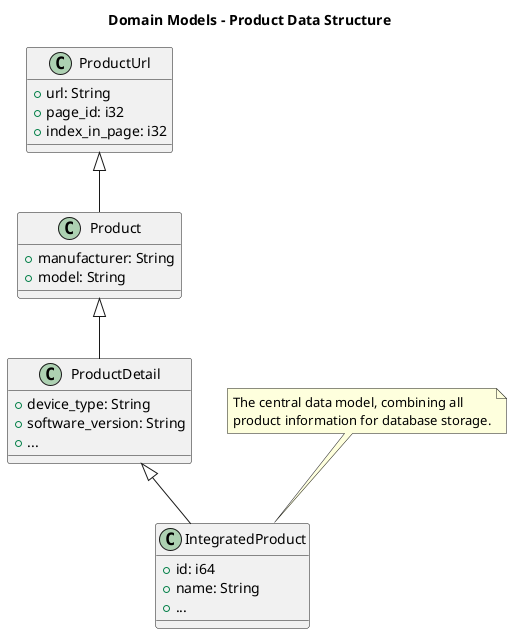

---

## 3. StageActor 아키텍처 심층 분석

### 3.1. StageActor와 전략 패턴 (클래스 다이어그램)

`StageActor`는 특정 `StageType`에 맞는 로직을 실행하기 위해 **전략 패턴**을 사용합니다. `StageLogicFactory`는 `StageType`에 따라 적절한 `IStageLogic` 구현체를 생성하여 `StageActor`에 제공합니다.

#### Mermaid 버전
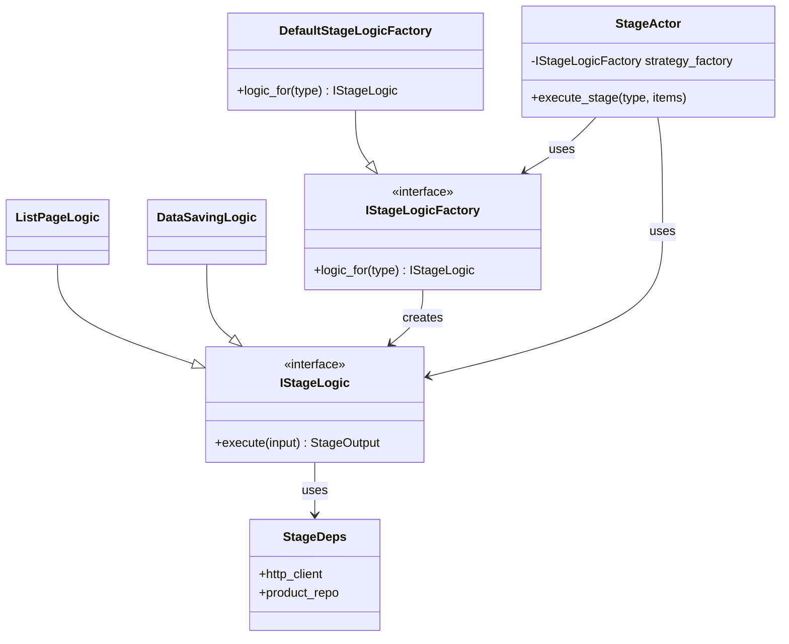

#### PlantUML 버전
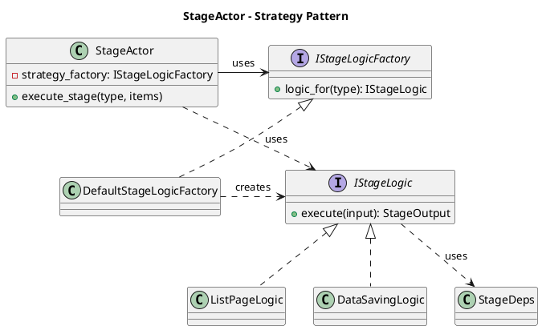

### 3.2. StageActor 아이템 처리 과정 (시퀀스 다이어그램)

`SessionActor`가 `StageActor`를 호출하여 작업을 처리하는, 단순화된 상호작용을 보여줍니다.

#### Mermaid 버전
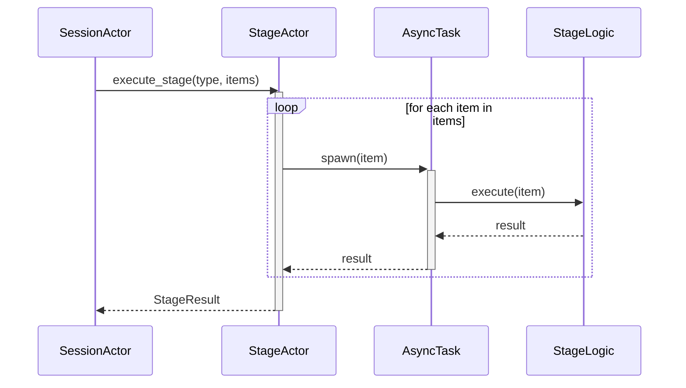

#### PlantUML 버전
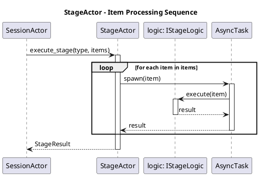

---

## 4. 데이터 흐름 다이어그램 (Activity Diagram)

데이터가 각 스테이지를 거치며 어떻게 변환되는지 보여줍니다. `SessionActor`가 전체 파이프라인을 관리합니다.
#### PlantUML 버전
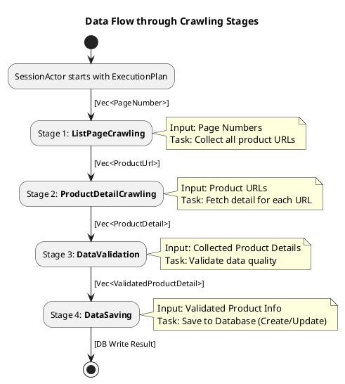

#### Mermaid 버전
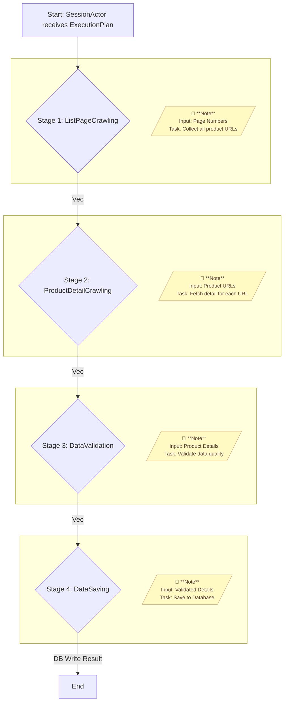

