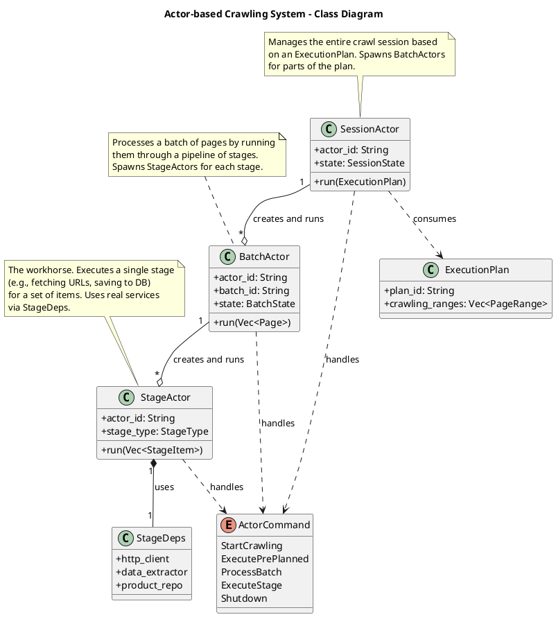
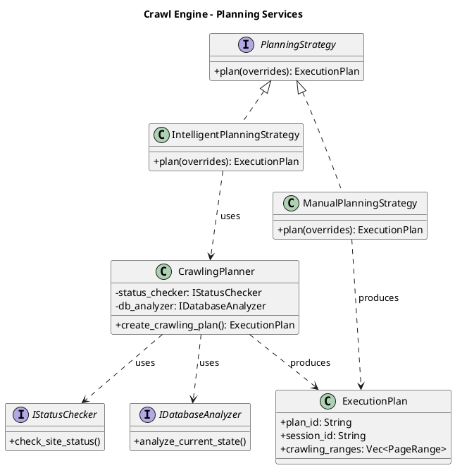
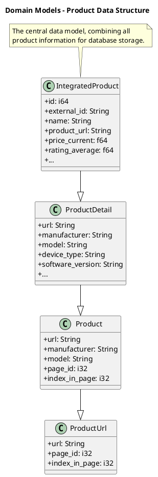
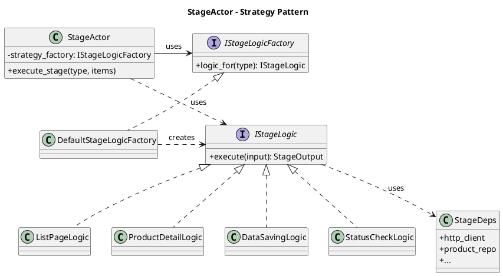
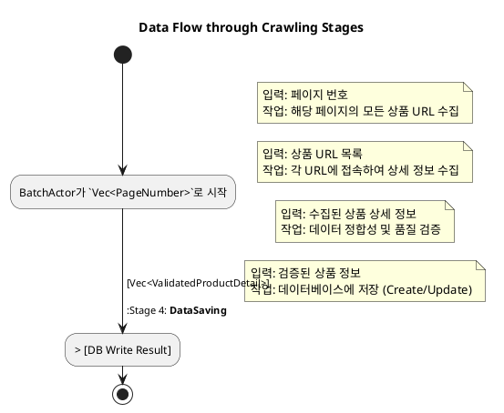
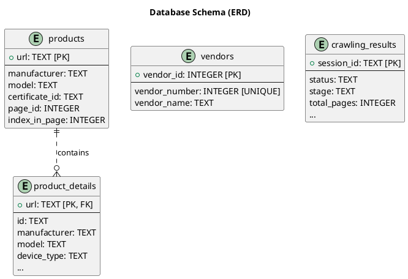

# 백엔드 아키텍처 다이어그램 (PlantUML)

이 문서는 rMatterCertis 애플리케이션의 백엔드 아키텍처를 시각화하기 위한 PlantUML 다이어그램을 포함합니다.

---

## 1. 전체 아키텍처

### 1.1. C4 시스템 컨텍스트 다이어그램

이 다이어그램은 시스템의 최상위 뷰를 제공하며, 사용자와 외부 시스템과 어떻게 상호작용하는지 보여줍니다.

```plantuml
@startuml C4_System_Context
!include https://raw.githubusercontent.com/plantuml-stdlib/C4-PlantUML/master/C4_Context.puml

title System Context diagram for rMatterCertis

Person(user, "User", "A user managing and monitoring e-commerce product crawling.")
System_Ext(ecommerce, "E-commerce Websites", "External websites providing product data.")
System(rmatter, "rMatterCertis", "Desktop application for crawling and managing product information from e-commerce sites.")

Rel(user, rmatter, "Views dashboards, starts/stops crawls, and manages data")
Rel_R(rmatter, ecommerce, "Crawls product data (HTTP/S requests)")

@enduml
```

### 1.2. C4 컴포넌트 다이어그램

이 다이어그램은 `rMatterCertis` 시스템 내부를 상세히 보여주며, 주요 내부 컴포넌트들과 그 상호작용을 나타냅니다. UI, Rust 백엔드의 여러 계층, 그리고 데이터베이스의 역할을 명확히 합니다.

```plantuml
@startuml C4_Component
!include https://raw.githubusercontent.com/plantuml-stdlib/C4-PlantUML/master/C4_Component.puml

title Component diagram for rMatterCertis

Person(user, "User", "Manages and monitors crawling.")
System_Ext(ecommerce, "E-commerce Websites", "Provides product data.")

System_Boundary(app, "rMatterCertis") {
    Component(ui, "SolidJS UI", "Webview", "Provides the user interface for monitoring and control.")
    Component(commands, "Tauri Commands", "Rust Module", "Exposes backend functionality to the UI via Tauri's IPC.")
    Component(app_layer, "Application Layer", "Rust Module", "Manages application state and orchestrates use cases.")
    Component(engine, "Crawl Engine", "Rust Module", "The core actor-based system for crawling websites.")
    Component(domain, "Domain Layer", "Rust Module", "Contains core business logic, entities, and rules, independent of infrastructure.")
    Component(infra, "Infrastructure Layer", "Rust Module", "Implements external concerns like database access and HTTP requests.")
    ComponentDb(db, "SQLite Database", "Database", "Stores all application data, including products, crawl status, etc.")
}

Rel(user, ui, "Uses")

Rel(ui, commands, "Sends commands/queries (Tauri IPC)")
Rel(commands, app_layer, "Uses")
Rel(commands, engine, "Invokes")
Rel(commands, domain, "Uses")

Rel(app_layer, domain, "Uses")
Rel(app_layer, infra, "Uses")

Rel(engine, domain, "Uses")
Rel(engine, infra, "Uses")

Rel(infra, db, "Reads/Writes data to", "SQL")
Rel_R(infra, ecommerce, "Crawls data from", "HTTPS")

@enduml
```

---

## 2. 핵심 로직 다이어그램

### 2.1. Actor 크롤링 시스템 (클래스 다이어그램)

`SessionActor`, `BatchActor`, `StageActor` 간의 계층적 위임 관계와 `ExecutionPlan`을 통해 작업이 전달되는 과정을 보여줍니다.



### 2.2. Crawl Engine 서비스 (클래스 다이어그램)

`CrawlingPlanner`가 `PlanningStrategy`를 사용하여 어떻게 `ExecutionPlan`을 생성하는지, 그 과정에서 어떤 의존성을 갖는지 보여줍니다.



### 2.3. 도메인 모델 (클래스 다이어그램)

시스템의 핵심 데이터 구조인 `ProductUrl`, `Product`, `ProductDetail`, `IntegratedProduct` 간의 관계를 보여줍니다.



---

## 3. StageActor 아키텍처 심층 분석

### 3.1. StageActor와 전략 패턴 (클래스 다이어그램)

`StageActor`는 특정 `StageType`에 맞는 로직을 실행하기 위해 **전략 패턴**을 사용합니다. `StageLogicFactory`는 `StageType`에 따라 적절한 `IStageLogic` 구현체(예: `ListPageLogic`, `DataSavingLogic`)를 생성하여 `StageActor`에 제공합니다. 이를 통해 `StageActor`는 로직의 구체적인 내용과 분리되어 오케스트레이션에만 집중할 수 있습니다.



### 3.2. StageActor 아이템 처리 과정 (시퀀스 다이어그램)

`StageActor`가 단일 아이템을 처리하는 과정을 보여줍니다. 특히 `TaskExecutionGuard`라는 RAII 객체를 사용하여, 작업 시작(`StageItemStarted`)과 완료(`StageItemCompleted`) 이벤트 발생이라는 **횡단 관심사**를 코드의 메인 흐름에서 분리하여 자동으로 처리하는 방식을 강조합니다.

```plantuml
@startuml StageActorSequence

title StageActor - Item Processing Sequence

participant BatchActor
participant StageActor
participant TaskExecutionGuard
participant "logic: IStageLogic"
participant "ctx: AppContext"

BatchActor -> StageActor: execute_stage(type, items)
activate StageActor

loop for each item in items
    StageActor -> TaskExecutionGuard**: create
    activate TaskExecutionGuard
    
    TaskExecutionGuard -> ctx: emit(StageItemStarted)
    note right of TaskExecutionGuard: Guard 생성 시 시작 이벤트 자동 발생

    StageActor -> "logic: IStageLogic": execute(item)
    activate "logic: IStageLogic"
    "logic: IStageLogic" --> StageActor: result
    deactivate "logic: IStageLogic"

    StageActor -> TaskExecutionGuard: record_ok(result)
    
    destroy TaskExecutionGuard
    note right of TaskExecutionGuard: Guard 소멸(Drop) 시
완료/실패 이벤트 자동 발생

end

StageActor --> BatchActor: StageResult
deactivate StageActor

@enduml
```

---

## 4. 추가 다이어그램

### 4.1. 데이터 흐름 다이어그램 (Activity Diagram)

크롤링 프로세스 중 데이터가 각 단계를 거치며 어떻게 변환되는지 보여줍니다. `BatchActor` 내에서 여러 `StageActor`가 순차적으로 호출되며 데이터 파이프라인을 형성하는 과정을 나타냅니다.



### 4.2. 상태 관리 다이어그램 (Component Diagram)

애플리케이션의 주요 상태 관리 객체들(`AppState`, `SharedStateCache`, `SessionRegistry`)과 다른 컴포넌트들이 이 상태를 어떻게 읽고 수정하는지 보여줍니다.

```plantuml
@startuml StateManagement

title State Management Architecture

package "State Managers" {
  [AppState] <<Tauri Managed>>
  [SharedStateCache] <<Tauri Managed>>
  [SessionRegistry] <<Global Static>>
}

package "Actors" {
  [SessionActor]
  [BatchActor]
}

package "Services" {
  [Tauri Commands]
  [PlanningStrategy]
}

' Relationships
Tauri Commands --> AppState : reads/writes
Tauri Commands --> SharedStateCache : reads/writes
Tauri Commands --> SessionRegistry : reads status

PlanningStrategy --> SharedStateCache : reads cache

SessionActor -> SessionRegistry : updates status
BatchActor -> SessionRegistry : reads config

@enduml
```

### 4.3. 데이터베이스 스키마 (ERD)

데이터베이스 마이그레이션 파일(`003_integrated_schema.sql`)을 기반으로 주요 테이블과 그 관계를 나타냅니다.


