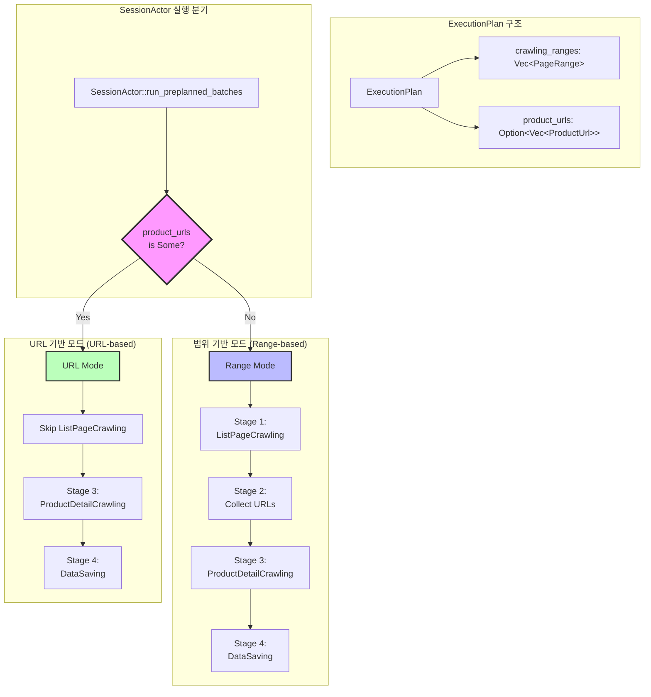

# 크롤링 모드 아키텍처: URL 기반 vs 범위 기반

## 📋 개요

SessionActor 기반 크롤링 시스템은 두 가지 크롤링 모드를 지원합니다:

1. **범위 기반 크롤링 (Range-based Crawling)** - 페이지 범위를 지정하여 순차적으로 크롤링
2. **URL 기반 크롤링 (URL-based Crawling)** - 특정 제품 URL 목록을 직접 크롤링

이 문서는 두 모드의 차이점, 사용 사례, 구현 방식을 설명합니다.

---

## 🏗️ 아키텍처 다이어그램



---

## 📊 비교표

| 특성 | 범위 기반 (Range-based) | URL 기반 (URL-based) |
|-----|------------------------|---------------------|
| **ExecutionPlan 필드** | `crawling_ranges: Vec<PageRange>` | `product_urls: Option<Vec<ProductUrl>>` |
| **시작 단계** | Stage 1: ListPageCrawling | Stage 3: ProductDetailCrawling |
| **URL 수집** | DB에서 페이지 범위로 쿼리 | ExecutionPlan에서 직접 제공 |
| **사용 사례** | 전체 사이트 크롤링, 신규 크롤링 | 제품 보완, 특정 제품 재크롤링 |
| **실행 시간** | 리스트 + 상세 (느림) | 상세만 (빠름) |
| **세션 ID 패턴** | `session-{timestamp}` | `complement-{timestamp}` |

---

## 🎯 사용 사례별 매핑

### 1. 빠른 동기화 (Fast Sync)
- **모드**: 범위 기반
- **ExecutionPlan**:
  - `crawling_ranges`: 전체 페이지 범위 (1~100)
  - `product_urls`: None
  - `list_only`: true (리스트만 크롤링)
- **단계**: ListPageCrawling만 실행
- **목적**: 제품 URL 및 좌표 갱신

### 2. 스마트 동기화 (Smart Sync)
- **1단계**: 범위 기반 (빠른 동기화)
- **2단계**: URL 기반 (제품 보완)
- **ExecutionPlan**:
  - 1단계: `crawling_ranges` 사용
  - 2단계: `product_urls` 사용 (누락 제품)
- **목적**: 전체 좌표 갱신 + 누락 제품 보완

### 3. 제품 보완 동기화 (Complement Crawl)
- **모드**: URL 기반
- **ExecutionPlan**:
  - `crawling_ranges`: [] (비어있음)
  - `product_urls`: Some(누락 제품 URL 목록)
  - `list_only`: false
- **단계**: ProductDetailCrawling + DataSaving
- **목적**: 핵심 필드 누락 제품만 선별 크롤링

---

## 🔧 구현 세부사항

### ExecutionPlan 구조체

```rust
pub struct ExecutionPlan {
    pub plan_id: String,
    pub session_id: String,
    
    // 범위 기반 크롤링
    pub crawling_ranges: Vec<PageRange>,
    
    // URL 기반 크롤링 (🆕 Phase 1에서 추가)
    #[serde(skip_serializing_if = "Option::is_none")]
    pub product_urls: Option<Vec<ProductUrl>>,
    
    pub batch_size: u32,
    pub concurrency_limit: u32,
    // ... 기타 필드
}
```

### SessionActor::run_preplanned_batches 분기 로직

```rust
async fn run_preplanned_batches(
    &mut self,
    context: &AppContext,
    session_id: &str,
    plan: &ExecutionPlan,
    deps: &SessionDeps,
    site_status: &SiteStatus,
) -> Result<usize, SessionError> {
    // 🎯 URL 기반 모드 체크
    if let Some(ref product_urls) = plan.product_urls {
        info!(
            "🎯 [URL-based Mode] ExecutionPlan contains {} product URLs",
            product_urls.len()
        );
        
        // ListPageCrawling 건너뛰기
        // ProductDetailCrawling 직접 실행
        let detail_items: Vec<StageItem> = vec![
            StageItem::ProductUrls(ch::ProductUrls {
                urls: product_urls.clone(),
                batch_id: Some(batch_id.clone()),
            })
        ];
        
        stage_actor.execute_stage(
            StageType::ProductDetailCrawling,
            detail_items,
            config_concurrency,
            timeout_secs,
            context,
        ).await?;
        
        // DataSaving 실행...
        
        return Ok(1); // 단일 배치로 처리
    }
    
    // 🏃 범위 기반 모드 (기존 로직)
    info!("📋 [Range-based Mode] Processing {} crawling ranges", 
          plan.crawling_ranges.len());
    
    for (idx, range) in plan.crawling_ranges.iter().enumerate() {
        let pages: Vec<u32> = if range.reverse_order {
            (range.end_page..=range.start_page).rev().collect()
        } else {
            (range.start_page..=range.end_page).collect()
        };
        
        // ListPageCrawling → ProductDetailCrawling → DataSaving
        self.run_batch_with_stage_actor(
            &batch_id, &pages, context, deps, site_status, Some(plan),
            idx as u32, planned_batches as u32
        ).await?;
    }
    
    Ok(planned_batches)
}
```

### 누락 제품 쿼리 (URL 기반 모드용)

```rust
async fn query_missing_products(
    app: &tauri::AppHandle
) -> Result<Vec<ProductUrl>, String> {
    let query = r"
        SELECT pd.url, pd.page_id, pd.index_in_page
        FROM integrated_products pd
        WHERE pd.certification_date IS NULL
           OR pd.transport_interface IS NULL
           OR pd.primary_device_type_ids IS NULL
        ORDER BY pd.page_id ASC, pd.index_in_page ASC
        LIMIT 1000
    ";
    
    let rows = sqlx::query_as::<_, (String, i32, i32)>(query)
        .fetch_all(&pool)
        .await
        .map_err(|e| format!("Query failed: {}", e))?;
    
    let missing_products: Vec<ProductUrl> = rows.into_iter()
        .map(|(url, page_id, index)| ProductUrl {
            url,
            page_id,
            index_in_page: index,
        })
        .collect();
    
    Ok(missing_products)
}
```

---

## 📈 성능 비교

### 범위 기반 크롤링 (100페이지)
- **ListPageCrawling**: ~60초 (1200개 URL 수집)
- **ProductDetailCrawling**: ~120초 (1200개 제품 상세)
- **DataSaving**: ~20초
- **합계**: ~200초 (3분 20초)

### URL 기반 크롤링 (100개 제품)
- **ListPageCrawling**: 0초 (건너뛰기)
- **ProductDetailCrawling**: ~10초 (100개 제품만)
- **DataSaving**: ~2초
- **합계**: ~12초

**성능 차이**: URL 기반이 **약 16배 빠름** (리스트 크롤링 생략)

---

## 🔍 디버깅 및 로그

### 범위 기반 모드 로그
```
📋 [Range-based Mode] Processing 5 crawling ranges
🏃 SessionActor session-123 running batch session-123-batch-1 with 20 pages: [1, 2, 3, ...]
📄 Page 1 (page_1): 12/12 products collected ✅
📄 Page 2 (page_2): 12/12 products collected ✅
[Chaining] Batch session-123-batch-1: starting ProductDetailCrawling for 240 urls
[Chaining] Batch session-123-batch-1: ProductDetailCrawling completed: 240 item_results (ok=235 fail=5)
[Chaining] Batch session-123-batch-1: starting DataSaving for 235 details
```

### URL 기반 모드 로그
```
🎯 [URL-based Mode] ExecutionPlan contains 87 product URLs - skipping list crawling
[URL Mode] Batch complement-123-url-details: starting ProductDetailCrawling for 87 urls
[URL Mode] Batch complement-123-url-details: ProductDetailCrawling completed: 1 item_results (ok=1 fail=0)
[URL Mode] Batch complement-123-url-details: Collected 82 product details (success=82 fail=5)
[URL Mode] Batch complement-123-url-details: starting DataSaving for 82 details
[URL Mode] Batch complement-123-url-details: DataSaving completed: ok=1 fail=0
```

---

## 🛠️ 확장 가능성

### 향후 지원 가능한 모드

#### 1. 하이브리드 모드 (Hybrid Mode)
- **설명**: 일부 페이지는 범위 기반, 일부는 URL 기반
- **사용 사례**: 특정 페이지만 전체 크롤링, 나머지는 선별 크롤링
- **구현**: `ExecutionPlan`에 `crawling_ranges`와 `product_urls` 동시 제공

#### 2. 증분 모드 (Incremental Mode)
- **설명**: 마지막 크롤링 이후 변경된 제품만 크롤링
- **사용 사례**: 정기 업데이트 크롤링
- **구현**: `last_crawled_at` 타임스탬프 기반 필터링

#### 3. 우선순위 모드 (Priority Mode)
- **설명**: 중요한 제품을 먼저 크롤링
- **사용 사례**: VIP 제품, 인기 제품 우선 처리
- **구현**: `product_urls`에 우선순위 필드 추가

---

## 📚 관련 문서

- [complement_crawl_refactoring_plan.md](./complement_crawl_refactoring_plan.md) - 리팩토링 계획 및 진행 상황
- [architecture.md](./architecture.md) - 전체 시스템 아키텍처
- [session_registry_architecture.md](./session_registry_architecture.md) - 세션 관리 아키텍처
- [sync_modes_verification_plan.md](./sync_modes_verification_plan.md) - 동기화 모드 검증 계획

---

## 🎯 핵심 요약

### 범위 기반 크롤링
- ✅ 전체 사이트 크롤링에 최적
- ✅ 신규 크롤링, 전체 갱신에 사용
- ⚠️ 리스트 + 상세 단계 필요 (시간 소요)

### URL 기반 크롤링
- ✅ 특정 제품 재크롤링에 최적
- ✅ 제품 보완, 에러 제품 재시도에 사용
- ⚠️ URL 목록을 미리 준비해야 함
- 🚀 리스트 단계 생략으로 **훨씬 빠름**

### 선택 가이드
```
전체 사이트 크롤링 필요? → 범위 기반
특정 제품만 크롤링 필요? → URL 기반
리스트 좌표만 갱신? → 범위 기반 (list_only: true)
누락 제품 보완? → URL 기반
```
