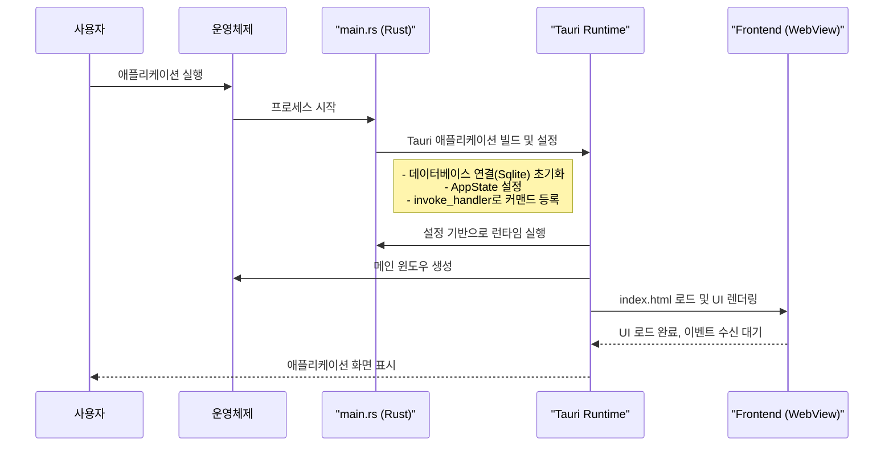
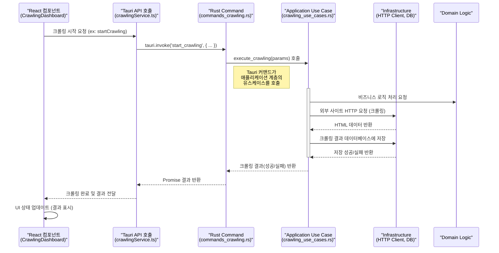
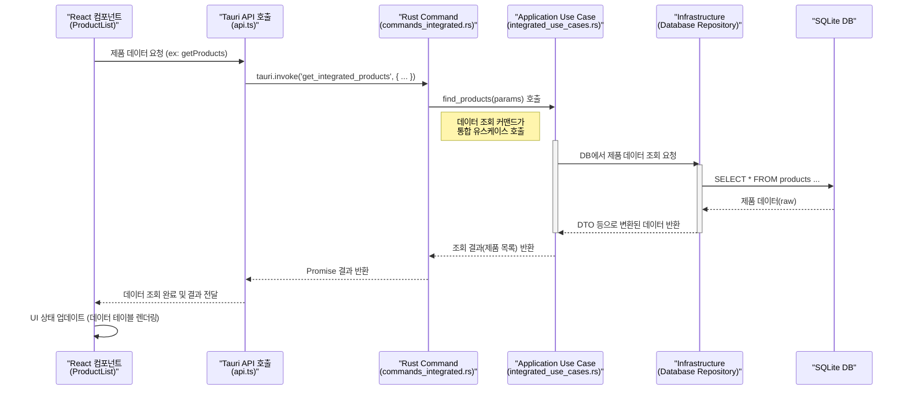

# 백엔드 핵심 동작 설계 (Sequence Diagram)

이 문서는 rMatterCertis 애플리케이션 백엔드의 주요 동작 흐름을 시퀀스 다이어그램을 통해 설명합니다. 백엔드는 Rust 언어와 Tauri 프레임워크를 기반으로 구축되었으며, 프론트엔드(React)와 `tauri::command`를 통해 통신하는 구조를 가집니다.

## 1. 애플리케이션 시작 (Application Startup)

사용자가 애플리케이션을 실행하면, Rust 진입점(`main.rs`)이 Tauri 애플리케이션을 빌드하고 실행합니다. 이 과정에서 데이터베이스 연결, 상태 관리 설정, 프론트엔드와 통신할 커맨드 등록 등이 이루어집니다.

## 2. 데이터 크롤링 실행 (Crawling Execution)

크롤링은 이 애플리케이션의 핵심 기능입니다. 사용자가 프론트엔드 UI를 통해 크롤링을 요청하면, Tauri 커맨드를 통해 백엔드의 크롤링 유스케이스가 실행됩니다.

- **파일 경로 추적**: `src/components/CrawlingDashboard.tsx` -> `src/services/crawlingService.ts` -> `(Tauri API)` -> `src-tauri/src/commands_crawling.rs` -> `src-tauri/src/application/crawling_use_cases.rs`

## 3. 통합 데이터 조회 (Integrated Data Query)

크롤링을 통해 수집된 데이터는 통합된 스키마를 통해 관리됩니다. 프론트엔드에서 이 데이터를 조회하는 요청 또한 Tauri 커맨드를 통해 처리됩니다.

- **파일 경로 추적**: `src/components/features/products/ProductList.tsx` -> `src/services/api.ts` -> `(Tauri API)` -> `src-tauri/src/commands_integrated.rs` -> `src-tauri/src/application/integrated_use_cases.rs`

