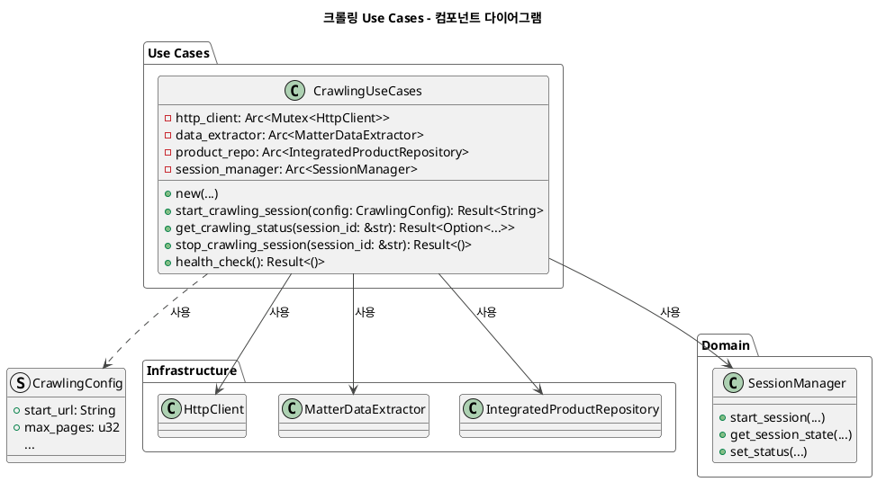
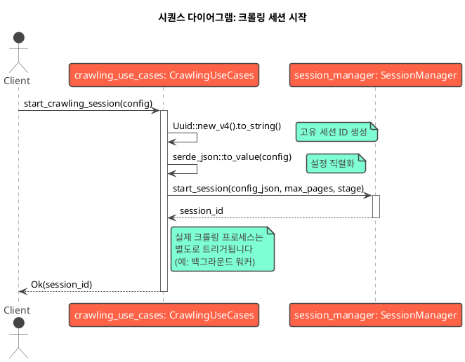

# 크롤링 Use Cases - 설계 문서

**📅 문서 작성일:** 2025년 6월 30일  
**🔗 Git 정보:**
- **브랜치:** main
- **커밋:** 7c8a407f41e6e764d9282554314076f63eb9f005 (7c8a407)
- **작성자:** Chanseok
- **날짜:** 2025-06-30 01:43:55 +0900
- **메시지:** feat: Add project performance evaluation report for rMatterCertis v2

**📝 문서 목적:** 이 문서는 `src-tauri/src/application/crawling_use_cases.rs`의 `CrawlingUseCases` 모듈 설계를 설명합니다. 컴포넌트 구조와 시스템 내 다른 부분들과의 상호작용을 시각적으로 표현합니다.

**🎯 구현 컨텍스트:** 
- **프로젝트 단계:** Phase 3 - 프론트엔드 및 크롤링 엔진 구현 (60% 완료)
- **대상 모듈:** `src-tauri/src/application/crawling_use_cases.rs`
- **아키텍처 패턴:** Clean Architecture with Dependency Injection
- **구현 상태:** 설계 단계 - 핵심 크롤링 엔진 구현 준비 중

---

## 1. 컴포넌트 다이어그램

이 다이어그램은 `CrawlingUseCases`와 그 의존성들의 정적 구조를 보여줍니다. 크롤링 작업의 중앙 조정자 역할을 하며, 인프라스트럭처와 도메인 계층의 컴포넌트들을 조정합니다.



**핵심 특징:**
- `CrawlingUseCases`는 의존성 주입(DI) 패턴을 따르며, 생성 시 의존성들을 받습니다.
- 인프라스트럭처의 구체적인 구현(HTTP 클라이언트, 데이터베이스 등)으로부터 애플리케이션 로직을 분리합니다.
- `Arc` 사용은 컴포넌트들이 동시성 환경에서 안전하게 공유되도록 설계되었음을 의미합니다.

## 2. 시퀀스 다이어그램: `start_crawling_session`

이 다이어그램은 새로운 크롤링 세션이 시작될 때 시스템의 동적 동작을 보여줍니다. 컴포넌트들 간의 상호작용 순서를 나타냅니다.



**핵심 특징:**
- `start_crawling_session` 함수는 전체 크롤링을 실행하는 것이 아니라 세션을 시작하고 준비하는 역할을 담당합니다.
- `SessionManager`에게 세션 상태 관리를 적절히 위임합니다.
- 이 설계는 메인 스레드를 장시간 크롤링 작업으로 블록하는 것을 피해 응답성을 보장하는 데 중요합니다. 실제 작업은 별도의 백그라운드 프로세스에서 처리할 수 있습니다.

---

## 📊 구현 상태

### ✅ **완료된 컴포넌트** (2025-06-30 기준)
- ✅ **SessionManager**: 메모리 기반 세션 관리 시스템
- ✅ **IntegratedProductRepository**: 제품 데이터베이스 접근 계층
- ✅ **기본 Use Case 구조**: 애플리케이션 계층 스캐폴딩
- ✅ **Tauri Commands**: 프론트엔드-백엔드 통신 브릿지

### 🚧 **진행 중** 
- 🚧 **CrawlingUseCases**: 설계 단계 완료, 구현 시작
- 🚧 **HttpClient**: 기본 구조 존재, 크롤링 특화 개선 필요
- 🚧 **MatterDataExtractor**: 핵심 파싱 로직 구현 필요

### ⏳ **구현 대기 중**
- ⏳ **Background Worker**: 비동기 크롤링 실행
- ⏳ **Error Recovery**: 재시도 로직 및 실패 처리
- ⏳ **Progress Monitoring**: 실시간 상태 업데이트
- ⏳ **Rate Limiting**: 요청 제한 및 서버 보호

### 🎯 **다음 구현 단계** (우선순위 순서)

#### 1. **HttpClient 개선** (1-2일)
```rust
// 대상: src-tauri/src/infrastructure/http_client.rs
impl HttpClient {
    pub async fn fetch_page(&mut self, url: &str) -> Result<String>;
    pub async fn fetch_with_retry(&mut self, url: &str, retries: u32) -> Result<String>;
    pub fn set_rate_limit(&mut self, delay_ms: u64);
}
```

#### 2. **MatterDataExtractor 구현** (3-4일)
```rust
// 대상: src-tauri/src/infrastructure/data_extractor.rs
impl MatterDataExtractor {
    pub fn extract_product_list(&self, html: &str) -> Result<Vec<ProductSummary>>;
    pub fn extract_product_detail(&self, html: &str) -> Result<ProductDetail>;
    pub fn extract_pagination_info(&self, html: &str) -> Result<PaginationInfo>;
}
```

#### 3. **CrawlingUseCases 핵심 메서드** (5-7일)
```rust
// 대상: src-tauri/src/application/crawling_use_cases.rs
impl CrawlingUseCases {
    pub async fn execute_crawling(&self, session_id: &str) -> Result<()>;
    pub async fn crawl_product_list(&self, session_id: &str) -> Result<Vec<String>>;
    pub async fn crawl_product_details(&self, session_id: &str, urls: Vec<String>) -> Result<()>;
}
```

#### 4. **Background Worker 통합** (8-10일)
- Tokio spawn 통합
- 진행률 콜백 시스템
- 우아한 종료 처리

### 🔗 **구현할 관련 파일들**
- `src-tauri/src/infrastructure/http_client.rs`
- `src-tauri/src/infrastructure/data_extractor.rs`
- `src-tauri/src/application/crawling_use_cases.rs`
- `src-tauri/src/application/dto/crawling_dto.rs`
- `src-tauri/src/commands/crawling_commands.rs`

### 📈 **성공 지표**
- [ ] CSA-IoT에서 100개 이상의 Matter 제품 성공적으로 크롤링
- [ ] 여러 페이지에 걸친 페이지네이션을 오류 없이 처리
- [ ] 속도 제한을 통한 안정적인 성능 유지
- [ ] 정확한 실시간 진행률 추적 제공
- [ ] 우아한 오류 처리 및 복구 구현

---

**📝 문서 변경 이력:**
- **2025-06-30**: PlantUML 다이어그램이 포함된 초기 설계 문서 작성
- **2025-06-30**: Git 정보 및 구현 로드맵 추가
