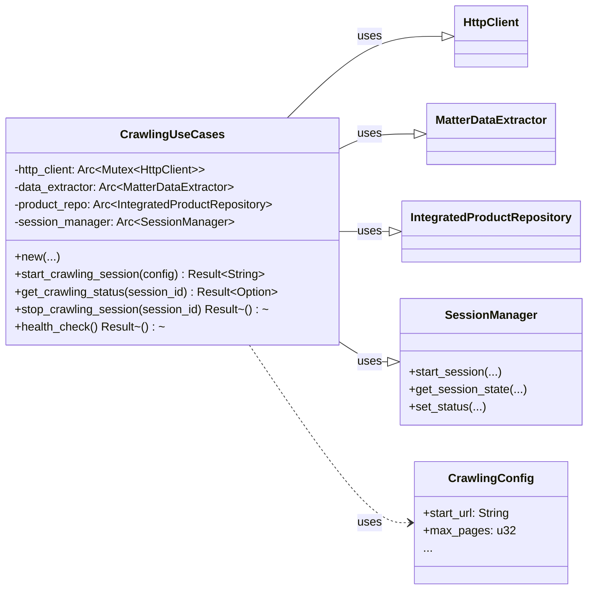
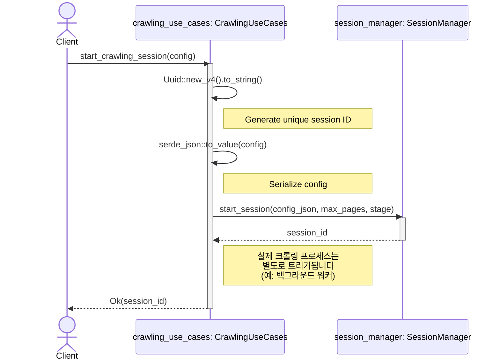
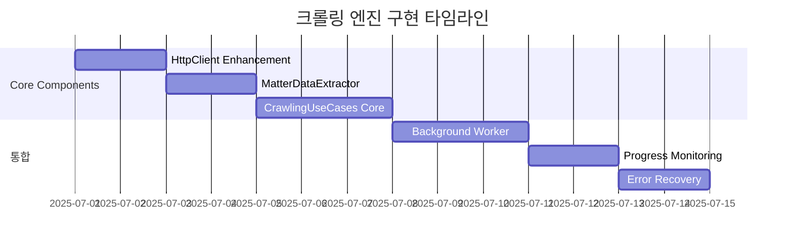

# 크롤링 Use Cases - 설계 문서 (Mermaid 버전)

**📅 문서 작성일:** 2025년 6월 30일  
**🔗 Git 정보:**
- **브랜치:** main
- **커밋:** 7c8a407f41e6e764d9282554314076f63eb9f005 (7c8a407)
- **작성자:** Chanseok
- **날짜:** 2025-06-30 01:43:55 +0900
- **메시지:** feat: Add project performance evaluation report for rMatterCertis v2

**📝 문서 목적:** 이 문서는 `src-tauri/src/application/crawling_use_cases.rs`의 `CrawlingUseCases` 모듈 설계를 설명합니다. Mermaid 다이어그램을 사용하여 컴포넌트 구조와 시스템 내 다른 부분들과의 상호작용을 시각적으로 표현합니다.

**🎯 구현 컨텍스트:** 
- **프로젝트 단계:** Phase 3 - 프론트엔드 및 크롤링 엔진 구현 (60% 완료)
- **대상 모듈:** `src-tauri/src/application/crawling_use_cases.rs`
- **아키텍처 패턴:** Clean Architecture with Dependency Injection
- **구현 상태:** 설계 단계 - 핵심 크롤링 엔진 구현 준비 중
- **다이어그램 유형:** Mermaid (GitHub/GitLab 호환성을 위한 PlantUML 대안)

---

## 1. 클래스 다이어그램

이 다이어그램은 `CrawlingUseCases`와 그 의존성들의 정적 구조를 보여줍니다. 크롤링 작업의 중앙 조정자 역할을 하며, 인프라스트럭처와 도메인 계층의 컴포넌트들을 조정합니다.

**핵심 특징:**
- `CrawlingUseCases`는 의존성 주입(DI) 패턴을 따르며, 생성 시 의존성들을 받습니다.
- 인프라스트럭처의 구체적인 구현(HTTP 클라이언트, 데이터베이스 등)으로부터 애플리케이션 로직을 분리합니다.
- `Arc` 사용은 컴포넌트들이 동시성 환경에서 안전하게 공유되도록 설계되었음을 의미합니다.

## 2. 시퀀스 다이어그램: `start_crawling_session`

이 다이어그램은 새로운 크롤링 세션이 시작될 때 시스템의 동적 동작을 보여줍니다. 컴포넌트들 간의 상호작용 순서를 나타냅니다.

**핵심 특징:**
- `start_crawling_session` 함수는 전체 크롤링을 실행하는 것이 아니라 세션을 시작하고 준비하는 역할을 담당합니다.
- `SessionManager`에게 세션 상태 관리를 적절히 위임합니다.
- 이 설계는 메인 스레드를 장시간 크롤링 작업으로 블록하는 것을 피해 응답성을 보장하는 데 중요합니다. 실제 작업은 별도의 백그라운드 프로세스에서 처리할 수 있습니다.

---

## 📊 구현 상태 및 로드맵

### 🎯 **현재 구현 단계**
**Phase 3: 크롤링 엔진 핵심 구현** (우선순위: 높음)

이 Mermaid 버전은 다음과 같은 호환성을 위해 PlantUML의 대안으로 제공됩니다:
- GitHub README 표시
- GitLab 문서화
- Confluence 및 기타 위키 시스템
- VS Code 확장 프로그램 (Mermaid Preview)

### 🔄 **다이어그램 사용 권장사항**

#### **PlantUML 버전** (`crawling_use_cases_design_2025-06-30.md`)
- ✅ **최적 용도**: 상세한 기술 문서화
- ✅ **특징**: 풍부한 스타일링, 복잡한 레이아웃, 전문적인 외관
- ✅ **도구**: PlantUML 확장이 있는 VS Code, 로컬 JAR 렌더링

#### **Mermaid 버전** (`crawling_use_cases_design_mermaid_2025-06-30.md`)  
- ✅ **최적 용도**: GitHub/GitLab 통합, 웹 기반 보기
- ✅ **특징**: 네이티브 GitHub 렌더링, 간단한 문법, 광범위한 도구 지원
- ✅ **도구**: GitHub, VS Code Mermaid 확장, 온라인 에디터

### 📈 **구현 진행 추적**

### 🔗 **상호 참조**
- **PlantUML 버전**: `crawling_use_cases_design_2025-06-30.md`
- **구현 가이드**: `../../guide/matter-certis-v2-phase4-5-guide.md`
- **프로젝트 상태**: `../../guide/PROJECT_STATUS.md`
- **성과 평가**: `../../guide/work_perf/project-performance-evaluation-2025-06-30.md`

---

**📝 문서 변경 이력:**
- **2025-06-30**: 초기 Mermaid 설계 문서 작성
- **2025-06-30**: Git 정보 및 구현 로드맵 추가
- **2025-06-30**: 상호 참조 및 타임라인 시각화 추가
