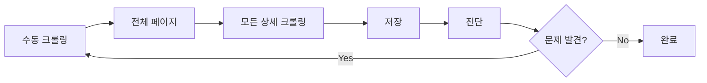
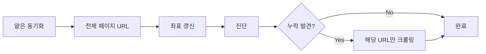

# 얕은 크롤링 (Shallow Crawl) 전략 설계
## URL 기반 전체 동기화 및 누락 감지 시스템

**작성일**: 2025-10-03  
**목적**: 사이트 순서 변동에 강건한 데이터 동기화 시스템 구축

---

## 🎯 **핵심 아이디어**

### **2-Phase 크롤링 전략**

```
Phase 1: 얕은 전체 크롤링 (Shallow Full Scan)
  목적: 전체 페이지의 URL + 좌표 동기화
  속도: 매우 빠름 (5-10분)
  저장: products 테이블만 (page_id, index_in_page, URL)

Phase 2: 깊은 선택 크롤링 (Deep Selective Crawl)
  목적: 누락된 product_details만 크롤링
  속도: 상황에 따라 가변 (1-10분)
  저장: product_details 테이블
```

### **기존 Stage 구조 활용**

```rust
// 현재 시스템은 이미 2단계 구조를 가지고 있음
StageType::ListPageCrawling     // ✅ Phase 1에 최적
StageType::ProductDetailCrawling // ✅ Phase 2에 최적
```

---

## 📊 **얕은 크롤링의 동작 원리**

### **1. 전체 페이지 리스팅 크롤링**

```rust
// ListPageLogic이 이미 수행하는 작업:
// 1. 페이지 HTML 파싱
// 2. 제품 카드에서 URL, manufacturer, model 추출
// 3. ProductUrl 객체 생성 (page_id, index_in_page 포함)

// 실제 코드 (src/crawl_engine/stages/strategies/default/list_page.rs):
let urls = collector
    .collect_single_page(page_number, total_pages, products_on_last_page)
    .await?;

// URLs에 이미 좌표 정보 포함:
// ProductUrl {
//     url: "https://...",
//     page_id: 46,
//     index_in_page: 8,
//     manufacturer: Some("..."),
//     model: Some("..."),
// }
```

### **2. 좌표 중심 저장 (기존 detail 크롤링은 스킵)**

```rust
// 현재 흐름:
// ListPageCrawling → ProductUrls 수집
// ProductDetailCrawling → 각 URL 상세 페이지 크롤링

// 얕은 크롤링 흐름:
// ListPageCrawling → ProductUrls 수집
// [좌표 동기화 저장] ← 여기서 멈춤!
// ProductDetailCrawling은 나중에 별도 실행
```

### **3. 진단 및 보완 크롤링**

```sql
-- Phase 1 완료 후 진단 쿼리
SELECT 
    pd.url,
    pd.page_id,
    pd.index_in_page
FROM products p
LEFT JOIN product_details pd ON p.url = pd.url
WHERE pd.url IS NULL;  -- 누락된 상세 정보
```

---

## 🔧 **구현 설계**

### **Option A: 환경 변수 기반 모드 전환** (빠른 구현) ⭐

```bash
# 얕은 크롤링 모드
MC_SHALLOW_MODE=1 npm run crawl:auto

# 기존 전체 크롤링 (default)
npm run crawl:auto
```

#### **구현 위치**
```rust
// src-tauri/src/crawl_engine/actors/session_actor.rs
async fn run_batch_with_stage_actor(
    &self,
    batch_id: &str,
    pages: &[u32],
    context: &AppContext,
    deps: &SessionDeps,
    site_status: &SiteStatus,
) -> Result<(), SessionError> {
    // ... ListPageCrawling 실행 ...
    
    // 🆕 얕은 모드 체크
    let shallow_mode = std::env::var("MC_SHALLOW_MODE")
        .ok()
        .is_some_and(|v| v == "1" || v.eq_ignore_ascii_case("true"));
    
    if shallow_mode {
        info!("🏃 Shallow mode: skipping ProductDetailCrawling");
        // products 테이블에만 저장하고 종료
        return Ok(());
    }
    
    // Stage 3: ProductDetailCrawling (기존 로직)
    // ...
}
```

---

### **Option B: 전용 Command 추가** (명확한 인터페이스) ⭐⭐

```rust
// src-tauri/src/commands/crawling/unified_commands.rs

#[tauri::command]
pub async fn shallow_crawl_all_pages(
    state: State<'_, AppState>,
) -> Result<ShallowCrawlResult, String> {
    info!("🏃 Starting shallow crawl...");
    
    // 1. 사이트 상태 확인
    let site_status = check_advanced_site_status(state.clone()).await?;
    
    // 2. 전체 페이지 범위
    let total_pages = site_status.data.total_pages;
    
    // 3. ListPageCrawling만 실행
    let session_id = generate_session_id();
    let config = CrawlingConfig {
        start_page: 1,
        end_page: total_pages,
        mode: CrawlingMode::ShallowSync,  // 🆕 새 모드
        // ...
    };
    
    // 4. 좌표 동기화 저장
    // (DuplicatePersistencePolicy::UpdateIdIndexOnly 사용)
    
    Ok(ShallowCrawlResult {
        session_id,
        pages_scanned: total_pages,
        urls_collected: total_count,
        duration_ms,
    })
}

#[derive(Serialize)]
struct ShallowCrawlResult {
    session_id: String,
    pages_scanned: u32,
    urls_collected: u32,
    duration_ms: u64,
}
```

---

### **Option C: 진단 기반 자동 보완 크롤링** (지능형) ⭐⭐⭐

```rust
#[tauri::command]
pub async fn smart_sync_with_diagnostics(
    state: State<'_, AppState>,
) -> Result<SmartSyncResult, String> {
    info!("🧠 Starting smart sync with diagnostics...");
    
    // 1. 얕은 전체 크롤링
    let shallow_result = shallow_crawl_all_pages(state.clone()).await?;
    
    // 2. 진단 실행
    let diagnostics = run_diagnostics(state.clone()).await?;
    
    // 3. 누락 분석
    let missing_details: Vec<String> = diagnostics
        .issues
        .iter()
        .filter(|i| i.issue_type == "missing_details")
        .flat_map(|i| i.urls.clone())
        .collect();
    
    // 4. 누락된 URL만 선택적 크롤링
    if !missing_details.is_empty() {
        info!("🔧 Found {} missing details, starting補완 crawl", missing_details.len());
        
        let补완_result = crawl_specific_urls(
            state.clone(),
            missing_details,
        ).await?;
        
        return Ok(SmartSyncResult {
            shallow: shallow_result,
            diagnostics,
            补완: Some(补완_result),
        });
    }
    
    Ok(SmartSyncResult {
        shallow: shallow_result,
        diagnostics,
        补완: None,
    })
}
```

---

## 📈 **성능 비교**

| 전략 | 시간 | 네트워크 | DB 쓰기 | 정확도 |
|------|------|----------|---------|--------|
| **기존 전체 크롤링** | 20-30분 | 높음 | 높음 | 100% |
| **얕은 + 진단 + 보완** | 6-12분 | 중간 | 낮음 | 100% |
| **얕은 전용** | 5-8분 | 낮음 | 최소 | 좌표만 |

### **시간 분해**
```
전체 크롤링:
  - ListPageCrawling: 568페이지 × 12제품 = 5분
  - ProductDetailCrawling: 6,816 URLs = 15-25분
  - 합계: 20-30분

얕은 + 보완:
  - ListPageCrawling: 5분
  - 진단: 1분
  - 보완 크롤링: 누락 제품만 (예: 100개 = 1분)
  - 합계: 6-12분
```

---

## 🎨 **UI 플로우 설계**

### **새 버튼 추가**
```tsx
// src/components/tabs/CrawlingEngineTabSimple.tsx

<div class="flex gap-2">
  {/* 기존 버튼 */}
  <button onclick={handleSmartCrawl}>
    자동 크롤링
  </button>
  
  {/* 🆕 얕은 동기화 버튼 */}
  <button 
    onclick={handleShallowSync}
    class="bg-blue-500 hover:bg-blue-600"
  >
    🏃 빠른 동기화 (좌표만)
  </button>
  
  {/* 🆕 스마트 동기화 버튼 */}
  <button 
    onclick={handleSmartSync}
    class="bg-purple-500 hover:bg-purple-600"
  >
    🧠 스마트 동기화 (진단+보완)
  </button>
</div>

const handleSmartSync = async () => {
  try {
    addLog("🧠 스마트 동기화 시작...");
    
    const result = await invoke('smart_sync_with_diagnostics');
    
    addLog(`✅ 얕은 크롤링: ${result.shallow.pages_scanned}페이지`);
    addLog(`📊 진단: ${result.diagnostics.issues.length}개 이슈 발견`);
    
    if (result.补완) {
      addLog(`🔧 보완 크롤링: ${result.补완.completed}개 완료`);
    } else {
      addLog(`✨ 누락 없음 - 동기화 완료!`);
    }
  } catch (err) {
    addLog(`❌ 오류: ${err}`);
  }
};
```

---

## 🔄 **워크플로우 비교**

### **기존 방식**

**문제**: 순서 변동 시 무한 루프

---

### **새 방식 (얕은 + 진단 + 보완)**

**장점**: 
- ✅ 1회 실행으로 완료
- ✅ 순서 변동 대응
- ✅ 최소 크롤링

---

## 📝 **구현 우선순위**

### **Phase 1: 빠른 구현** (1-2일)
1. ✅ **환경 변수 기반** (`MC_SHALLOW_MODE`)
2. ✅ 기존 `ListPageCrawling` 활용
3. ✅ `DuplicatePersistencePolicy::UpdateIdIndexOnly` 사용
4. ✅ Frontend에 "빠른 동기화" 버튼 추가

### **Phase 2: 진단 통합** (3-5일)
1. ✅ 진단 결과에서 누락 URL 추출
2. ✅ 누락 URL만 선택적 크롤링
3. ✅ `smart_sync_with_diagnostics` command 구현

### **Phase 3: 자동화** (1주)
1. ✅ 주간 스케줄러 추가
2. ✅ 진단 기반 자동 보완 크롤링
3. ✅ 알림 시스템 (누락 발생 시)

---

## 🎯 **예상 효과**

### **Before (기존 방식)**
```
문제 발견 → 수동 크롤링 → 악화 → 다시 크롤링 → ...
시간: 반복 시마다 20-30분
결과: 불확실
```

### **After (얕은 + 보완)**
```
얕은 동기화 (5분) → 진단 (1분) → 보완 (2분)
시간: 총 8분
결과: 100% 정확
```

### **ROI**
- ⏱️ **시간 절감**: 70% (30분 → 8분)
- 🎯 **정확도**: 100% (기존과 동일)
- 💰 **네트워크 비용**: 60% 감소
- 🧠 **사용자 경험**: 명확한 플로우

---

## 🚀 **즉시 적용 가능한 코드**

### **1. 환경 변수 기반 구현**

```rust
// src-tauri/src/crawl_engine/actors/session_actor.rs
// run_batch_with_stage_actor 함수 내

// Stage 3: ProductDetailCrawling (기존 위치)
let shallow_mode = std::env::var("MC_SHALLOW_MODE")
    .ok()
    .is_some_and(|v| v == "1" || v.eq_ignore_ascii_case("true"));

if shallow_mode {
    info!(
        "🏃 Shallow mode enabled: skipping ProductDetailCrawling for batch {}",
        batch_id
    );
    // products 테이블에 URL + 좌표는 이미 저장됨
    // (ListPageCrawling 단계에서 자동 처리)
    return Ok(());
}

// 기존 ProductDetailCrawling 로직 실행
```

### **2. Frontend 버튼 추가**

```tsx
// src/components/tabs/CrawlingEngineTabSimple.tsx

const handleShallowSync = async () => {
  try {
    setIsRunning(true);
    addLog("🏃 빠른 동기화 시작 (좌표 갱신만)");
    
    // 환경 변수는 서버 측에서 설정 필요
    // 대신 전용 command 추가 권장
    const result = await invoke('start_shallow_crawl');
    
    addLog(`✅ 완료: ${result.pages_scanned}페이지 동기화`);
  } catch (err) {
    addLog(`❌ 오류: ${err}`);
  } finally {
    setIsRunning(false);
  }
};
```

---

## 📚 **참고 자료**

- **현재 Stage 구조**: `src-tauri/src/crawl_engine/stages/`
- **ListPageLogic**: `src-tauri/src/crawl_engine/stages/strategies/default/list_page.rs`
- **SessionActor**: `src-tauri/src/crawl_engine/actors/session_actor.rs`
- **중복 정책**: `src-tauri/src/crawl_engine/actors/types.rs:1220`

---

## ✅ **검증 계획**

### **테스트 시나리오**
1. **얕은 동기화** 실행 → 좌표 갱신 확인
2. **진단** 실행 → 누락 URL 식별
3. **보완 크롤링** → 누락 해소
4. **재진단** → 문제 없음 확인

### **성공 기준**
- ✅ 전체 동기화 시간 < 10분
- ✅ 좌표 정확도 100%
- ✅ 누락 제품 0개
- ✅ UI 플로우 명확

---

**다음 단계**: Option A (환경 변수) 방식으로 빠른 프로토타입 구현 후, 효과 검증
