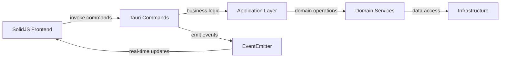

# Matter Certis v2 - Architecture Overview (현재 구현 반영)

**📅 업데이트: 2025년 7월 2일**  
**🎯 목적**: 실제 구현된 코드와 100% 일치하는 현재 아키텍처 문서

---

## 🏗️ **전체 아키텍처**

### **기술 스택 (확정)**
- **백엔드**: Rust + Tauri v2
- **프론트엔드**: SolidJS + TypeScript + Vite
- **데이터베이스**: SQLite (통합 스키마)
- **상태 관리**: SolidJS createStore + 반응형 시그널
- **HTTP 클라이언트**: reqwest + 커스텀 HttpClient
- **HTML 파싱**: scraper crate
- **IPC 통신**: Tauri invoke + Event 시스템
- **로깅**: tracing + structured logging

### **프로젝트 구조 (실제 구현)**

```
rMatterCertis/
├── src-tauri/                 # 🦀 Rust 백엔드
│   ├── src/
│   │   ├── application/       # ✅ 비즈니스 로직 레이어
│   │   │   ├── state.rs       # ✅ 전역 앱 상태 (EventEmitter 포함)
│   │   │   ├── events.rs      # ✅ 이벤트 발신 시스템
│   │   │   └── crawling_use_cases.rs  # ✅ 크롤링 유스케이스
│   │   ├── commands/          # ✅ Tauri IPC 명령어
│   │   │   ├── modern_crawling.rs    # ✅ 크롤링 제어 명령어
│   │   │   ├── config_commands.rs    # ✅ 설정 관리 명령어
│   │   │   └── parsing_commands.rs   # ✅ 파싱 유틸리티 명령어
│   │   ├── domain/            # ✅ 도메인 모델
│   │   │   ├── events.rs      # ✅ 도메인 이벤트 정의
│   │   │   ├── integrated_product.rs # ✅ 통합 제품 모델
│   │   │   └── session_manager.rs    # ✅ 메모리 기반 세션 관리
│   │   ├── infrastructure/    # ✅ 외부 연동 레이어
│   │   │   ├── crawling_engine.rs    # ✅ BatchCrawlingEngine
│   │   │   ├── html_parser.rs         # ✅ HTML 파싱 및 데이터 추출
│   │   │   ├── simple_http_client.rs  # ✅ HTTP 클라이언트
│   │   │   ├── database_connection.rs # ✅ SQLite 연결 및 마이그레이션
│   │   │   ├── config/               # ✅ 설정 관리 모듈
│   │   │   │   ├── app_config.rs     # ✅ 앱 설정 구조체
│   │   │   │   ├── csa_iot.rs        # ✅ CSA-IoT 사이트 특화 설정
│   │   │   │   └── config_manager.rs # ✅ 설정 로드/저장 관리자
│   │   │   └── parsing/              # ✅ 파싱 관련 모듈
│   │   │       ├── product_list_parser.rs    # ✅ 제품 목록 파싱
│   │   │       ├── product_detail_parser.rs  # ✅ 제품 상세 파싱
│   │   │       └── config.rs                 # ✅ 파싱 설정
│   │   └── lib.rs             # ✅ Tauri 앱 진입점 및 명령어 등록
├── src/                       # ⚛️ SolidJS 프론트엔드
│   ├── components/            # ✅ UI 컴포넌트
│   │   ├── CrawlingForm.tsx   # ✅ 크롤링 시작 폼
│   │   └── features/settings/ # ✅ 설정 관리 UI
│   ├── services/              # ✅ 서비스 레이어
│   │   ├── tauri-api.ts       # ✅ Tauri IPC 추상화 계층
│   │   └── realtime-manager.ts # ✅ 실시간 상태 관리
│   ├── stores/                # ✅ 상태 관리
│   │   ├── crawlerStore.ts    # ✅ 크롤링 전용 상태
│   │   └── uiStore.ts         # ✅ UI 상태 관리
│   ├── types/                 # ✅ TypeScript 타입 정의
│   │   ├── crawling.ts        # ✅ 크롤링 관련 타입 (백엔드 매핑)
│   │   ├── domain.ts          # ✅ 도메인 모델 타입
│   │   └── api.ts            # ✅ API 응답 타입
│   └── AppNew.tsx            # ✅ 메인 앱 컴포넌트
└── guide/                    # 📚 프로젝트 문서
    ├── crawling/             # ✅ 크롤링 구현 가이드
    └── *.md                 # ✅ 각종 개발 가이드
```

---

## 🔄 **데이터 흐름 및 통신 아키텍처**

### **IPC 통신 패턴 (실제 구현)**



#### **1. 명령 기반 통신 (Command Pattern)**
```typescript
// 프론트엔드에서 백엔드 명령 호출
const sessionId = await tauriApi.startCrawling(config);
const status = await tauriApi.getCrawlingStatus();
await tauriApi.pauseCrawling();
```

```rust
// 백엔드 Tauri 명령어 처리
#[tauri::command]
pub async fn start_crawling(
    config: ComprehensiveCrawlerConfig,
    state: tauri::State<'_, AppState>,
    app_handle: tauri::AppHandle,
) -> Result<String, String> {
    // 비즈니스 로직 실행
}
```

#### **2. 이벤트 기반 실시간 업데이트**
```rust
// 백엔드에서 이벤트 방출
impl EventEmitter {
    pub async fn emit_progress(&self, progress: CrawlingProgress) -> EventResult {
        let event = CrawlingEvent::ProgressUpdate(progress);
        self.app_handle.emit("crawling-progress", &event)?;
    }
}
```

```typescript
// 프론트엔드에서 이벤트 구독
const unlisten = await listen<CrawlingProgress>('crawling-progress', (event) => {
    crawlerStore.setProgress(event.payload);
});
```

---

## 🏛️ **레이어별 상세 아키텍처**

### **Application Layer (비즈니스 로직)**

#### **AppState - 전역 상태 관리**
```rust
pub struct AppState {
    pub config: Arc<RwLock<AppConfig>>,
    pub crawling_progress: Arc<RwLock<Option<CrawlingProgress>>>,
    pub event_emitter: Arc<RwLock<Option<EventEmitter>>>,
    session_start_time: Arc<RwLock<Option<DateTime<Utc>>>>,
}
```

**핵심 기능:**
- ✅ 전역 앱 설정 관리
- ✅ 크롤링 진행 상황 추적
- ✅ EventEmitter 생명주기 관리
- ✅ 스레드 안전한 상태 접근 (Arc<RwLock>)

#### **EventEmitter - 실시간 이벤트 발신**
```rust
pub struct EventEmitter {
    app_handle: AppHandle,
    enabled: Arc<RwLock<bool>>,
    event_sender: Option<mpsc::Sender<CrawlingEvent>>,
}
```

**기능:**
- ✅ 크롤링 진행상황 실시간 방출
- ✅ 배치 이벤트 처리 (성능 최적화)
- ✅ 이벤트 활성화/비활성화 토글
- ✅ 에러 처리 및 백프레셔 관리

### **Domain Layer (도메인 모델)**

#### **CrawlingProgress - 진행상황 모델**
```rust
pub struct CrawlingProgress {
    pub current: u32,
    pub total: u32,
    pub percentage: f64,
    pub current_stage: CrawlingStage,
    pub status: CrawlingStatus,
    pub new_items: u32,
    pub updated_items: u32,
    pub errors: u32,
    pub timestamp: DateTime<Utc>,
}
```

#### **SessionManager - 메모리 기반 세션 관리**
```rust
pub struct SessionManager {
    sessions: Arc<Mutex<HashMap<String, CrawlingSessionState>>>,
    active_session: Arc<Mutex<Option<String>>>,
}
```

**특징:**
- ✅ 메모리 기반 고성능 세션 관리
- ✅ 동시성 안전 (Arc<Mutex>)
- ✅ 세션 생명주기 완전 관리
- ✅ 백그라운드 정리 작업

### **Infrastructure Layer (외부 연동)**

#### **BatchCrawlingEngine - 4단계 크롤링 엔진**
```rust
pub struct BatchCrawlingEngine {
    http_client: Arc<tokio::sync::Mutex<HttpClient>>,
    data_extractor: Arc<MatterDataExtractor>,
    product_repo: Arc<IntegratedProductRepository>,
    event_emitter: Arc<Option<EventEmitter>>,
    config: BatchCrawlingConfig,
    session_id: String,
}
```

**4단계 워크플로우:**
1. ✅ **Stage 1**: 총 페이지 수 발견
2. ✅ **Stage 2**: 제품 목록 수집 (배치 처리)
3. ✅ **Stage 3**: 제품 상세정보 수집 (병렬 처리)
4. ✅ **Stage 4**: 데이터베이스 저장

#### **MatterDataExtractor - HTML 파싱 엔진**
```rust
pub struct MatterDataExtractor {
    config: ParsingConfig,
    product_list_parser: ProductListParser,
    product_detail_parser: ProductDetailParser,
}
```

**파싱 기능:**
- ✅ CSA-IoT 사이트 특화 CSS 셀렉터
- ✅ 견고한 에러 처리 (파싱 실패 허용)
- ✅ 데이터 품질 검증
- ✅ URL 정규화 및 유효성 검사

#### **ConfigManager - 통합 설정 관리**
```rust
pub struct ConfigManager {
    config_path: PathBuf,
    data_dir: PathBuf,
}
```

**설정 관리:**
- ✅ 첫 실행 시 기본 설정 자동 생성
- ✅ JSON 기반 설정 파일 관리
- ✅ 데이터 디렉토리 자동 생성
- ✅ 설정 버전 관리 및 마이그레이션

---

## 🔧 **핵심 기능 구현 상태**

### **✅ 완전 구현된 기능들**

#### **1. 설정 관리 시스템**
- **단일 진실 소스**: 백엔드 `ComprehensiveCrawlerConfig`
- **IPC 기반 로드**: 프론트엔드가 백엔드에서 설정 가져옴
- **자동 초기화**: 첫 실행 시 기본 설정 및 디렉토리 생성
- **타입 안전성**: Rust ↔ TypeScript 완전한 타입 매핑

#### **2. 실시간 이벤트 시스템**
- **EventEmitter**: 백엔드에서 프론트엔드로 실시간 이벤트 방출
- **배치 처리**: 고성능을 위한 이벤트 배치 전송
- **구독 관리**: 프론트엔드에서 자동 구독/해제
- **에러 핸들링**: 이벤트 전송 실패 처리

#### **3. SolidJS 상태 관리**
- **crawlerStore**: 크롤링 전용 반응형 상태 관리
- **실시간 업데이트**: 폴링 없는 이벤트 기반 UI 업데이트
- **타입 안전성**: 완전한 TypeScript 타입 지원
- **에러 처리**: 포괄적인 에러 상태 관리

#### **4. 크롤링 엔진 기본 구조**
- **4단계 워크플로우**: 체계적인 크롤링 프로세스
- **배치 처리**: 대용량 데이터 효율적 처리
- **에러 복구**: 기본적인 재시도 및 에러 처리
- **진행률 추적**: 실시간 진행상황 계산 및 방출

### **⚠️ 개선 필요 영역들**

#### **1. BatchCrawlingEngine 서비스 분리 (60% 완성)**
**현재 구조**: 단일 클래스에 모든 로직 포함  
**목표 구조**: StatusChecker, ProductListCollector 등으로 명시적 분리

#### **2. 세분화된 이벤트 시스템 (40% 완성)**
**현재**: 기본적인 CrawlingProgress 이벤트  
**목표**: SessionStarted, PageCompleted, ProductFailed 등 상세 이벤트

#### **3. 고급 데이터 처리 (20% 완성)**
**현재**: 기본 DB 저장  
**목표**: 중복제거 → 유효성검사 → 충돌해결 → DB저장 파이프라인

#### **4. 성능 최적화 (10% 완성)**
**현재**: 고정된 동시성 설정  
**목표**: 적응형 최적화, 실시간 모니터링, 자동 튜닝

---

## 🎯 **다음 우선순위**

### **즉시 시작 (Week 1-2)**
1. **BatchCrawlingEngine 서비스 분리**
   - StatusChecker, ProductListCollector 등 트레이트 정의
   - 의존성 주입 구조로 리팩토링

2. **실제 이벤트 방출 구현**
   - 각 서비스에서 세분화된 이벤트 방출
   - 프론트엔드 이벤트 핸들러 확장

### **단기 목표 (Week 3-4)**
3. **데이터 처리 파이프라인 구축**
   - DeduplicationService, ValidationService 구현
   - 데이터 품질 관리 시스템

4. **성능 최적화 기반 마련**
   - PerformanceMonitor, AdaptiveConnectionPool 기초 구현

---

**현재 아키텍처는 견고한 기반을 제공하며, 계획된 개선사항들을 통해 엔터프라이즈급 크롤링 시스템으로 발전할 준비가 되어있습니다.**
