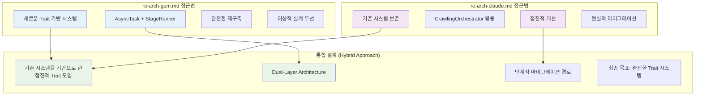
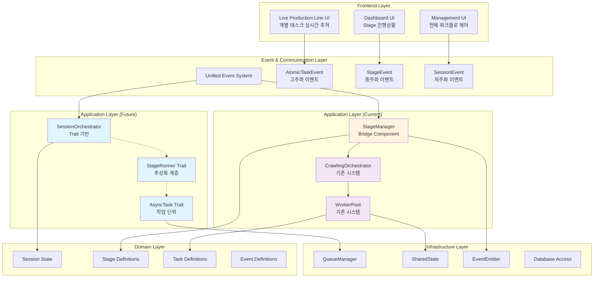
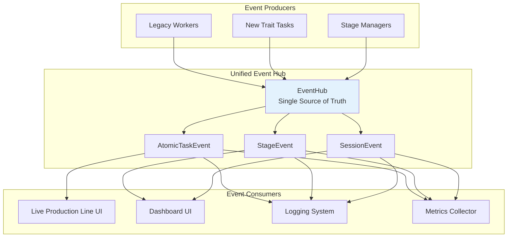
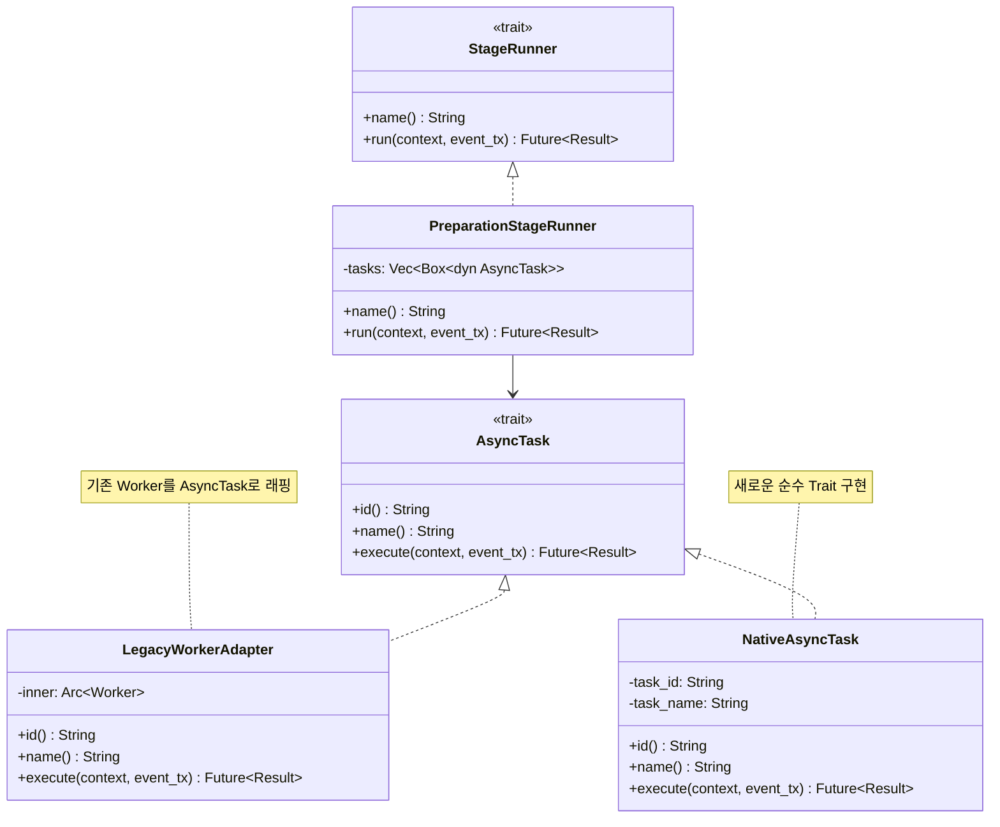
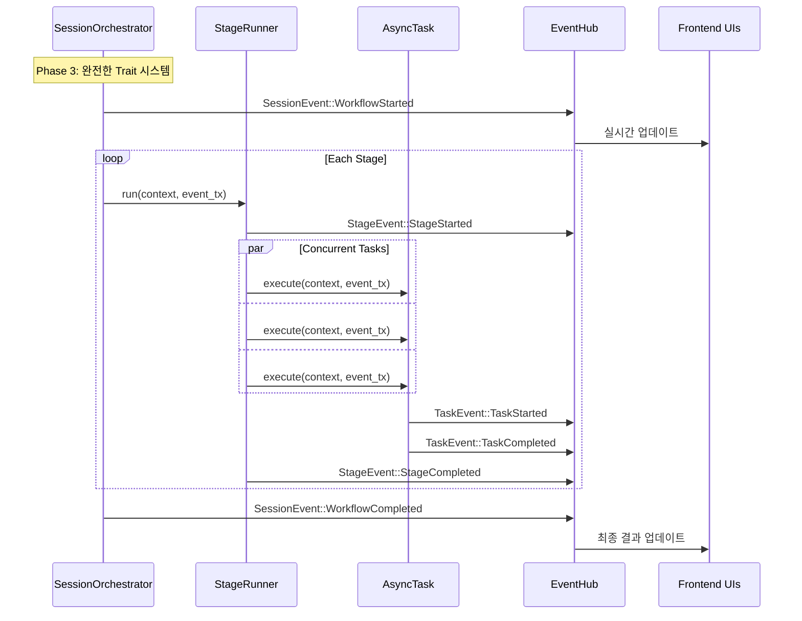
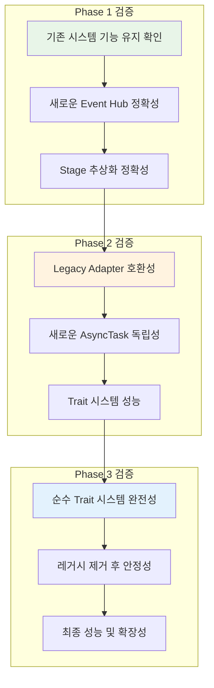
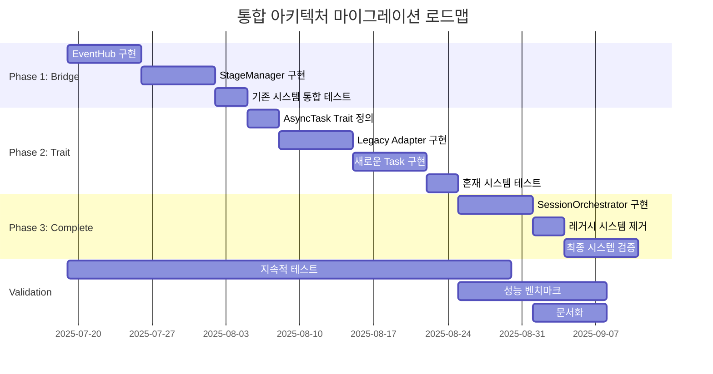
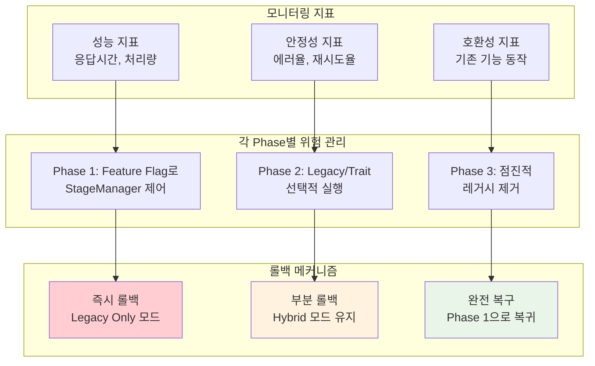
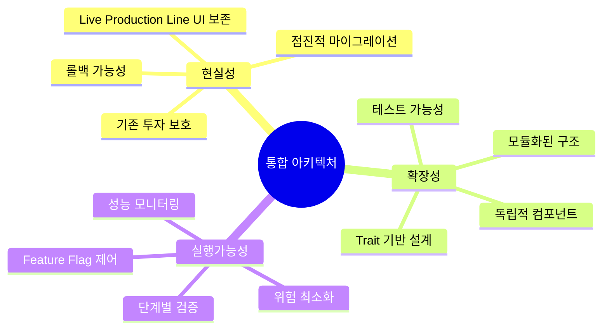

# rMatterCertis 아키텍처 최종 통합 설계서

*본 문서는 `re-arch-gem.md`의 이상적 설계와 `re-arch-claude.md`의 현실적 접근을 통합하여, 실제 구현 가능한 종합적 아키텍처를 제시합니다.*

## 1. 두 접근법의 핵심 차이점과 통합 방향

### 1.1 접근법 비교 분석



### 1.2 통합 전략: Dual-Layer Evolution

**핵심 아이디어**: 기존 시스템을 보존하면서도 최종적으로는 완전한 Trait 기반 시스템으로 진화

1. **Layer 1 (Legacy)**: 현재 CrawlingOrchestrator, WorkerPool 시스템
2. **Layer 2 (Future)**: 새로운 Trait 기반 시스템 
3. **Bridge**: 두 레이어를 연결하는 어댑터 패턴

## 2. 통합 아키텍처 설계

### 2.1 전체 시스템 구조



### 2.2 진화 경로 (3단계 마이그레이션)

```mermaid
graph LR
    subgraph "Phase 1: Bridge 구축"
        P1A[StageManager 구현]
        P1B[Unified Event System]
        P1C[기존 시스템 래핑]
    end
    
    subgraph "Phase 2: Trait 시스템 도입"
        P2A[AsyncTask Trait 정의]
        P2B[기존 Worker를 Trait로 래핑]
        P2C[StageRunner Trait 구현]
    end
    
    subgraph "Phase 3: 완전 마이그레이션"
        P3A[SessionOrchestrator 구현]
        P3B[레거시 시스템 제거]
        P3C[순수 Trait 기반 시스템]
    end
    
    P1A --> P1B
    P1B --> P1C
    P1C --> P2A
    P2A --> P2B
    P2B --> P2C
    P2C --> P3A
    P3A --> P3B
    P3B --> P3C
    
    style P1A fill:#e8f5e8
    style P2A fill:#fff3e0
    style P3A fill:#e3f2fd
```



## 3. 구체적 구현 설계

### 3.1 Phase 1: Bridge 시스템 구현

#### Unified Event System



#### StageManager Implementation

```rust
// Phase 1: Bridge Component
pub struct StageManager {
    // 기존 시스템 연결
    orchestrator: Arc<CrawlingOrchestrator>,
    
    // 새로운 이벤트 시스템
    event_hub: Arc<EventHub>,
    
    // Stage 상태 관리
    current_stage: Arc<RwLock<CrawlingStage>>,
    stage_history: Arc<RwLock<Vec<StageExecution>>>,
}

impl StageManager {
    pub async fn execute_stage(&self, stage: CrawlingStage) -> Result<StageResult> {
        // 1. Stage 시작 이벤트 발행
        self.event_hub.emit(SessionEvent::StageStarted { 
            stage: stage.clone() 
        }).await;
        
        // 2. 기존 시스템에 작업 위임
        let tasks = self.generate_stage_tasks(&stage).await?;
        for task in tasks {
            self.orchestrator.enqueue_task(task).await?;
        }
        
        // 3. 진행상황 모니터링
        let result = self.monitor_stage_progress(&stage).await?;
        
        // 4. Stage 완료 이벤트 발행
        self.event_hub.emit(SessionEvent::StageCompleted {
            stage: stage.clone(),
            result: result.clone()
        }).await;
        
        Ok(result)
    }
    
    async fn generate_stage_tasks(&self, stage: &CrawlingStage) -> Result<Vec<CrawlingTask>> {
        match stage {
            CrawlingStage::Preparation => {
                // 기존 시스템의 Task 생성 로직 활용
                Ok(vec![
                    CrawlingTask::SiteStatusCheck { /* ... */ },
                    CrawlingTask::DbStatusCheck { /* ... */ },
                ])
            },
            CrawlingStage::Collection => {
                // 기존 orchestrator의 로직 재사용
                self.orchestrator.generate_list_page_tasks().await
            },
            // ... 기타 스테이지들
        }
    }
}
```

### 3.2 Phase 2: Trait 시스템 점진적 도입

#### AsyncTask Trait 시스템



#### 마이그레이션 어댑터 구현

```rust
// Phase 2: Legacy Worker를 AsyncTask로 래핑
pub struct LegacyWorkerAdapter<W> 
where 
    W: Worker<CrawlingTask> + Send + Sync 
{
    inner: Arc<W>,
    task_id: String,
    task_name: String,
}

#[async_trait]
impl<W> AsyncTask for LegacyWorkerAdapter<W>
where 
    W: Worker<CrawlingTask> + Send + Sync 
{
    type Output = TaskResult;

    fn id(&self) -> String { self.task_id.clone() }
    fn name(&self) -> String { self.task_name.clone() }

    async fn execute(
        &self, 
        context: AppContext, 
        event_tx: mpsc::Sender<AppEvent>
    ) -> Result<Self::Output> {
        // 1. 기존 Worker 로직 호출
        let task = self.create_legacy_task(&context);
        let result = self.inner.process_task(task, context.shared_state).await?;
        
        // 2. 결과를 새로운 이벤트 시스템으로 전파
        event_tx.send(AppEvent::Task(TaskEvent::TaskCompleted {
            name: self.name(),
            id: self.id(),
            result: result.clone(),
        })).await?;
        
        Ok(result)
    }
}

// Phase 2: 새로운 순수 AsyncTask 구현 예시
pub struct SiteStatusCheckTask {
    task_id: String,
    target_url: String,
}

#[async_trait]
impl AsyncTask for SiteStatusCheckTask {
    type Output = SiteStatus;

    fn id(&self) -> String { self.task_id.clone() }
    fn name(&self) -> String { "SiteStatusCheck".to_string() }

    async fn execute(
        &self, 
        context: AppContext, 
        event_tx: mpsc::Sender<AppEvent>
    ) -> Result<Self::Output> {
        // 1. Task 시작 이벤트
        event_tx.send(AppEvent::Task(TaskEvent::TaskStarted {
            name: self.name(),
            id: self.id(),
        })).await?;
        
        // 2. 실제 작업 수행 (독립적, 테스트 가능)
        let status = self.check_site_status(&context).await?;
        
        // 3. Task 완료 이벤트
        event_tx.send(AppEvent::Task(TaskEvent::TaskCompleted {
            name: self.name(),
            id: self.id(),
            result: TaskResult::SiteStatus(status.clone()),
        })).await?;
        
        Ok(status)
    }
    
    async fn check_site_status(&self, context: &AppContext) -> Result<SiteStatus> {
        // 순수한 비즈니스 로직, 외부 의존성 최소화
        let response = context.http_client.get(&self.target_url).await?;
        Ok(SiteStatus {
            url: self.target_url.clone(),
            is_accessible: response.status().is_success(),
            response_time: response.elapsed(),
        })
    }
}
```

### 3.3 Phase 3: 완전한 Trait 기반 시스템

#### SessionOrchestrator 최종 구현



## 4. 검증 및 테스트 전략

### 4.1 각 Phase별 검증 계획



### 4.2 통합 테스트 시나리오

```rust
#[tokio::test]
async fn test_dual_layer_system_integration() {
    // Given: Phase 1 상태의 시스템
    let system = IntegratedCrawlingSystem::new_phase1_config().await;
    let mut event_stream = system.event_hub.subscribe_all().await;
    
    // When: 전체 워크플로 실행
    let session_result = system.stage_manager
        .execute_workflow(CrawlingConfig::test_config())
        .await
        .expect("Workflow should complete successfully");
    
    // Then: 모든 레이어에서 올바른 이벤트 발생 확인
    let events = collect_events_with_timeout(&mut event_stream, Duration::from_secs(30)).await;
    
    // Legacy 시스템 이벤트 확인
    assert_contains_atomic_task_events(&events);
    
    // 새로운 Stage 이벤트 확인  
    assert_contains_stage_events(&events);
    
    // 최종 Session 이벤트 확인
    assert_eq!(
        events.last(),
        Some(&AppEvent::Session(SessionEvent::WorkflowCompleted { 
            results: session_result 
        }))
    );
}

#[tokio::test]
async fn test_trait_migration_compatibility() {
    // Given: Phase 2 상태 - Legacy와 새로운 Task 혼재
    let legacy_task = LegacyWorkerAdapter::new(
        Arc::new(ListPageFetcher::new()),
        "legacy_fetch_001".to_string()
    );
    
    let native_task = SiteStatusCheckTask::new(
        "native_check_001".to_string(),
        "https://example.com".to_string()
    );
    
    // When: 두 종류의 Task를 동일한 방식으로 실행
    let stage_runner = PreparationStageRunner::new(vec![
        Box::new(legacy_task),
        Box::new(native_task),
    ]);
    
    let result = stage_runner.run(context, event_tx).await;
    
    // Then: 동일한 인터페이스로 성공적 실행
    assert!(result.is_ok());
    assert_eq!(result.unwrap().completed_tasks, 2);
}
```

## 5. 마이그레이션 로드맵

### 5.1 타임라인과 마일스톤



### 5.2 위험 관리 및 롤백 계획



## 6. 결론: 점진적 진화를 통한 이상적 시스템 달성

### 6.1 통합 방식의 장점



### 6.2 최종 비전 달성

이 통합 설계는:

1. **re-arch-claude.md의 현실성**: 기존 시스템 보존과 점진적 개선
2. **re-arch-gem.md의 이상성**: 완전한 Trait 기반의 깔끔한 설계
3. **실제 구현 가능성**: 단계별 마이그레이션으로 위험 최소화

를 모두 만족하는 **진화적 아키텍처**를 제공합니다.

최종적으로는 각 컴포넌트가 자신의 책임을 완벽히 수행하고, 비동기 메시지를 통해 유기적으로 협력하는 **신뢰 기반의 자율 실행 시스템**을 달성하게 됩니다.

### 6.3 실행 준비 완료

이 설계서는 즉시 구현에 착수할 수 있도록:

- 구체적인 코드 구조와 인터페이스 제공
- 단계별 마이그레이션 경로 명시
- 검증 가능한 테스트 시나리오 포함
- 위험 관리 및 롤백 계획 완비

모든 실무적 요소를 갖추고 있습니다.
