# 크롤링 아키텍처 통합 실행 계획

*본 문서는 `re-arch.md`의 개선 방향과 `re-arch-red.md`의 현실적 분석을 통합하여, 실제 구현 가능한 진화적 개선 방안을 제시합니다.*

## 1. 현실 진단: 구현된 것과 필요한 것

### 1.1 현재 구현 상태 (re-arch-red.md 입증 사실)

**✅ 이미 구현된 정교한 시스템들:**

1. **CrawlingOrchestrator**: 완전한 태스크 오케스트레이션 계층
   - 전역 세마포어를 통한 동시성 제어 (`Arc<Semaphore>`)
   - 백그라운드 태스크 스케줄링 (`process_task_queue`)
   - 헬스 체크, 통계 수집, 그레이스풀 셧다운

2. **WorkerPool**: 타입 안전한 워커 관리
   - 5개 전문 워커 (ListPageFetcher, Parser, DetailFetcher, DetailParser, DbSaver)
   - 개별 워커별 동시성 제어 및 메트릭스
   - Builder 패턴으로 유연한 구성

3. **실시간 이벤트 시스템**: Live Production Line UI 지원
   - AtomicTaskEvent: 개별 태스크 상태 추적
   - EventEmitter: 프론트엔드 실시간 업데이트
   - 게임형 UI를 위한 세밀한 이벤트 발행

4. **SharedState & 동시성**: 
   - `Arc<RwLock<SessionState>>` 기반 상태 관리
   - 원자적 카운터를 통한 락프리 성능 추적
   - CancellationToken으로 정확한 생명주기 관리

### 1.2 re-arch.md의 유효한 개선 제안

**🎯 실제로 도움이 될 개선 방향:**

1. **수직적 슬라이스 검증**: 통합 테스트를 통한 안정성 증명
2. **명시적 Stage 구조**: 크롤링 단계별 추상화 개선
3. **mpsc 채널 활용**: 이벤트 집계 및 배압 제어
4. **단계별 프로토타이핑**: 리스크 최소화된 점진적 개선

## 2. 통합 전략: 현재 시스템 기반 진화적 개선

### 2.1 전체 시스템 아키텍처 비전

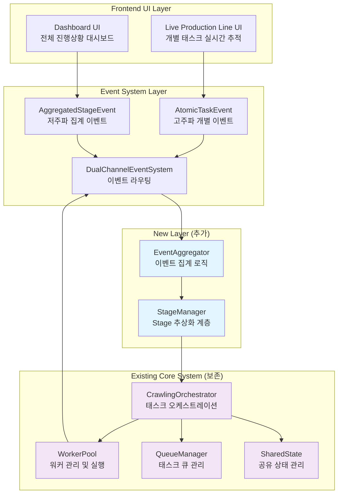

### 2.2 핵심 원칙

1. **기존 코드 보존**: 잘 작동하는 CrawlingOrchestrator, WorkerPool, EventEmitter 유지
2. **Live Production Line UI 우선**: 개별 태스크 추적 기능 절대 훼손 금지
3. **점진적 개선**: 기존 시스템에 새로운 레이어 추가하는 방식
4. **검증 주도**: 각 개선사항을 통합 테스트로 검증

### 2.3 구체적 개선 계획

#### Phase 1: Stage 추상화 레이어 추가 (기존 시스템 위에)

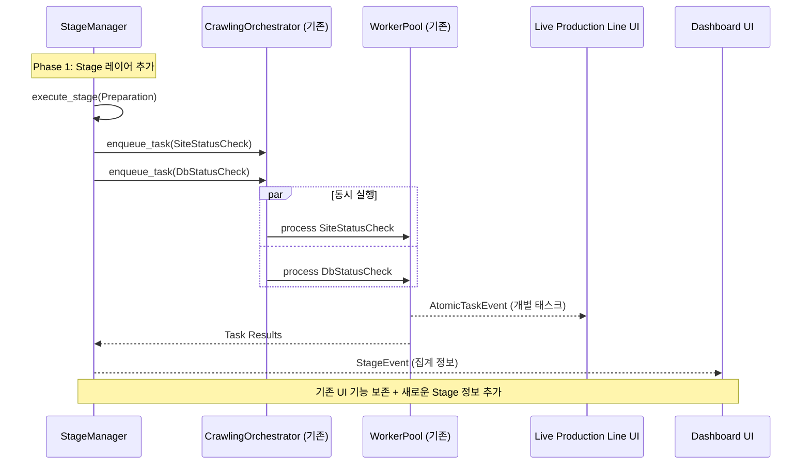

기존 CrawlingOrchestrator는 그대로 두고, 상위에 Stage 관리 레이어를 추가:

```rust
// 새로 추가: 기존 시스템을 래핑하는 Stage 레이어
pub struct StageManager {
    orchestrator: Arc<CrawlingOrchestrator>,  // 기존 시스템 활용
    stage_events: mpsc::Sender<StageEvent>,   // re-arch.md 제안 적용
    current_stage: Arc<RwLock<CrawlingStage>>,
}

pub enum CrawlingStage {
    Preparation,     // 사이트/DB 상태 체크
    Collection,      // 목록 페이지 수집
    Details,         // 상세 정보 수집
    Finalization,    // 정리 및 보고
}
```

**장점:**
- 기존 CrawlingOrchestrator의 정교한 태스크 관리 로직 보존
- Live Production Line UI의 개별 태스크 추적 기능 유지
- re-arch.md가 제안한 Stage 개념을 안전하게 도입

#### Phase 2: 이벤트 집계 채널 추가 (기존 EventEmitter와 공존)

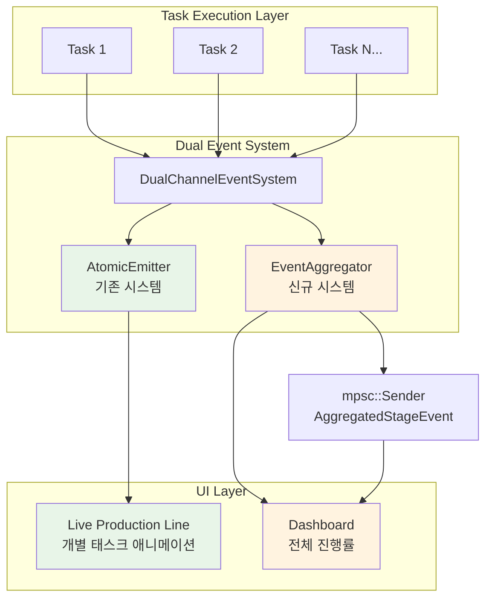

```rust
pub struct DualChannelEventSystem {
    // 기존: 고주파 개별 태스크 이벤트 (Live Production Line용)
    atomic_emitter: Arc<EventEmitter>,  // 보존
    
    // 신규: 저주파 집계 이벤트 (대시보드용)
    stage_sender: mpsc::Sender<AggregatedStageEvent>,
    
    // 이벤트 집계 로직
    aggregator: EventAggregator,
}

pub struct AggregatedStageEvent {
    stage: CrawlingStage,
    progress_percentage: f64,
    eta_seconds: u64,
    error_count: u32,
    throughput_per_minute: f64,
}
```

**장점:**
- Live Production Line UI: 기존 AtomicTaskEvent로 개별 태스크 애니메이션
- 대시보드 UI: 새로운 AggregatedStageEvent로 전체 진행 상황
- 두 시스템이 독립적으로 작동하여 안정성 보장

#### Phase 3: 수직적 슬라이스 검증 시스템

re-arch.md의 제안을 따라 핵심 시나리오의 End-to-End 테스트:

```rust
#[tokio::test]
async fn test_preparation_stage_vertical_slice() {
    // Given: StageManager 초기화
    let stage_manager = StageManager::new(orchestrator, event_channels);
    
    // When: Preparation Stage 실행
    let result = stage_manager.execute_stage(CrawlingStage::Preparation).await;
    
    // Then: 검증 조건들
    assert!(result.is_ok());
    assert_eq!(result.stage_duration < Duration::from_secs(30));
    assert_eq!(result.task_count, 2); // SiteCheck + DbCheck
    assert!(result.all_tasks_completed_concurrently);
    assert!(result.stage_events_fired_correctly);
}
```

### 2.4 마이그레이션 전략

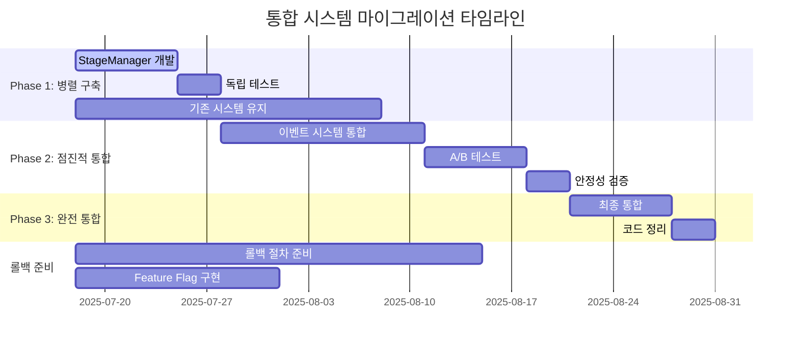

#### 단계 1: 병렬 시스템 구축 (1-2주)
- StageManager를 별도 모듈로 구현
- 기존 CrawlingOrchestrator와 독립적으로 테스트
- Live Production Line UI는 기존 이벤트 시스템 계속 사용

#### 단계 2: 점진적 통합 (2-3주)  
- 새로운 Stage 이벤트를 UI에 추가 (기존 이벤트와 공존)
- A/B 테스트로 새 시스템의 안정성 검증
- 문제 발견 시 기존 시스템으로 즉시 롤백 가능

#### 단계 3: 완전 통합 (1주)
- 두 시스템이 안정적으로 공존함을 확인 후
- 최종 통합 및 불필요한 코드 정리

## 3. 실제 구현 예시

### 3.1 StageManager 구현 아키텍처

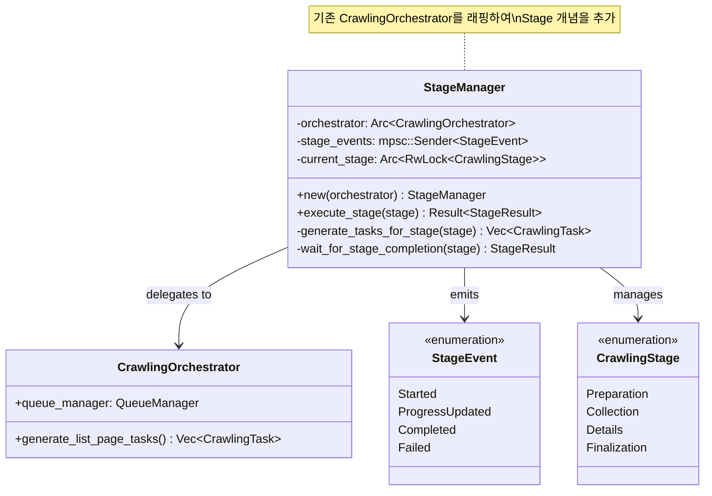

### 3.1 StageManager 구현

```rust
use crate::crawling::orchestrator::CrawlingOrchestrator;
use tokio::sync::mpsc;

pub struct StageManager {
    orchestrator: Arc<CrawlingOrchestrator>,
    stage_events: mpsc::Sender<StageEvent>,
    current_stage: Arc<RwLock<CrawlingStage>>,
}

impl StageManager {
    pub fn new(orchestrator: Arc<CrawlingOrchestrator>) -> Self {
        let (stage_sender, stage_receiver) = mpsc::channel(100);
        
        Self {
            orchestrator,
            stage_events: stage_sender,
            current_stage: Arc::new(RwLock::new(CrawlingStage::Preparation)),
        }
    }
    
    pub async fn execute_stage(&self, stage: CrawlingStage) -> Result<StageResult, StageError> {
        // 1. Stage 시작 이벤트 발행
        self.stage_events.send(StageEvent::Started { stage: stage.clone() }).await?;
        
        // 2. 기존 CrawlingOrchestrator에 작업 위임
        let tasks = self.generate_tasks_for_stage(&stage).await?;
        for task in tasks {
            self.orchestrator.queue_manager.enqueue_task(task).await?;
        }
        
        // 3. Stage 완료 대기 및 결과 집계
        let result = self.wait_for_stage_completion(&stage).await?;
        
        // 4. Stage 완료 이벤트 발행
        self.stage_events.send(StageEvent::Completed { 
            stage: stage.clone(), 
            result: result.clone() 
        }).await?;
        
        Ok(result)
    }
    
    async fn generate_tasks_for_stage(&self, stage: &CrawlingStage) -> Result<Vec<CrawlingTask>, StageError> {
        match stage {
            CrawlingStage::Preparation => Ok(vec![
                CrawlingTask::SiteStatusCheck { /* ... */ },
                CrawlingTask::DbStatusCheck { /* ... */ },
            ]),
            CrawlingStage::Collection => {
                // 기존 orchestrator의 로직 활용
                self.orchestrator.generate_list_page_tasks().await
            },
            // ... 기타 stage들
        }
    }
}
```

### 3.2 이중 채널 이벤트 시스템

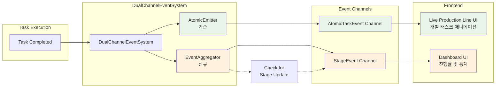

```rust
pub struct DualChannelEventSystem {
    // 기존 시스템 (보존)
    atomic_emitter: Arc<EventEmitter>,
    
    // 새로운 집계 시스템
    stage_aggregator: EventAggregator,
}

impl DualChannelEventSystem {
    pub async fn emit_task_started(&self, task_id: TaskId, task_type: String) {
        // 1. Live Production Line UI용 (기존)
        self.atomic_emitter.emit_task_started(task_id, task_type.clone()).await;
        
        // 2. 집계 시스템용 (신규)
        self.stage_aggregator.record_task_started(task_type).await;
    }
    
    pub async fn emit_task_completed(&self, task_id: TaskId, task_type: String, duration_ms: u64) {
        // 1. Live Production Line UI용 (기존)
        self.atomic_emitter.emit_task_completed(task_id, task_type.clone(), duration_ms).await;
        
        // 2. 집계 시스템용 (신규) 
        self.stage_aggregator.record_task_completed(task_type, duration_ms).await;
        
        // 3. 필요시 집계 이벤트 발행
        if let Some(aggregated) = self.stage_aggregator.check_for_stage_update().await {
            self.emit_stage_progress(aggregated).await;
        }
    }
}
```

## 4. 검증 계획

### 4.1 수직적 슬라이스 테스트 플로우

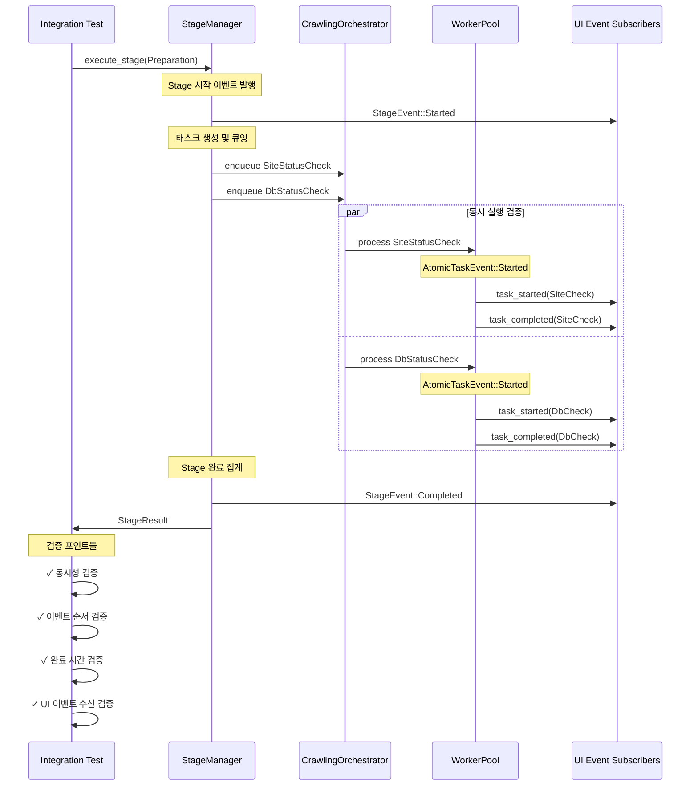

### 4.1 수직적 슬라이스 테스트

```rust
#[tokio::test]
async fn test_preparation_stage_end_to_end() {
    // Setup
    let system = IntegratedCrawlingSystem::new_for_test();
    let mut ui_events = system.subscribe_atomic_events();
    let mut stage_events = system.subscribe_stage_events();
    
    // Execute
    let stage_result = system.stage_manager
        .execute_stage(CrawlingStage::Preparation)
        .await
        .expect("Preparation stage should succeed");
    
    // Verify individual task events (Live Production Line UI)
    let atomic_events: Vec<_> = ui_events.collect_timeout(Duration::from_secs(30)).await;
    assert_eq!(atomic_events.len(), 4); // 2 started + 2 completed
    assert!(atomic_events.iter().any(|e| matches!(e, AtomicTaskEvent::Started { task_type, .. } if task_type == "SiteStatusCheck")));
    assert!(atomic_events.iter().any(|e| matches!(e, AtomicTaskEvent::Started { task_type, .. } if task_type == "DbStatusCheck")));
    
    // Verify stage events (Dashboard UI)
    let stage_events: Vec<_> = stage_events.collect_timeout(Duration::from_secs(30)).await;
    assert_eq!(stage_events.len(), 2); // Started + Completed
    assert!(matches!(stage_events[0], StageEvent::Started { stage: CrawlingStage::Preparation }));
    assert!(matches!(stage_events[1], StageEvent::Completed { stage: CrawlingStage::Preparation, .. }));
    
    // Verify concurrency
    let task_timings = extract_task_timings(&atomic_events);
    assert!(tasks_executed_concurrently(&task_timings), "SiteCheck and DbCheck should run concurrently");
    
    // Verify stage result
    assert_eq!(stage_result.tasks_completed, 2);
    assert_eq!(stage_result.tasks_failed, 0);
    assert!(stage_result.duration < Duration::from_secs(10));
}
```

### 4.2 성능 및 안정성 테스트

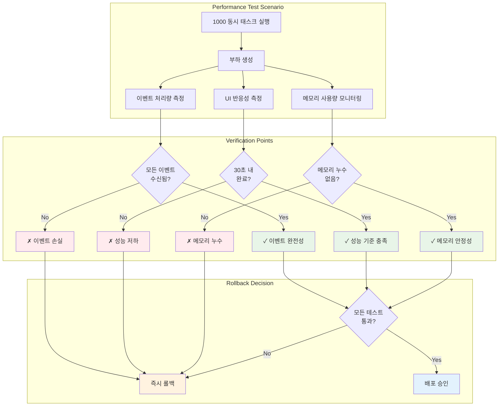

```rust
#[tokio::test]
async fn test_live_production_line_ui_performance() {
    // Live Production Line UI가 높은 이벤트 부하에서도 반응성 유지하는지 검증
    let system = IntegratedCrawlingSystem::new_for_test();
    
    // 1000개 동시 태스크 실행
    let tasks: Vec<_> = (0..1000).map(|i| create_mock_task(i)).collect();
    
    let start = Instant::now();
    for task in tasks {
        system.orchestrator.queue_manager.enqueue_task(task).await.unwrap();
    }
    
    // UI 이벤트 수신 성능 측정
    let mut ui_events = system.subscribe_atomic_events();
    let received_events = ui_events.collect_timeout(Duration::from_secs(60)).await;
    let elapsed = start.elapsed();
    
    // 검증: 모든 이벤트가 적시에 수신되었는가?
    assert_eq!(received_events.len(), 2000); // 1000 started + 1000 completed
    assert!(elapsed < Duration::from_secs(30), "UI events should be delivered within reasonable time");
    
    // 검증: 이벤트 순서가 보장되는가?
    verify_event_ordering(&received_events);
}
```

## 5. 위험 관리 및 롤백 계획

### 5.1 점진적 도입으로 위험 최소화

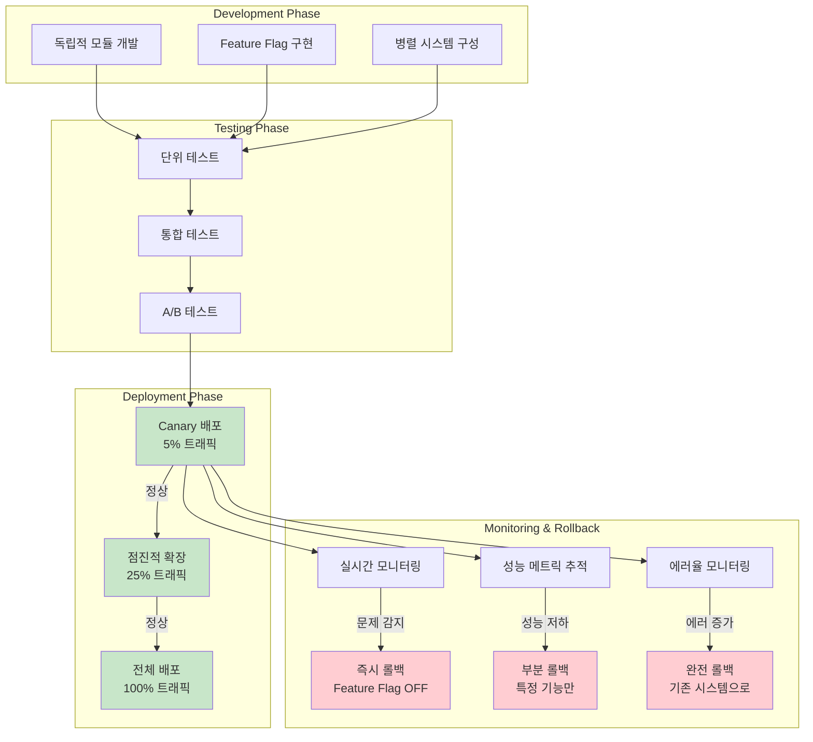

### 5.2 롤백 절차

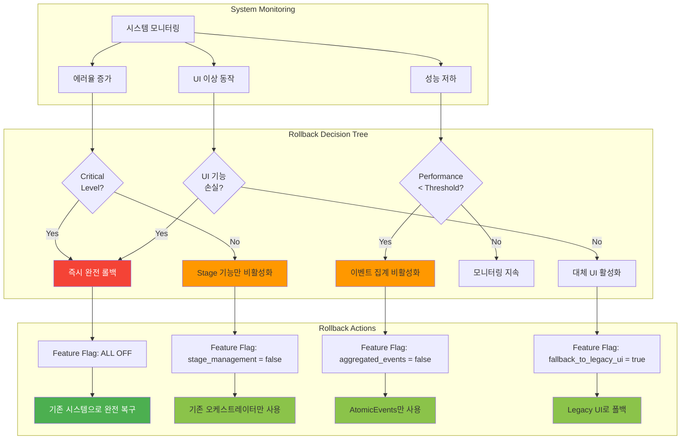

```rust
// Feature flag를 통한 즉시 롤백
pub struct SystemConfig {
    pub enable_stage_management: bool,  // 문제시 false로 설정
    pub enable_aggregated_events: bool, // 독립적으로 제어 가능
    pub fallback_to_legacy_ui: bool,    // 긴급시 기존 UI로 폴백
}

impl IntegratedCrawlingSystem {
    pub async fn execute_with_fallback(&self, session: CrawlingSession) -> Result<SessionResult, SystemError> {
        if self.config.enable_stage_management {
            // 새로운 Stage 기반 실행 시도
            match self.stage_manager.execute_session(session.clone()).await {
                Ok(result) => return Ok(result),
                Err(e) => {
                    warn!("Stage management failed, falling back to legacy: {}", e);
                    // 자동 롤백 후 아래 레거시 실행
                }
            }
        }
        
        // 기존 시스템으로 실행 (항상 작동 보장)
        self.orchestrator.execute_session(session).await
    }
}
```

## 6. 결론: 안전하고 점진적인 진화

### 6.1 통합 계획 요약

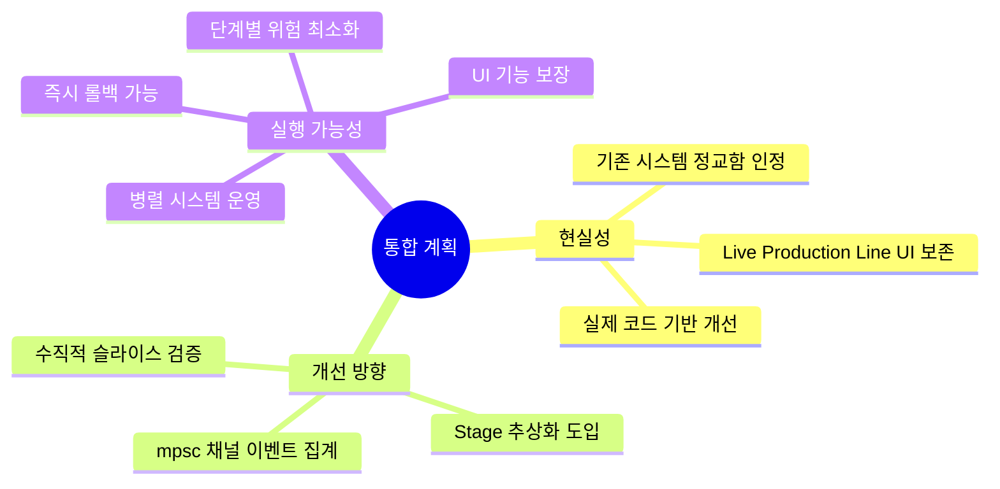

본 통합 계획은 두 문서의 장점을 결합하여:

### 6.2 re-arch-red.md의 현실성 반영
- ✅ 기존 시스템의 정교함 인정 및 보존
- ✅ Live Production Line UI 요구사항 최우선 고려
- ✅ 실제 코드 기반의 점진적 개선

### 6.3 re-arch.md의 개선 방향 수용
- ✅ Stage 추상화를 통한 구조적 명확성
- ✅ mpsc 채널을 활용한 이벤트 집계
- ✅ 수직적 슬라이스 검증으로 안정성 보장

### 6.4 실행 가능성 보장

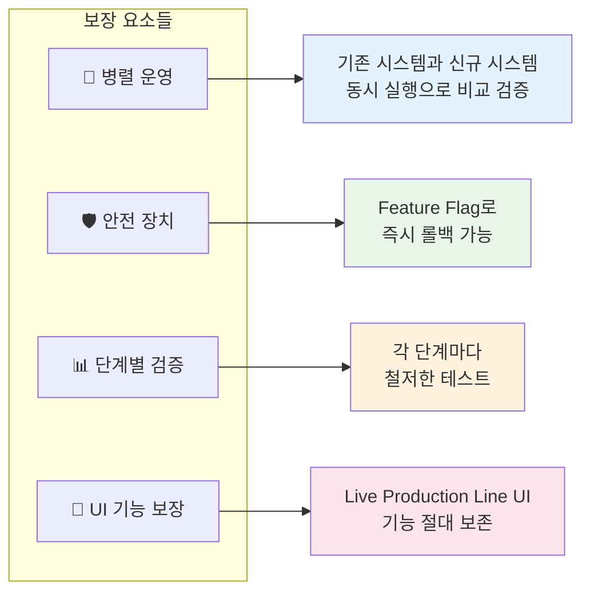

이 계획을 통해 현재 시스템의 강점은 보존하면서도, 아키텍처의 구조적 개선을 안전하게 달성할 수 있습니다.
