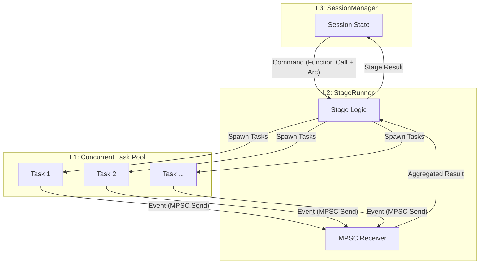

# 크롤링 아키텍처 개선 계획 (v3: 통합과 검증 중심의 실행 계획)

*본 문서는 v2 아키텍처를 기반으로, `re-arch-red.md`에서 제기된 '컴포넌트 파편화'와 '통합 실패' 문제를 해결하기 위한 구체적인 통합 메커니즘과 검증 방안을 제시합니다.*

## 1. 문제 재정의: 파편화된 기능과 통합의 실패

현재 시스템은 `re-arch-red.md`의 주장대로 개별 기능(상태 체크, DB 조회 등)들이 코드 상에 존재할 수는 있으나, 이들을 유기적으로 연결하고 조율하는 **'오케스트레이션(Orchestration) 계층'**이 부재하거나 오작동하고 있다. 이로 인해 Concurrency, 이벤트 발행 등 핵심 요구사항이 전혀 동작하지 않는, **'기능들의 단순한 집합'**에 머물러 있는 상태다.

**따라서 우리의 과제는 단순히 좋은 설계를 다시 구현하는 것이 아니라, "파편화된 컴포넌트들을 어떻게 신뢰성 있게 통합하고, 그 통합이 올바르게 동작함을 어떻게 증명할 것인가?" 입니다.**

---

## 2. 핵심 통합 전략: '오케스트레이션 계층'의 도입과 증명

`Session Manager` → `Stage Runner` → `Task`로 이어지는 계층 구조를 실질적으로 동작시키기 위해, 이들 사이의 상호작용을 책임지는 **'통합 메커니즘'**을 명확히 정의하고, **'수직적 슬라이스(Vertical Slice)'** 개발 방식을 통해 통합 자체를 조기에 검증합니다.

### 2.1. 통합 메커니즘: 컴포넌트를 연결하는 구체적인 방법

컴포넌트 간의 상호작용은 다음 두 가지 채널을 통해 이루어집니다.

1.  **명령 채널 (하향식):**
    *   **역할:** 상위 계층이 하위 계층에 작업을 지시하고, 필요한 데이터(설정, 상태 등)를 전달합니다.
    *   **구현:** Rust의 표준적인 `async` 함수 호출과 `struct` 파라미터를 사용합니다. 상위 계층의 상태는 `Arc<Mutex<SharedState>>`와 같은 동시성 안전 객체를 통해 하위 계층에 참조로 전달되어, 불필요한 데이터 복사를 피하고 일관성을 유지합니다.

2.  **이벤트/결과 채널 (상향식):**
    *   **역할:** 하위 계층(`Task`, `Stage`)이 자신의 작업 결과를 상위 계층으로 보고하고, 진행 상황 이벤트를 전파합니다.
    *   **구현:** Tokio의 `mpsc` (multi-producer, single-consumer) 채널을 사용합니다. 각 `Task`는 `mpsc::Sender`를 통해 자신의 상태(성공, 실패, 재시도)를 `Stage Runner`에게 비동기적으로 보냅니다. `Stage Runner`는 `mpsc::Receiver`를 통해 이 결과들을 수신하고 집계합니다.

**동작 흐름:**

### 2.2. 통합 검증 전략: '수직적 슬라이스' 프로토타이핑

모든 기능을 한 번에 개발하는 대신, **가장 핵심적인 하나의 시나리오를 처음부터 끝까지 완벽하게 동작하도록 먼저 개발하여 아키텍처 자체의 실행 가능성을 증명**합니다. 이는 통합 과정에서 발생할 수 있는 문제를 조기에 발견하고 해결하기 위함입니다.

**첫 번째 슬라이스 목표: "크롤링 준비 단계의 완벽한 구현 및 테스트"**

*   **범위:** `SessionManager`가 `Preparation` 스테이지를 시작하고, `PreparationStageRunner`가 `SiteStatusCheckTask`와 `DbStatusCheckTask`를 **동시에(concurrently)** 실행시킨 후, 그 결과를 **비동기 채널(mpsc)로** 받아 종합하여 `CrawlingRange`를 계산하고, 최종적으로 `SessionManager`의 상태를 업데이트하는 전 과정.
*   **성공 조건 (Test Case):**
    1.  `SessionManager`를 시작하면, `PreparationStageRunner`가 실행되는가?
    2.  두 개의 `CheckTask`가 **실제로 동시에** 실행되는가? (실행 시간에 기반한 테스트)
    3.  `CheckTask`가 `mpsc` 채널로 보낸 결과가 `StageRunner`에 정확히 수신되는가?
    4.  `StageRunner`가 수신된 결과를 바탕으로 올바른 `CrawlingRange`를 계산하는가?
    5.  전 과정에서 `StageChanged`, `StageProgressUpdated`, `StageCompleted` 이벤트가 순서대로, 정확한 데이터를 담아 발행되는가?

**이 슬라이스의 성공은 우리가 제안한 아키텍처와 통합 방식이 실제로 동작함을 증명하는 시금석이 될 것입니다.**

---

## 3. 개정된 구현 로드맵

1.  **(Phase 0) 통합 프로토타입 구축 및 검증:**
    *   **목표:** 위에 정의된 "크롤링 준비 단계" 수직적 슬라이스를 완벽하게 구현합니다.
    *   **산출물:**
        *   `PreparationStageRunner` 및 Mock `CheckTask` 구현.
        *   `Arc<Mutex<...>>`와 `mpsc` 채널을 사용한 통합 로직 구현.
        *   위 **성공 조건**을 모두 통과하는 **통합 테스트(Integration Test) 코드**.

2.  **(Phase 1) 핵심 컴포넌트 확장:**
    *   프로토타입을 통해 검증된 아키텍처 패턴을 바탕으로, 나머지 컴포넌트들을 구현합니다.
    *   `CollectionStageRunner`, 실제 `PageCrawlingTask` 등을 개발합니다.
    *   각 컴포넌트에 대한 **단위 테스트(Unit Test)** 를 작성하여 개별 기능의 안정성을 확보합니다.

3.  **(Phase 2) 전체 시스템 통합 및 테스트:**
    *   모든 `Stage`와 `Task`를 `SessionManager`에 연결하여 전체 크롤링 워크플로우를 완성합니다.
    *   End-to-End (E2E) 테스트를 통해 전체 시나리오의 안정성을 검증하고, 성능(Concurrency) 튜닝을 진행합니다.

---

## 4. 결론

이 접근 방식은 단순히 문서를 개선하는 것을 넘어, **'동작하는 소프트웨어'를 통해 아키텍처의 타당성을 증명**하는 데 초점을 맞춥니다. '수직적 슬라이스' 프로토타이핑을 통해 통합의 위험을 조기에 해소하고, 이후의 개발 과정에 대한 팀의 신뢰를 구축할 수 있습니다.

이제, 이 **v3 계획**에 따라 **Phase 0: 통합 프로토타입 구축**을 시작하는 것에 동의하십니까?