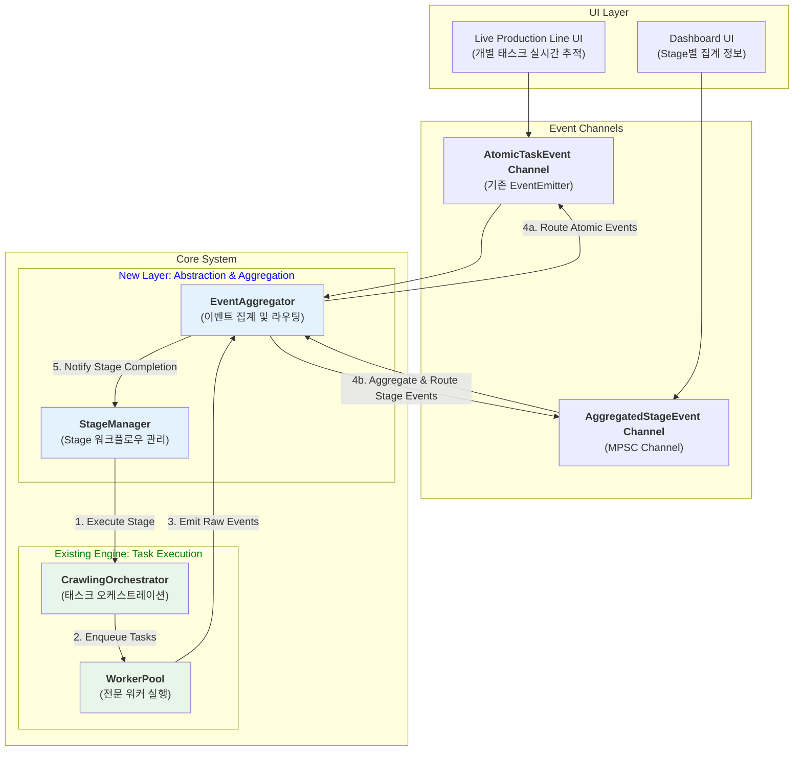
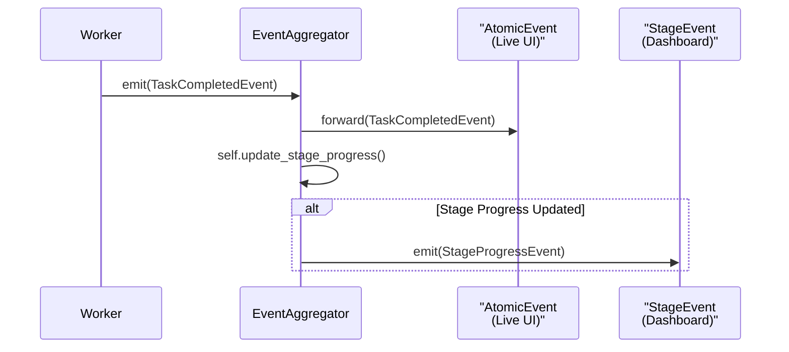

# Unified Architecture Blueprint: A Practical Guide to Evolving the Crawling Engine

*Filename: `guide/re-arch-by-gem.md`*

*본 문서는 `re-arch-gem.md`의 클린 아키텍처 원칙과 `re-arch-claude.md`의 실용적인 진화 전략을 통합한 최종 실행 계획입니다. 이 문서는 **'어떻게'** 구현할지에 대한 구체적인 청사진을 제공합니다.*

## 1. Executive Summary: The Unified Vision

우리의 목표는 **"기존의 정교하고 검증된 `CrawlingOrchestrator`와 `WorkerPool`의 안정성을 보존하면서, 그 위에 명확한 `Stage` 추상화 계층을 추가하여 시스템의 구조적 명확성을 높이고, 두 종류의 UI(실시간 태스크 추적, 집계 대시보드)를 모두 완벽하게 지원하는 것"** 입니다.

이를 위해 **'교체'가 아닌 '증축(Wrapping)'** 방식을 채택합니다. 새로운 `StageManager`는 기존 `Orchestrator`를 조율하는 지휘자 역할을 수행하며, 이중 채널 이벤트 시스템을 통해 UI 요구사항을 모두 만족시킵니다.

### High-Level Architecture Vision



---

## 2. Core Principles: The 'Why'

1.  **Preserve the Core:** `CrawlingOrchestrator`와 `WorkerPool`의 정교한 동시성 제어 및 태스크 관리 로직은 검증된 자산입니다. 이를 최대한 보존하여 리스크를 최소화합니다.
2.  **Evolve, Don't Replace:** 기존 시스템 위에 새로운 `StageManager` 레이어를 추가하여, 시스템의 복잡도를 점진적으로 개선하고 구조적 명확성을 확보합니다.
3.  **Dual UI Support:** 'Live Production Line'을 위한 고주파/개별 이벤트와 'Dashboard'를 위한 저주파/집계 이벤트를 동시에 지원하는 이중 채널 이벤트 시스템을 구축합니다. 이는 두 UI의 요구사항이 서로를 방해하지 않도록 보장합니다.
4.  **Test-Driven Integration:** 모든 새로운 통합 지점은 반드시 '수직적 슬라이스(Vertical Slice)' 통합 테스트를 통해 검증합니다. 코드가 아닌, **동작하는 테스트**가 아키텍처의 성공을 증명합니다.

---

## 3. Detailed Component Design: The 'How'

### 3.1. The New Abstraction Layer

#### `StageManager`: The Workflow Conductor

`StageManager`는 `CrawlingOrchestrator`를 직접 호출하여 특정 스테이지에 필요한 태스크들을 실행시키고, `EventAggregator`로부터 스테이지 완료 신호를 기다리는 역할을 합니다.

```rust
// src-tauri/src/application/stages/manager.rs
use async_trait::async_trait;

// StageRunner Trait: 모든 스테이지가 구현해야 할 인터페이스
#[async_trait]
pub trait StageRunner: Send + Sync {
    fn name(&self) -> String;
    async fn run(&self, context: AppContext, orchestrator: Arc<CrawlingOrchestrator>) -> Result<(), anyhow::Error>;
}

// StageManager: StageRunner들을 순서대로 실행
pub struct StageManager {
    stages: Vec<Box<dyn StageRunner>>,
    orchestrator: Arc<CrawlingOrchestrator>,
    event_aggregator: Arc<EventAggregator>,
}

impl StageManager {
    pub async fn execute_workflow(&self) {
        for stage in &self.stages {
            // 1. 스테이지 실행을 위임
            stage.run(self.context.clone(), self.orchestrator.clone()).await;
            // 2. EventAggregator로부터 스테이지 완료/실패 이벤트를 기다림
            self.event_aggregator.wait_for_stage_completion(stage.name()).await;
        }
    }
}
```

#### `EventAggregator`: The Central Post Office

모든 `Worker`로부터 오는 원시(raw) `AtomicTaskEvent`를 수신하여, 두 개의 다른 채널로 라우팅하고 집계하는 핵심 컴포넌트입니다.



```rust
// src-tauri/src/application/events/aggregator.rs
pub struct EventAggregator {
    atomic_emitter: Arc<EventEmitter>, // 기존 시스템 (고주파)
    stage_event_tx: mpsc::Sender<StageEvent>, // 신규 채널 (저주파)
    // ... stage별 진행 상황을 추적하는 내부 상태 ...
}

impl EventAggregator {
    // 이 메소드는 기존 WorkerPool에서 호출됩니다.
    pub async fn handle_raw_event(&self, event: AtomicTaskEvent) {
        // 1. 고주파 채널로 즉시 전달 (Live UI 용)
        self.atomic_emitter.emit(event.clone()).await;

        // 2. 내부 상태를 업데이트하고, 필요시 저주파/집계 이벤트 발행
        self.update_and_aggregate(event).await;
    }

    async fn update_and_aggregate(&self, event: AtomicTaskEvent) {
        // ... event 내용에 따라 내부 Stage 진행률 업데이트 ...
        // if progress > 5% increment or 1s passed
        //     self.stage_event_tx.send(AggregatedEvent).await;
        // end
    }
}
```

---

## 4. Implementation & Verification Plan: The 'When'

### Phase 1: Build and Verify the `EventAggregator`

가장 먼저, 기존 시스템과 UI에 영향을 주지 않는 `EventAggregator`를 구축하고 테스트합니다. 기존 `WorkerPool`이 발행하는 이벤트를 `EventAggregator`가 수신하여, 새로운 `mpsc` 채널로 집계된 이벤트를 정확히 발행하는지 검증합니다.

### Phase 2: The First Vertical Slice: "Preparation Stage"

`re-arch-claude.md`의 제안대로, 첫 번째 스테이지를 완벽하게 구현하여 아키텍처를 증명합니다.

**Test Scenario: `PreparationStageRunner`**

```mermaid
graph TD
    A[Test Starts] --> B(1. `PreparationStageRunner.run()`)
    B --> C{2. `Orchestrator.enqueue_task()` 호출<br/>(SiteStatusCheck, DbStatusCheck)}
    C --> D{3. `WorkerPool`이 태스크 실행}
    D --> E{4. `EventAggregator`가<br/>`TaskCompleted` 이벤트 2개 수신}
    subgraph Verification
        E --> F[5a. `AtomicChannel`로<br/>이벤트 2개 전달되었는가?]
        E --> G[5b. `StageChannel`로<br/>`StageCompleted` 이벤트 1개 전달되었는가?]
    end
```

**성공 조건:**
1.  `PreparationStageRunner`가 `Orchestrator`에 정확한 태스크 2개를 큐잉하는가?
2.  `EventAggregator`가 `AtomicChannel`과 `StageChannel` 양쪽으로 정확한 이벤트를 발행하는가?
3.  두 태스크가 **동시에** 실행되었는가? (이벤트 타임스탬프 기반으로 검증)

### Phase 3: Expand to Other Stages & Gradual Rollout

`Preparation` 스테이지의 성공적인 검증 이후, 동일한 패턴을 `Collection`, `Details` 등 다른 스테이지로 확장합니다. UI 표시는 Feature Flag를 통해 점진적으로 사용자에게 노출하여 안정성을 확보합니다.

---

## 5. Conclusion: A Synthesis of Vision and Pragmatism

이 통합 청사진은 다음과 같은 장점을 가집니다:

*   **Pragmatism (`claude.md`):** 검증된 기존 엔진을 보존하여 리스크를 최소화하고, 'Live Production Line' UI의 연속성을 보장합니다.
*   **Clean Architecture (`gem.md`):** `Stage`라는 새로운 추상화 계층을 `trait`과 명확한 책임 분리를 통해 도입하여, 시스템의 장기적인 유지보수성과 확장성을 확보합니다.
*   **Verifiability:** 모든 새로운 기능은 '수직적 슬라이스' 통합 테스트를 통해 검증되므로, **'동작하는 소프트웨어'**를 통해 아키텍처의 진화를 증명합니다.

이 계획은 두 비전의 강점을 결합하여, 현재의 자산을 기반으로 더 나은 미래를 구축하는 가장 안전하고 효율적인 경로입니다.