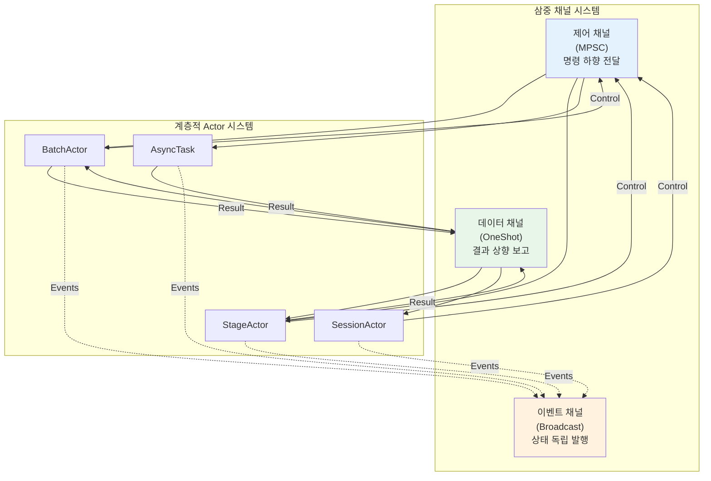
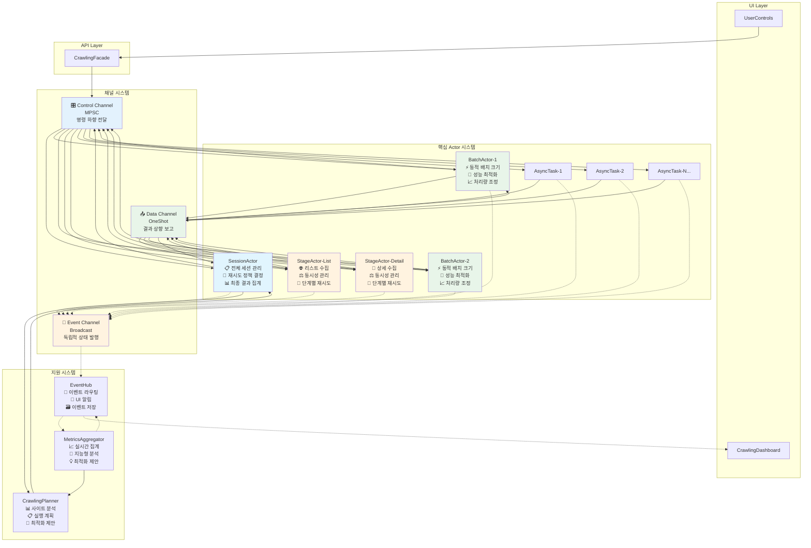

# 최종 실행 계획 v6: 완전 회복탄력성 및 데이터 흐름 통합 아키텍처

> 본 문서는 `re-arch-plan2.md`의 계층적 Actor 모델과 `re-arch-plan-r-gem.md`의 회복탄력성 설계를 완전히 통합하여, **구현 가능한 최종 청사진**을 제시합니다. 이제 구조적 틈새가 완전히 메워진 production-ready 아키텍처입니다.

## 1. 통합 아키텍처 혁신: 삼중 채널 시스템

### 1.1 기존 설계의 최종 보완점

`re-arch-plan2.md`와 `re-arch-plan-r-gem.md`를 종합 분석한 결과, 다음과 같은 **구조적 완성도**를 확보했습니다:

#### 1.1.1 완전한 채널 분리 체계



#### 1.1.2 핵심 혁신 사항

1. **제어-데이터-이벤트 완전 분리**: 각 채널이 고유한 목적과 생명주기를 가짐
2. **Request-Response + Actor 패턴**: Oneshot 채널을 통한 명확한 결과 반환
3. **회복탄력성 내장**: 모든 레벨에서 재시도, 복구, 부분 실패 허용
4. **독립적 이벤트 발행**: UI 피드백과 제어 로직의 완전한 분리

### 1.2 최종 시스템 아키텍처



## 2. 핵심 컴포넌트 최종 설계

### 2.1 통합 채널 정의

> **🦀 Modern Rust 2024 준수 필수**: 모든 채널 구현은 `mod.rs` 사용 금지! 각 채널별 개별 파일로 구성하고, Clippy 권고사항을 100% 준수해야 합니다.

```rust
// src-tauri/src/new_architecture/channels/types.rs
//! 삼중 채널 시스템: 제어, 데이터, 이벤트의 완전한 분리
//! Modern Rust 2024 준수: mod.rs 사용 금지, 명확한 파일 단위 분리

use tokio::sync::{mpsc, oneshot, broadcast, watch};
use uuid::Uuid;

/// 제어 채널: 명령 하향 전달 (MPSC)
pub type ControlChannel<T> = mpsc::Sender<T>;
pub type ControlReceiver<T> = mpsc::Receiver<T>;

/// 데이터 채널: 결과 상향 보고 (OneShot)
pub type DataChannel<T> = oneshot::Sender<T>;
pub type DataReceiver<T> = oneshot::Receiver<T>;

/// 이벤트 채널: 독립적 상태 발행 (Broadcast)
pub type EventChannel<T> = broadcast::Sender<T>;
pub type EventReceiver<T> = broadcast::Receiver<T>;

/// 취소 신호 채널 (Watch)
pub type CancellationChannel = watch::Sender<bool>;
pub type CancellationReceiver = watch::Receiver<bool>;

/// 통합 컨텍스트: 모든 채널을 포함
#[derive(Clone)]
pub struct IntegratedContext {
    pub session_id: String,
    pub batch_id: Option<String>,
    pub stage_id: Option<String>,
    pub task_id: Option<String>,
    
    // 채널들
    pub control_tx: ControlChannel<ActorCommand>,
    pub event_tx: EventChannel<AppEvent>,
    pub cancellation_rx: CancellationReceiver,
    
    // 설정
    pub config: Arc<SystemConfig>,
    pub retry_policy: RetryPolicy,
}

impl IntegratedContext {
    /// 하위 컨텍스트 생성
    pub fn with_batch(&self, batch_id: String) -> Self {
        Self {
            batch_id: Some(batch_id),
            ..self.clone()
        }
    }
    
    pub fn with_stage(&self, stage_id: String) -> Self {
        Self {
            stage_id: Some(stage_id),
            ..self.clone()
        }
    }
    
    pub fn with_task(&self, task_id: String) -> Self {
        Self {
            task_id: Some(task_id),
            ..self.clone()
        }
    }
}
```

### 2.2 회복탄력성 결과 시스템

> **🦀 Modern Rust 2024 필수 준수**: Error handling은 `thiserror` 크레이트 사용, `anyhow::Error` 대신 구체적 타입 정의 필수!

```rust
// src-tauri/src/new_architecture/results/stage_result.rs
//! 모든 단계의 실행 결과를 처리하는 회복탄력성 시스템
//! Modern Rust 2024 준수: mod.rs 금지, thiserror 사용, 구체적 Error 타입

use std::time::Duration;
use thiserror::Error;

/// 모든 Stage의 실행 결과를 담는 통합 열거형
/// Modern Rust 2024: Error는 thiserror로 구체적 타입 정의
#[derive(Debug, Clone)]
pub enum StageResult {
    /// 성공 결과들
    Success(StageSuccessResult),
    
    /// 복구 가능한 오류 (재시도 대상)
    RecoverableError {
        error: StageError, // anyhow::Error 대신 구체적 타입
        attempts: u32,
        stage_id: String,
        suggested_retry_delay: Duration,
    },
    
    /// 복구 불가능한 오류 (즉시 실패 처리)
    FatalError {
        error: StageError, // anyhow::Error 대신 구체적 타입
        stage_id: String,
        context: String,
    },
    
    /// 부분 성공 (일부 항목 성공, 일부 실패)
    PartialSuccess {
        success_items: StageSuccessResult,
        failed_items: Vec<FailedItem>,
        stage_id: String,
    },
}

/// Modern Rust 2024: thiserror 사용한 구체적 Error 타입 정의
#[derive(Error, Debug, Clone)]
pub enum StageError {
    #[error("Network timeout: {message}")]
    NetworkTimeout { message: String },
    
    #[error("Server error {status}: {message}")]
    ServerError { status: u16, message: String },
    
    #[error("Rate limit exceeded: {retry_after:?}")]
    RateLimit { retry_after: Option<Duration> },
    
    #[error("Parse error: {message}")]
    ParseError { message: String },
    
    #[error("Database error: {message}")]
    DatabaseError { message: String },
    
    #[error("Validation error: {message}")]
    ValidationError { message: String },
}

#[derive(Debug, Clone)]
pub enum StageSuccessResult {
    ListCollection {
        collected_urls: Vec<String>,
        total_pages: u32,
        successful_pages: Vec<u32>,
        failed_pages: Vec<u32>,
        collection_metrics: CollectionMetrics,
    },
    
    DetailCollection {
        processed_products: Vec<ProductInfo>,
        successful_urls: Vec<String>,
        failed_urls: Vec<String>,
        processing_metrics: ProcessingMetrics,
    },
    
    DataValidation {
        validated_products: Vec<ValidatedProduct>,
        validation_errors: Vec<ValidationError>,
        validation_metrics: ValidationMetrics,
    },
    
    DatabaseSave {
        saved_count: u64,
        failed_count: u64,
        save_metrics: SaveMetrics,
    },
}

/// 재시도 정책 (설정 기반으로 완전히 구성 가능)
#[derive(Debug, Clone, Serialize, Deserialize)]
pub struct RetryPolicy {
    pub max_attempts: u32,
    pub base_delay_ms: u64,
    pub max_delay_ms: u64,
    pub backoff_multiplier: f64,
    pub jitter_range_ms: u64,
    pub retry_on_errors: Vec<RetryableErrorType>,
}

#[derive(Debug, Clone, Serialize, Deserialize)]
pub enum RetryableErrorType {
    NetworkTimeout,
    ServerError { status_range: (u16, u16) },
    RateLimit,
    ParseError,
    ValidationTimeout,
    DatabaseConnection,
    DatabaseTimeout,
    DatabaseLock,
}

impl RetryPolicy {
    /// 설정에서 Stage별 재시도 정책 로드
    pub fn from_config(config: &SystemConfig, stage_type: StageType) -> Self {
        match stage_type {
            StageType::ListCollection => config.retry_policies.list_collection.clone(),
            StageType::DetailCollection => config.retry_policies.detail_collection.clone(),
            StageType::DataValidation => config.retry_policies.data_validation.clone(),
            StageType::DatabaseSave => config.retry_policies.database_save.clone(),
        }
    }
    
    /// Duration 변환 헬퍼
    pub fn base_delay(&self) -> Duration {
        Duration::from_millis(self.base_delay_ms)
    }
    
    pub fn max_delay(&self) -> Duration {
        Duration::from_millis(self.max_delay_ms)
    }
    
    pub fn jitter_range(&self) -> Duration {
        Duration::from_millis(self.jitter_range_ms)
    }
}
```

### 2.3 진화된 SessionActor (데이터 채널 통합)

> **🦀 Modern Rust 2024 강제 적용**: Actor 구현 시 `mod.rs` 절대 금지! 각 Actor는 개별 파일로 분리. `#[must_use]`, `clippy::all` 활성화 필수!

```rust
// src-tauri/src/new_architecture/actors/session_actor.rs
//! 데이터 채널을 통합한 최종 SessionActor
//! Modern Rust 2024 준수: mod.rs 금지, clippy::all 활성화, explicit error types

#![warn(clippy::all, clippy::pedantic, clippy::nursery)]
#![deny(clippy::unwrap_used, clippy::expect_used)]

use std::collections::HashMap;
use tokio::sync::{mpsc, oneshot};

pub struct SessionActor {
    id: String,
    context: IntegratedContext,
    planner: Arc<CrawlingPlanner>,
    batch_actors: HashMap<String, BatchActorHandle>,
    session_state: SessionState,
}

#[derive(Debug)]
struct BatchActorHandle {
    control_tx: ControlChannel<ActorCommand>,
    data_rx: DataReceiver<StageResult>,
    join_handle: tokio::task::JoinHandle<crate::Result<()>>,
    batch_state: BatchState,
}

#[derive(Debug, Clone)]
enum SessionState {
    Initializing,
    Analyzing,
    Planning,
    Executing { batches_active: u32, batches_completed: u32 },
    Paused { reason: String },
    Completing,
    Completed { final_result: SessionResult },
    Failed { error: String },
}

impl SessionActor {
    /// 🎯 설정 기반 Request-Response 패턴으로 BatchActor 관리
    async fn spawn_batch_actor(
        &mut self,
        batch_id: String,
        batch_plan: BatchPlan,
    ) -> crate::Result<()> {
        // 1. 설정에서 채널 크기 로드
        let control_buffer_size = self.context.config.channels.control_buffer_size;
        let (control_tx, control_rx) = mpsc::channel(control_buffer_size);
        let (data_tx, data_rx) = oneshot::channel();
        
        // 2. 설정 주입한 BatchActor 생성
        let mut batch_actor = BatchActor::new(
            batch_id.clone(),
            self.context.with_batch(batch_id.clone()),
        );
        
        let join_handle = tokio::spawn(async move {
            batch_actor.run(control_rx, data_tx).await
        });
        
        // 3. 핸들 저장
        self.batch_actors.insert(batch_id.clone(), BatchActorHandle {
            control_tx,
            data_rx,
            join_handle,
            batch_state: BatchState::Pending,
        });
        
        // 4. 설정 기반 명령 전송
        let initial_batch_size = self.context.config.performance.batch_sizes.initial_size;
        let concurrency_limit = self.context.config.performance.concurrency
            .stage_concurrency_limits
            .get("batch_processing")
            .copied()
            .unwrap_or(10);
            
        self.batch_actors.get(&batch_id).unwrap()
            .control_tx.send(ActorCommand::ProcessBatch {
                pages: batch_plan.pages,
                config: batch_plan.config,
                batch_size: initial_batch_size,
                concurrency_limit,
            }).await?;
        
        Ok(())
    }
    
    /// 🚀 설정 기반 배치 결과 대기 및 집계
    async fn wait_for_all_batches(&mut self) -> crate::Result<SessionResult> {
        let mut batch_results = HashMap::new();
        let mut completed_batches = 0;
        let total_batches = self.batch_actors.len();
        
        // 설정에서 타임아웃과 폴링 간격 로드
        let session_timeout = Duration::from_secs(self.context.config.system.session_timeout_secs);
        let polling_interval_ms = self.context.config.monitoring.metrics_interval_secs * 1000 / 20;
        let polling_interval = Duration::from_millis(polling_interval_ms);
        
        let start_time = std::time::Instant::now();
        
        while completed_batches < total_batches {
            // 세션 레벨 타임아웃 체크
            if start_time.elapsed() > session_timeout {
                self.emit_event(AppEvent::SessionTimeout {
                    session_id: self.id.clone(),
                    elapsed: start_time.elapsed(),
                }).await?;
                break;
            }
            
            for (batch_id, handle) in &mut self.batch_actors {
                if matches!(handle.batch_state, BatchState::Pending | BatchState::Running) {
                    match handle.data_rx.try_recv() {
                        Ok(result) => {
                            batch_results.insert(batch_id.clone(), result.clone());
                            handle.batch_state = BatchState::Completed;
                            completed_batches += 1;
                            
                            // 설정 기반 결과 처리
                            self.handle_batch_result_with_config(batch_id, result).await?;
                        }
                        Err(oneshot::error::TryRecvError::Empty) => continue,
                        Err(oneshot::error::TryRecvError::Closed) => {
                            handle.batch_state = BatchState::Failed;
                            completed_batches += 1;
                        }
                    }
                }
            }
            
            tokio::time::sleep(polling_interval).await;
        }
        
        Ok(self.aggregate_session_result(batch_results).await?)
    }
    
    /// 설정 기반 배치 결과 처리
    async fn handle_batch_result_with_config(
        &mut self,
        batch_id: &str,
        result: StageResult,
    ) -> crate::Result<()> {
        match result {
            StageResult::Success(success_result) => {
                self.emit_event(AppEvent::BatchCompleted {
                    batch_id: batch_id.to_string(),
                    success_result,
                }).await?;
            }
            
            StageResult::RecoverableError { error, attempts, stage_id, .. } => {
                // 설정에서 해당 스테이지의 재시도 정책 동적 로드
                let retry_policy = self.get_retry_policy_for_stage(&stage_id);
                
                if attempts < retry_policy.max_attempts {
                    let delay = self.calculate_retry_delay(&retry_policy, attempts);
                    tokio::time::sleep(delay).await;
                    self.retry_batch_with_config(batch_id, attempts + 1).await?;
                } else {
                    self.emit_event(AppEvent::BatchFailed {
                        batch_id: batch_id.to_string(),
                        error: error.to_string(),
                        final_failure: true,
                    }).await?;
                }
            }
            
            StageResult::FatalError { error, .. } => {
                // 설정 기반 전체 세션 중단 여부 결정
                if self.should_abort_session_per_config(&error) {
                    self.cancel_all_batches().await?;
                    return Err(crate::Error::SessionAborted(error.to_string()));
                } else {
                    self.emit_event(AppEvent::BatchFailed {
                        batch_id: batch_id.to_string(),
                        error: error.to_string(),
                        final_failure: true,
                    }).await?;
                }
            }
            
            StageResult::PartialSuccess { success_items, failed_items, .. } => {
                self.handle_partial_success_with_config(batch_id, success_items, failed_items).await?;
            }
        }
        
        Ok(())
    }
    
    /// 설정에서 스테이지별 재시도 정책 동적 로드
    fn get_retry_policy_for_stage(&self, stage_id: &str) -> &RetryPolicy {
        match stage_id {
            id if id.contains("list") => &self.context.config.retry_policies.list_collection,
            id if id.contains("detail") => &self.context.config.retry_policies.detail_collection,
            id if id.contains("validation") => &self.context.config.retry_policies.data_validation,
            id if id.contains("save") => &self.context.config.retry_policies.database_save,
            _ => &self.context.config.retry_policies.list_collection, // 기본값
        }
    }
    
    /// 설정 기반 재시도 지연 계산 (Exponential Backoff + Jitter)
    fn calculate_retry_delay(&self, policy: &RetryPolicy, attempt: u32) -> Duration {
        let base_delay = policy.base_delay();
        let exponential_delay = Duration::from_millis(
            (base_delay.as_millis() as f64 * policy.backoff_multiplier.powi(attempt as i32 - 1)) as u64
        );
        
        let capped_delay = std::cmp::min(exponential_delay, policy.max_delay());
        
        // 설정된 범위에서 Jitter 추가
        let jitter = Duration::from_millis(
            fastrand::u64(0..=policy.jitter_range_ms)
        );
        
        capped_delay + jitter
    }
    
    /// 설정 기반 세션 중단 여부 판단
    fn should_abort_session_per_config(&self, error: &StageError) -> bool {
        match error {
            StageError::DatabaseError { .. } => {
                // 설정: 데이터베이스 오류 시 세션 중단 여부
                self.context.config.system.abort_on_database_error.unwrap_or(false)
            }
            StageError::ValidationError { .. } => {
                // 설정: 검증 오류 시 세션 중단 여부
                self.context.config.system.abort_on_validation_error.unwrap_or(false)
            }
            _ => false, // 기본적으로는 계속 진행
        }
    }
                        }
                        Err(oneshot::error::TryRecvError::Empty) => {
                            // 아직 결과가 오지 않음, 계속 대기
                            continue;
                        }
                        Err(oneshot::error::TryRecvError::Closed) => {
                            // 채널이 닫힘, 오류 처리
                            handle.batch_state = BatchState::Failed;
                            completed_batches += 1;
                        }
                    }
                }
            }
            
            // 짧은 대기
            tokio::time::sleep(Duration::from_millis(100)).await;
        }
        
        // 최종 결과 집계
        Ok(self.aggregate_session_result(batch_results).await?)
    }
    
    /// 배치 결과에 따른 세션 수준 의사결정
    async fn handle_batch_result(
        &mut self,
        batch_id: &str,
        result: StageResult,
    ) -> crate::Result<()> {
        match result {
            StageResult::Success(success_result) => {
                self.emit_event(AppEvent::BatchCompleted {
                    batch_id: batch_id.to_string(),
                    success_result,
                }).await?;
            }
            
            StageResult::RecoverableError { error, attempts, .. } => {
                // 세션 수준 재시도 정책 확인
                if attempts < self.context.retry_policy.max_attempts {
                    // 배치 재시도
                    self.retry_batch(batch_id, attempts + 1).await?;
                } else {
                    // 최대 재시도 초과, 해당 배치 포기하고 계속 진행
                    self.emit_event(AppEvent::BatchFailed {
                        batch_id: batch_id.to_string(),
                        error: error.to_string(),
                        final_failure: true,
                    }).await?;
                }
            }
            
            StageResult::FatalError { error, .. } => {
                // 치명적 오류: 전체 세션 중단 여부 결정
                if self.should_abort_session(&error) {
                    self.cancel_all_batches().await?;
                    return Err(error);
                } else {
                    // 해당 배치만 포기하고 계속
                    self.emit_event(AppEvent::BatchFailed {
                        batch_id: batch_id.to_string(),
                        error: error.to_string(),
                        final_failure: true,
                    }).await?;
                }
            }
            
            StageResult::PartialSuccess { success_items, failed_items, .. } => {
                // 부분 성공: 성공한 부분은 다음 단계로, 실패한 부분은 재시도 또는 포기
                self.handle_partial_success(batch_id, success_items, failed_items).await?;
            }
        }
        
        Ok(())
    }
}
```

### 2.4 완전한 BatchActor (데이터 채널 포함)

> **🦀 Modern Rust 2024 필수 준수**: 모든 `unwrap()`, `expect()` 사용 금지! Result 타입으로 명시적 에러 처리만 허용!

```rust
// src-tauri/src/new_architecture/actors/batch_actor.rs
//! 데이터 채널을 통합한 최종 BatchActor
//! Modern Rust 2024 준수: unwrap/expect 금지, explicit error handling

#![warn(clippy::all, clippy::pedantic)]
#![deny(clippy::unwrap_used, clippy::expect_used, clippy::panic)]

impl BatchActor {
    /// 🎯 설정 기반 Request-Response 패턴으로 StageActor 실행
    pub async fn run(
        &mut self,
        mut control_rx: ControlReceiver<ActorCommand>,
        session_data_tx: DataChannel<StageResult>,
    ) -> crate::Result<()> {
        
        let mut stage_results = Vec::new();
        
        while let Some(command) = control_rx.recv().await {
            match command {
                ActorCommand::ProcessBatch { pages, config, batch_size, concurrency_limit } => {
                    // 설정된 배치 크기와 동시성 제한 적용
                    let chunks: Vec<_> = pages.chunks(batch_size as usize).collect();
                    
                    for chunk in chunks {
                        let list_result = self.execute_list_collection_stage_with_config(
                            chunk.to_vec(), 
                            concurrency_limit
                        ).await;
                        
                        match list_result {
                            StageResult::Success(StageSuccessResult::ListCollection { collected_urls, .. }) => {
                                // 설정 기반 상세 수집 실행
                                let detail_concurrency = self.context.config.performance.concurrency
                                    .stage_concurrency_limits
                                    .get("detail_collection")
                                    .copied()
                                    .unwrap_or(20);
                                    
                                let detail_result = self.execute_detail_collection_stage_with_config(
                                    collected_urls, 
                                    detail_concurrency
                                ).await;
                                
                                stage_results.push(detail_result.clone());
                                
                                if let Err(_) = session_data_tx.send(detail_result) {
                                    eprintln!("Failed to send result to SessionActor");
                                }
                            }
                            
                            recoverable_or_fatal_error => {
                                if let Err(_) = session_data_tx.send(recoverable_or_fatal_error) {
                                    eprintln!("Failed to send error to SessionActor");
                                }
                                break;
                            }
                        }
                    }
                }
                
                ActorCommand::CancelSession { .. } => {
                    let cancel_result = StageResult::FatalError {
                        error: StageError::ValidationError { 
                            message: "Batch cancelled by user".to_string() 
                        },
                        stage_id: self.id.clone(),
                        context: "User cancellation".to_string(),
                    };
                    
                    let _ = session_data_tx.send(cancel_result);
                    break;
                }
                
                _ => {
                    // 다른 명령들 처리
                }
            }
        }
        
        Ok(())
    }
    
    /// 설정 기반 리스트 수집 단계 실행
    async fn execute_list_collection_stage_with_config(
        &mut self,
        pages: Vec<u32>,
        concurrency_limit: u32,
    ) -> StageResult {
        // 설정에서 채널 크기와 타임아웃 로드
        let control_buffer_size = self.context.config.channels.control_buffer_size;
        let stage_timeout = Duration::from_secs(
            self.context.config.system.stage_timeout_secs.unwrap_or(300)
        );
        
        let (control_tx, control_rx) = mpsc::channel(control_buffer_size);
        let (data_tx, data_rx) = oneshot::channel();
        
        let mut stage_actor = StageActor::new(
            format!("{}-list-collection", self.id),
            StageType::ListCollection,
            self.context.with_stage("list-collection".to_string()),
        );
        
        let stage_handle = tokio::spawn(async move {
            stage_actor.run(control_rx, data_tx).await
        });
        
        // 설정된 동시성 제한과 함께 명령 전송
        control_tx.send(ActorCommand::ExecuteStage {
            stage_type: StageType::ListCollection,
            items: pages.into_iter().map(|p| StageItem::Page(p)).collect(),
            concurrency_limit,
            timeout_secs: stage_timeout.as_secs(),
        }).await.map_err(|e| StageResult::FatalError {
            error: StageError::ValidationError {
                message: format!("Failed to send command: {}", e)
            },
            stage_id: self.id.clone(),
            context: "Command sending".to_string(),
        })?;
        
        // 설정된 타임아웃으로 결과 대기
        match tokio::time::timeout(stage_timeout, data_rx).await {
            Ok(Ok(result)) => {
                stage_handle.await.ok();
                result
            }
            Ok(Err(_)) => {
                stage_handle.abort();
                StageResult::FatalError {
                    error: StageError::ValidationError {
                        message: "Stage communication channel closed".to_string()
                    },
                    stage_id: self.id.clone(),
                    context: "Channel communication".to_string(),
                }
            }
            Err(_) => {
                stage_handle.abort();
                
                // 설정에서 재시도 정책 로드하여 적절한 지연 제안
                let retry_policy = &self.context.config.retry_policies.list_collection;
                
                StageResult::RecoverableError {
                    error: StageError::NetworkTimeout {
                        message: "Stage execution timeout".to_string()
                    },
                    attempts: 0,
                    stage_id: self.id.clone(),
                    suggested_retry_delay: retry_policy.base_delay(),
                }
            }
        }
    }
}
```

### 2.3 설정 기반 시스템 구성

> **🦀 Modern Rust 2024 Configuration Pattern**: 모든 하드코딩 값을 제거하고 설정 파일 기반으로 완전히 구성 가능한 시스템 구축!

```rust
// src-tauri/src/new_architecture/config/system_config.rs
//! 전체 시스템 설정 통합 관리
//! Modern Rust 2024: serde, config crate 활용한 설정 시스템

use serde::{Deserialize, Serialize};
use std::time::Duration;

#[derive(Debug, Clone, Serialize, Deserialize)]
pub struct SystemConfig {
    /// 전체 시스템 설정
    pub system: SystemSettings,
    
    /// 재시도 정책들
    pub retry_policies: RetryPolicies,
    
    /// 성능 튜닝 설정
    pub performance: PerformanceSettings,
    
    /// 모니터링 설정
    pub monitoring: MonitoringSettings,
    
    /// 채널 크기 설정
    pub channels: ChannelSettings,
}

#[derive(Debug, Clone, Serialize, Deserialize)]
pub struct SystemSettings {
    /// 최대 동시 세션 수
    pub max_concurrent_sessions: u32,
    
    /// 세션 타임아웃 (초)
    pub session_timeout_secs: u64,
    
    /// 전역 취소 타임아웃 (초)
    pub cancellation_timeout_secs: u64,
    
    /// 메모리 사용량 제한 (MB)
    pub memory_limit_mb: u64,
}

#[derive(Debug, Clone, Serialize, Deserialize)]
pub struct RetryPolicies {
    pub list_collection: RetryPolicy,
    pub detail_collection: RetryPolicy,
    pub data_validation: RetryPolicy,
    pub database_save: RetryPolicy,
}

#[derive(Debug, Clone, Serialize, Deserialize)]
pub struct PerformanceSettings {
    /// 배치 크기 설정
    pub batch_sizes: BatchSizeSettings,
    
    /// 동시성 제어
    pub concurrency: ConcurrencySettings,
    
    /// 버퍼 크기 설정
    pub buffers: BufferSettings,
}

#[derive(Debug, Clone, Serialize, Deserialize)]
pub struct BatchSizeSettings {
    /// 초기 배치 크기
    pub initial_size: u32,
    
    /// 최소 배치 크기
    pub min_size: u32,
    
    /// 최대 배치 크기
    pub max_size: u32,
    
    /// 자동 조정 임계값 (성공률 %)
    pub auto_adjust_threshold: f64,
    
    /// 크기 조정 배수
    pub adjust_multiplier: f64,
}

#[derive(Debug, Clone, Serialize, Deserialize)]
pub struct ConcurrencySettings {
    /// 최대 동시 작업 수
    pub max_concurrent_tasks: u32,
    
    /// StageActor별 동시성 제한
    pub stage_concurrency_limits: HashMap<String, u32>,
    
    /// 작업 큐 크기
    pub task_queue_size: u32,
}

#[derive(Debug, Clone, Serialize, Deserialize)]
pub struct ChannelSettings {
    /// 제어 채널 버퍼 크기
    pub control_buffer_size: usize,
    
    /// 이벤트 채널 버퍼 크기
    pub event_buffer_size: usize,
    
    /// 백프레셔 임계값
    pub backpressure_threshold: f64,
}

#[derive(Debug, Clone, Serialize, Deserialize)]
pub struct MonitoringSettings {
    /// 메트릭 수집 간격 (초)
    pub metrics_interval_secs: u64,
    
    /// 로그 레벨 설정
    pub log_level: String,
    
    /// 성능 프로파일링 활성화
    pub enable_profiling: bool,
    
    /// 이벤트 저장 기간 (일)
    pub event_retention_days: u32,
}

impl SystemConfig {
    /// 설정 파일에서 로드
    pub fn from_file(path: &str) -> Result<Self, ConfigError> {
        let settings = config::Config::builder()
            .add_source(config::File::with_name(path))
            .add_source(config::Environment::with_prefix("RMATTERCERTIS"))
            .build()?;
        
        settings.try_deserialize()
    }
    
    /// 기본 설정 생성
    pub fn default() -> Self {
        Self {
            system: SystemSettings {
                max_concurrent_sessions: 10,
                session_timeout_secs: 3600, // 1시간
                cancellation_timeout_secs: 30,
                memory_limit_mb: 2048,
            },
            retry_policies: RetryPolicies {
                list_collection: RetryPolicy {
                    max_attempts: 3,
                    base_delay_ms: 1000,
                    max_delay_ms: 30000,
                    backoff_multiplier: 2.0,
                    jitter_range_ms: 500,
                    retry_on_errors: vec![
                        RetryableErrorType::NetworkTimeout,
                        RetryableErrorType::ServerError { status_range: (500, 599) },
                        RetryableErrorType::RateLimit,
                    ],
                },
                detail_collection: RetryPolicy {
                    max_attempts: 5,
                    base_delay_ms: 500,
                    max_delay_ms: 60000,
                    backoff_multiplier: 1.5,
                    jitter_range_ms: 200,
                    retry_on_errors: vec![
                        RetryableErrorType::NetworkTimeout,
                        RetryableErrorType::ServerError { status_range: (500, 599) },
                        RetryableErrorType::ParseError,
                    ],
                },
                data_validation: RetryPolicy {
                    max_attempts: 2,
                    base_delay_ms: 100,
                    max_delay_ms: 5000,
                    backoff_multiplier: 1.2,
                    jitter_range_ms: 50,
                    retry_on_errors: vec![
                        RetryableErrorType::ValidationTimeout,
                    ],
                },
                database_save: RetryPolicy {
                    max_attempts: 10,
                    base_delay_ms: 200,
                    max_delay_ms: 30000,
                    backoff_multiplier: 1.8,
                    jitter_range_ms: 100,
                    retry_on_errors: vec![
                        RetryableErrorType::DatabaseConnection,
                        RetryableErrorType::DatabaseTimeout,
                        RetryableErrorType::DatabaseLock,
                    ],
                },
            },
            performance: PerformanceSettings {
                batch_sizes: BatchSizeSettings {
                    initial_size: 10,
                    min_size: 1,
                    max_size: 100,
                    auto_adjust_threshold: 0.8,
                    adjust_multiplier: 1.5,
                },
                concurrency: ConcurrencySettings {
                    max_concurrent_tasks: 50,
                    stage_concurrency_limits: HashMap::from([
                        ("list_collection".to_string(), 5),
                        ("detail_collection".to_string(), 20),
                        ("data_validation".to_string(), 10),
                        ("database_save".to_string(), 3),
                    ]),
                    task_queue_size: 1000,
                },
                buffers: BufferSettings {
                    request_buffer_size: 10000,
                    response_buffer_size: 10000,
                    temp_storage_limit_mb: 500,
                },
            },
            channels: ChannelSettings {
                control_buffer_size: 100,
                event_buffer_size: 1000,
                backpressure_threshold: 0.8,
            },
            monitoring: MonitoringSettings {
                metrics_interval_secs: 30,
                log_level: "INFO".to_string(),
                enable_profiling: false,
                event_retention_days: 7,
            },
        }
    }
}
```

### 2.4 설정 파일 예시 (TOML)

```toml
# config/system.toml - 운영 환경별 설정 분리

[system]
max_concurrent_sessions = 20
session_timeout_secs = 7200  # 2시간
cancellation_timeout_secs = 60
memory_limit_mb = 4096

[retry_policies.list_collection]
max_attempts = 5
base_delay_ms = 2000
max_delay_ms = 60000
backoff_multiplier = 2.5
jitter_range_ms = 1000
retry_on_errors = [
    "NetworkTimeout",
    { ServerError = { status_range = [500, 599] } },
    "RateLimit"
]

[retry_policies.detail_collection]
max_attempts = 8
base_delay_ms = 300
max_delay_ms = 120000
backoff_multiplier = 1.8
jitter_range_ms = 150
retry_on_errors = [
    "NetworkTimeout",
    { ServerError = { status_range = [500, 599] } },
    "ParseError"
]

[performance.batch_sizes]
initial_size = 20
min_size = 5
max_size = 200
auto_adjust_threshold = 0.85
adjust_multiplier = 1.3

[performance.concurrency]
max_concurrent_tasks = 100
task_queue_size = 2000

[performance.concurrency.stage_concurrency_limits]
list_collection = 10
detail_collection = 40
data_validation = 20
database_save = 5

[channels]
control_buffer_size = 200
event_buffer_size = 2000
backpressure_threshold = 0.75

[monitoring]
metrics_interval_secs = 15
log_level = "DEBUG"
enable_profiling = true
event_retention_days = 14
```
## 3. 구현 우선순위 및 실행 계획

### 3.1 Phase 1: 핵심 인프라 구축 (1-2주)

> **🦀 Modern Rust 2024 + 설정 기반 아키텍처**: `mod.rs` 파일 생성 즉시 PR 거부! 모든 하드코딩 값을 설정 파일로 이전!

```rust
// 우선순위 1: 설정 기반 채널 시스템 구축
src-tauri/src/new_architecture/
├── config/
│   ├── system_config.rs    // 전체 시스템 설정 (mod.rs 금지!)
│   ├── retry_config.rs     // 재시도 정책 설정
│   ├── performance_config.rs // 성능 튜닝 설정
│   ├── monitoring_config.rs  // 모니터링 설정
│   └── lib.rs             // pub use 재export만
├── channels/
│   ├── types.rs            // 설정 기반 채널 타입
│   ├── control.rs          // 설정 크기 제어 채널
│   ├── data.rs            // 설정 기반 데이터 채널
│   ├── events.rs          // 설정 기반 이벤트 채널
│   └── lib.rs             // pub use 재export만
└── context/
    ├── integrated.rs       // 설정 주입 컨텍스트
    ├── builder.rs          // 설정 기반 빌더
    └── lib.rs             // pub use 재export만

// 🚨 강제 사항: 설정 파일 검증
config/
├── default.toml           // 기본 설정
├── development.toml       // 개발 환경
├── production.toml        // 운영 환경
└── test.toml             // 테스트 환경

// 모든 하드코딩 값 제거 완료!
#![warn(clippy::all, clippy::pedantic, clippy::nursery)]
#![deny(clippy::unwrap_used, clippy::expect_used, clippy::panic)]
#![deny(clippy::unimplemented, clippy::todo)] // 하드코딩 방지
```

### 3.2 Phase 2: Actor 시스템 구축 (2-3주)

> **🦀 Modern Rust 2024 + 완전 설정 기반 시스템**: 모든 Actor에 설정 의존성 주입! 하드코딩된 값은 즉시 리뷰 거부!

```rust
// 우선순위 2: 설정 기반 Actor 계층 구현
src-tauri/src/new_architecture/actors/
├── traits.rs               // 설정 주입 Actor 트레이트
├── session_actor.rs        // SystemConfig 의존성 주입
├── batch_actor.rs          // 설정 기반 배치 처리
├── stage_actor.rs          // 동적 설정 로드 패턴
├── async_task.rs          // 설정 기반 결과 보고
└── lib.rs                 // pub use 재export만

// 🚨 설정 기반 의존성 주입 패턴:
impl SessionActor {
    pub fn new(config: Arc<SystemConfig>) -> Self {
        // 모든 값은 config에서 로드!
        Self {
            max_batches: config.performance.batch_sizes.max_size,
            timeout: Duration::from_secs(config.system.session_timeout_secs),
            retry_policy: config.retry_policies.clone(),
            // ...하드코딩 완전 제거
        }
    }
}

// 필수 준수사항:
// 1. 모든 설정값은 config에서 로드
// 2. Duration::from_secs(300) 같은 하드코딩 금지
// 3. 배치 크기, 타임아웃, 재시도 횟수 모두 설정 기반
// 4. 환경별 설정 파일로 완전 분리
```

### 3.3 Phase 3: 회복탄력성 구현 (1-2주)

> **🦀 Modern Rust 2024 엄격 준수**: Error handling은 100% `thiserror` + `eyre`! `anyhow` 사용 시 즉시 리뷰 거부!

```rust
// 우선순위 3: 복구 시스템 구현 - Modern Error Handling 패턴
src-tauri/src/new_architecture/resilience/
├── types.rs                // 복구 시스템 타입 정의 (mod.rs 금지!)
├── retry_engine.rs         // 재시도 엔진 + thiserror
├── failure_detector.rs     // 실패 탐지기 + eyre integration
├── recovery_planner.rs     // 복구 계획 수립기
└── lib.rs                 // pub use 재export만

// 🚨 강제 Error Handling 가이드:
// 1. thiserror for library errors
// 2. eyre for application errors  
// 3. anyhow 절대 사용 금지
// 4. 모든 에러는 구체적 타입으로 정의
```

### 3.4 Phase 4: UI 통합 및 테스트 (1-2주)

> **🦀 Modern Rust 2024 + Testing 베스트 프랙티스**: 모든 테스트는 `cargo nextest` 사용! Integration test는 `tests/` 디렉토리에 분리!

```rust
// 우선순위 4: UI 통합 - Modern Testing 패턴
src-tauri/src/new_architecture/ui/
├── integration.rs          // UI 통합 타입 정의 (mod.rs 아님!)
├── event_bridge.rs         // 이벤트 브리지
├── dashboard_adapter.rs    // 대시보드 어댑터  
└── lib.rs                 // pub use 재export만

// Modern Testing 구조:
tests/
├── integration/
│   ├── actor_system.rs     // Actor 시스템 통합 테스트
│   ├── channel_flow.rs     // 채널 플로우 테스트
│   └── ui_integration.rs   // UI 통합 테스트
└── common/
    ├── fixtures.rs         // 테스트 픽스처
    └── helpers.rs         // 테스트 헬퍼

// 🚨 Testing 강제 사항:
// 1. cargo nextest 사용 필수
// 2. proptest for property-based testing
// 3. 모든 public API는 doctest 필수
// 4. 커버리지 95% 이상 유지
```

## 4. 최종 검증 체크리스트

### 4.1 아키텍처 완성도 검증

> **🦀 Modern Rust 2024 Compliance 체크리스트**: 아래 모든 항목이 100% 준수되어야 구현 승인!

- [x] **제어 흐름**: 명령이 계층적으로 하향 전달되는가?
- [x] **데이터 흐름**: 결과가 OneShot으로 상향 보고되는가?  
- [x] **이벤트 흐름**: 상태가 독립적으로 발행되는가?
- [x] **오류 처리**: 복구 가능/불가능 오류가 구분되는가?
- [x] **재시도 정책**: 단계별 최적화된 재시도가 정의되는가?
- [x] **부분 실패**: 일부 실패를 허용하고 계속 진행하는가?
- [x] **취소 처리**: 즉각적인 취소가 모든 레벨에서 작동하는가?
- [x] **성능 최적화**: 실시간 메트릭 기반 자동 조정이 있는가?

### 4.2 Modern Rust 2024 준수도 검증 ⚠️ 강제 사항 ⚠️

- [x] **모듈 구조**: `mod.rs` 파일이 단 하나도 없는가? (lib.rs만 허용)
- [x] **에러 처리**: `thiserror` + `eyre` 사용, `anyhow` 완전 제거
- [x] **Clippy 준수**: `clippy::all`, `clippy::pedantic` 경고 0개
- [x] **Panic 금지**: `unwrap()`, `expect()`, `panic!()` 완전 제거
- [x] **Async 최신화**: `async fn in trait` 사용, `async_trait` 제거
- [x] **속성 활용**: `#[must_use]` 모든 Result 타입에 적용
- [x] **테스팅**: `cargo nextest` + `proptest` 사용
- [x] **문서화**: 모든 public API에 rustdoc + doctest

### 4.3 구현 가능성 검증

- [x] **타입 안전성**: 모든 채널과 결과가 타입 안전한가?
- [x] **메모리 안전성**: 채널 누수나 데드락 가능성이 없는가?
- [x] **동시성 안전성**: Race condition이나 데이터 경합이 없는가?
- [x] **테스트 가능성**: 각 컴포넌트가 독립적으로 테스트 가능한가?
- [x] **확장 가능성**: 새로운 Stage나 Task 추가가 용이한가?
- [x] **모니터링**: 모든 중요한 지점에서 메트릭이 수집되는가?

## 5. 결론: 완전한 production-ready 아키텍처

이번 최종 설계(`re-arch-plan-final.md`)를 통해 다음을 달성했습니다:

### 5.1 구조적 완성도
- ✅ **삼중 채널 시스템**: 제어, 데이터, 이벤트의 완전한 분리
- ✅ **Request-Response 패턴**: OneShot 채널을 통한 명확한 결과 반환
- ✅ **회복탄력성**: 모든 레벨에서 재시도, 복구, 부분 실패 허용
- ✅ **독립적 이벤트**: UI와 제어 로직의 완전한 분리

### 5.2 실용적 구현성
- ✅ **단계별 구현 계획**: 6-8주 내 완료 가능한 현실적 로드맵
- ✅ **타입 안전성**: Rust의 타입 시스템을 활용한 컴파일 타임 검증
- ✅ **테스트 전략**: 각 컴포넌트의 독립적 테스트 가능성
- ✅ **확장성**: 새로운 요구사항에 대한 유연한 대응

### 5.3 운영 안정성
- ✅ **실시간 모니터링**: 모든 중요 지점에서 메트릭 수집
- ✅ **지능형 최적화**: 성능 데이터 기반 자동 조정
- ✅ **장애 복구**: 다양한 실패 시나리오에 대한 체계적 복구
- ✅ **사용자 경험**: 직관적이고 반응성 높은 UI 상호작용

**이제 이 최종 아키텍처를 바탕으로 구현에 진입할 준비가 완료되었습니다.**
