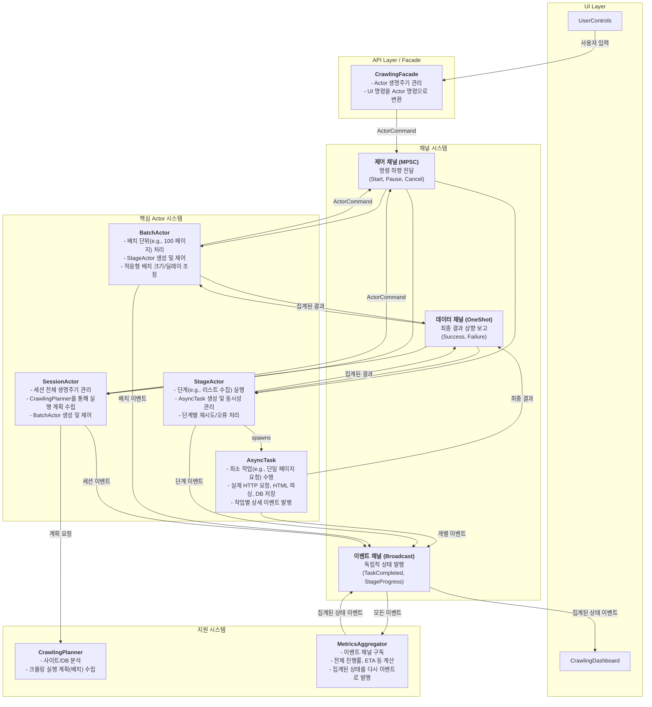

# 최종 통합 설계 계획 v7: Actor 모델과 삼중 채널 아키텍처

> **문서 목적:** `re-arch-plan2.md`의 구체적인 계층적 Actor 모델과 `re-arch-plan-final.md`의 추상적인 삼중 채널 및 회복탄력성 설계를 완벽하게 통합하여, 모순이 없고 모든 세부사항을 포함하는 **단일 최종 설계 문서(Single Source of Truth)**를 수립합니다.

## 1. 최종 아키텍처 원칙: 제어, 데이터, 이벤트의 완전한 분리

본 아키텍처는 **계층적 Actor 모델**을 기반으로, Actor 간의 상호작용을 **삼중 채널 시스템**을 통해 명확히 분리하여 복잡성을 제어하고 예측 가능성을 극대화합니다.

1.  **계층적 Actor 모델:** `SessionActor` → `BatchActor` → `StageActor` → `AsyncTask`로 이어지는 명확한 책임과 제어의 계층을 정의합니다.
2.  **삼중 채널 시스템:**
    *   **제어 채널 (MPSC):** 상위 Actor에서 하위 Actor로의 **명령(Command)**을 전달하는 단방향 채널.
    *   **데이터 채널 (One-shot):** 하위 Actor가 작업을 완료한 후, 그 **최종 결과(Result)**를 상위 Actor에게 보고하는 단방향 채널.
    *   **이벤트 채널 (Broadcast):** 모든 Actor가 자신의 **상태 변경(Event)**을 시스템 전체에 독립적으로 발행하는 채널.
3.  **독립적 이벤트 집계:** `MetricsAggregator`가 이벤트 채널을 구독하여 시스템의 전체 상태와 진행률을 계산하고, 이를 다시 이벤트 채널로 발행합니다. UI는 이 집계된 이벤트를 구독합니다.
4.  **설정 기반 동작:** 모든 핵심 로직(재시도 정책, 동시성, 타임아웃 등)은 외부 설정 파일에 의해 제어됩니다.

---

## 2. 통합 시스템 아키텍처 다이어그램



---

## 3. 핵심 컴포넌트 상세 설계

### 3.1. 통합 채널 및 컨텍스트 (`re-arch-plan-final.md` 기반)

- **채널 타입:** `mpsc`, `oneshot`, `broadcast`를 사용한 제어, 데이터, 이벤트 채널을 명확히 정의합니다.
- **`IntegratedContext`:** `session_id`, `config`, `event_tx`, `cancellation_rx` 등을 포함하여 모든 Actor와 Task에 전파되는 실행 컨텍스트입니다. 이를 통해 모든 컴포넌트는 자신의 위치를 몰라도 이벤트를 발행하고 취소 신호를 감지할 수 있습니다.

```rust
// src-tauri/src/new_architecture/channels/types.rs

use tokio::sync::{mpsc, oneshot, broadcast, watch};
use std::sync::Arc;
use crate::config::SystemConfig;
use crate::actors::ActorCommand;
use crate::events::AppEvent;

pub type ControlChannel = mpsc::Sender<ActorCommand>;
pub type ControlReceiver = mpsc::Receiver<ActorCommand>;
pub type DataChannel<T> = oneshot::Sender<T>;
pub type DataReceiver<T> = oneshot::Receiver<T>;
pub type EventChannel = broadcast::Sender<AppEvent>;
pub type EventReceiver = broadcast::Receiver<AppEvent>;
pub type CancellationChannel = watch::Sender<bool>;
pub type CancellationReceiver = watch::Receiver<bool>;

#[derive(Clone)]
pub struct IntegratedContext {
    pub session_id: String,
    pub control_tx: ControlChannel,
    pub event_tx: EventChannel,
    pub cancellation_rx: CancellationReceiver,
    pub config: Arc<SystemConfig>,
}
```

### 3.2. 계층적 Actor 모델 (`re-arch-plan2.md` 기반)

#### 3.2.1. `SessionActor`
- **책임:** 세션의 전체 생명주기(분석, 계획, 실행, 완료)를 관리합니다. `CrawlingPlanner`를 사용하여 실행 계획을 수립하고, 계획에 따라 `BatchActor`들을 생성하고 제어합니다.
- **입력:** UI로부터의 `StartCrawling`, `PauseSession`, `CancelSession` 등의 최상위 명령.
- **출력:** `BatchActor`들에게 전달할 `ProcessBatch` 명령. 세션 수준의 이벤트(`SessionStarted`, `SessionCompleted`).

#### 3.2.2. `BatchActor`
- **책임:** 할당된 페이지 범위(배치)의 처리를 담당합니다. `StageActor`들을 생성하여 "리스트 수집", "상세 정보 수집" 등의 단계를 실행시킵니다. 네트워크 상태나 오류율에 따라 동적으로 처리량(배치 크기, 딜레이)을 조절하는 로직을 포함할 수 있습니다.
- **입력:** `SessionActor`로부터의 `ProcessBatch` 명령.
- **출력:** `StageActor`들에게 전달할 `ExecuteStage` 명령. 배치 수준의 이벤트(`BatchStarted`, `BatchCompleted`).

#### 3.2.3. `StageActor`
- **책임:** 특정 단계(Stage)의 실행을 책임집니다. 예를 들어 "리스트 수집" `StageActor`는 여러 페이지에 대한 `AsyncTask`를 생성하고, 설정된 동시성(concurrency)에 맞춰 실행을 관리합니다. 단계 수준의 재시도 로직을 수행합니다.
- **입력:** `BatchActor`로부터의 `ExecuteStage` 명령.
- **출력:** `AsyncTask` 생성 및 실행. 단계 수준의 이벤트(`StageStarted`, `StageProgress`, `StageCompleted`).

#### 3.2.4. `AsyncTask`
- **책임:** 더 이상 쪼갤 수 없는 최소 작업 단위(e.g., 단일 페이지 HTTP 요청)를 수행합니다. 작업의 성공/실패 여부와 수집된 데이터를 `StageActor`에게 `DataChannel`을 통해 보고하고, 작업 수행과 관련된 모든 세부 이벤트를 `EventChannel`로 발행합니다.
- **입력:** `StageActor`로부터의 실행 요청.
- **출력:** `DataChannel`을 통한 `TaskResult`. `EventChannel`을 통한 `TaskStarted`, `TaskCompleted`, `TaskFailed` 등의 상세 이벤트.

### 3.3. 회복탄력성 및 에러 처리 (`re-arch-plan-final.md` 기반)

- **`StageResult` Enum:** 모든 작업의 결과를 `Success`, `RecoverableError`, `FatalError`, `PartialSuccess`로 명확히 구분하여 보고합니다.
- **`StageError` Enum:** `thiserror`를 사용하여 `NetworkTimeout`, `ServerError`, `ParseError` 등 구체적인 오류 타입을 정의합니다.
- **`RetryPolicy`:** 설정 파일에 기반하여 각 단계별 재시도 횟수, 지연 시간, 백오프 전략 등을 정의합니다. `StageActor`는 이 정책에 따라 `RecoverableError` 발생 시 재시도를 수행합니다.

```rust
// src-tauri/src/new_architecture/results/stage_result.rs
use thiserror::Error;

#[derive(Debug, Clone)]
pub enum StageResult {
    Success(StageSuccessResult),
    RecoverableError { error: StageError, attempts: u32 },
    FatalError { error: StageError },
    PartialSuccess { successes: Vec<StageSuccessResult>, failures: Vec<StageError> },
}

#[derive(Error, Debug, Clone)]
pub enum StageError {
    #[error("Network timeout after {elapsed:?}")]
    NetworkTimeout { elapsed: std::time::Duration },
    // ... other specific errors
}
```

### 3.4. 독립적 이벤트 집계 (`re-arch-plan2.md` 기반)

- **`MetricsAggregator`:**
    - `EventChannel`을 구독하여 시스템에서 발생하는 모든 `TaskCompleted`, `TaskFailed` 등의 원시(raw) 이벤트를 수신합니다.
    - 수신된 이벤트를 바탕으로 전체 진행률(%), 남은 예상 시간(ETA), 분당 처리량(items/min) 등 의미 있는 지표를 계산합니다.
    - 계산된 집계 데이터를 `AggregatedStateUpdate`와 같은 새로운 이벤트로 만들어 다시 `EventChannel`에 발행합니다.
- **UI (CrawlingDashboard):**
    - 원시 이벤트를 직접 구독하지 않고, `MetricsAggregator`가 발행하는 집계된 상태 이벤트(`AggregatedStateUpdate`)만 구독하여 화면을 갱신합니다.
    - 이를 통해 UI는 복잡한 계산 로직으로부터 자유로워지고, 백엔드의 상태 집계 로직 변경이 UI 코드에 영향을 주지 않습니다.

---

## 4. 통합 설계 기반 구현 진단 및 개선 계획

> **기준:** 위 통합 설계(`re-arch-plan-final2.md`)
> **대상:** 현재 구현 코드 (`crawlerStore.ts`, `Cargo.toml` 등)

### 4.1. 진단: 설계와 구현의 핵심 불일치 지점

1.  **데이터 모델 불일치 (가장 시급):**
    - **설계:** Rust 타입(`StageResult`, `StageError` 등)이 `ts-rs`를 통해 자동으로 프론트엔드 타입과 동기화되어야 합니다.
    - **현실:** `ts-rs`가 도입되었으나, `crawlerStore.ts`는 여전히 수동으로 작성된 레거시 타입(`CrawlingProgress`)을 사용하고 있으며, 이로 인해 불필요한 데이터 변환 로직이 남아있습니다.

2.  **상태 표현력 부족:**
    - **설계:** 프론트엔드는 백엔드의 `RecoverableError`, `FatalError` 등 구체적인 상태를 인지하여 "재시도 중", "치명적 오류" 등 상세한 피드백을 제공해야 합니다.
    - **현실:** `crawlerStore.ts`의 상태는 `Idle`, `Running`, `Error` 등 단순한 문자열로 관리되어, 백엔드의 풍부한 상태 정보를 표현하지 못하고 있습니다.

3.  **API 경계 모호성:**
    - **설계:** "제어", "데이터", "이벤트"는 명확히 구분된 채널(혹은 API 엔드포인트/이벤트 이름)을 통해 전달되어야 합니다.
    - **현실:** `tauriApi`라는 단일 인터페이스를 통해 모든 종류의 정보가 혼재되어 전달되고 있어, 로직의 구분이 어렵습니다.

### 4.2. 최종 개선 실행 계획

#### **Phase 1: 타입 시스템 완전 자동화 (1-2일)**

1.  **`ts-rs` 워크플로우 확립:** `build.rs`를 설정하여 `cargo build` 시점에 Rust 타입이 `src/types/generated/` 디렉토리에 자동으로 생성되도록 파이프라인을 구축합니다.
2.  **레거시 타입 완전 제거:** `src/types/` 아래의 수동 관리 파일을 모두 삭제하고, 프로젝트 전체에서 `generated` 디렉토리의 타입만 참조하도록 수정합니다.
3.  **`.gitignore` 설정:** `src/types/generated/`를 Git 추적에서 제외합니다.

#### **Phase 2: `crawlerStore` 현대화 (2-3일)**

1.  **상태 모델 재정의:** `crawlerStore`의 `CrawlerState`를 자동 생성된 Rust `enum` 타입(`StageResult` 등)을 사용하여 백엔드의 상태 기계와 1:1로 매칭되도록 리팩토링합니다.
2.  **데이터 변환 로직 제거:** API 응답을 그대로 상태에 저장하도록 수정하여, `performSiteAnalysis` 등에 남아있는 불필요한 변환 코드를 모두 삭제합니다.
3.  **UI 피드백 고도화:** 새로운 상태 모델을 기반으로 `CrawlingDashboard.tsx`에서 "재시도 중...", "일시정지됨" 등 구체적인 UI 피드백을 표시하도록 개선합니다.

#### **Phase 3: API 경계 명확화 (1-2일)**

1.  **백엔드 이벤트 이름 재정의:** 백엔드에서 `emit`하는 이벤트 이름을 `event-state-update`, `event-session-result` 와 같이 목적에 따라 명확하게 구분합니다.
2.  **프론트엔드 리스너 분리:** `crawlerStore`에서 각 이벤트 이름에 맞는 리스너를 별도로 등록하여, 코드의 가독성과 유지보수성을 높입니다.

---

이 통합된 설계와 실행 계획을 통해 프로젝트의 모든 부분이 일관된 아키텍처를 따르게 될 것이며, 이는 장기적인 안정성과 확장성의 핵심 기반이 될 것입니다.
