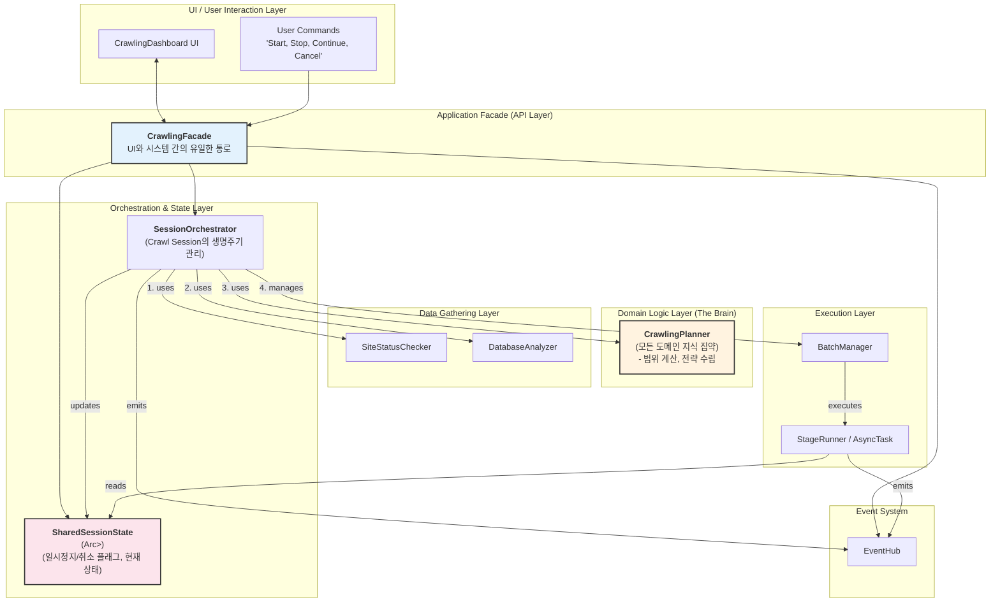
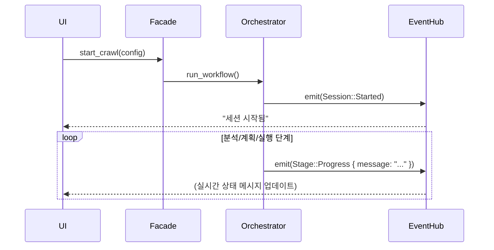
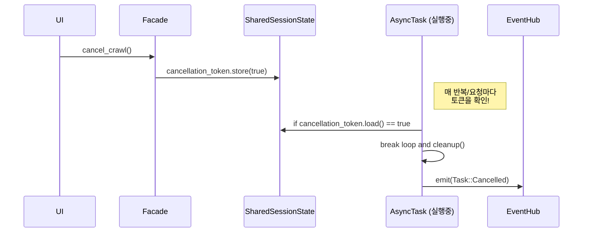
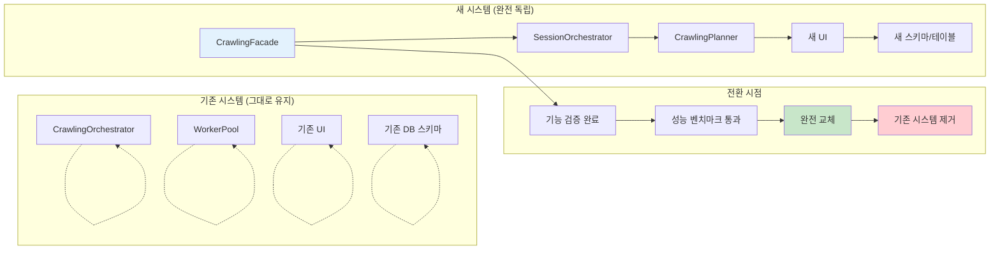

# 최종 실행 계획: 도메인 지식과 사용자 상호작용 중심의 크롤링 아키텍처 v2

*본 문서는 `re-arch-plan.md`의 아이디어를 기반으로, **기존 도메인 지식, 체계적인 역할 분담, UI 상호작용**이라는 세 가지 핵심 원칙을 완벽하게 통합하여 재설계한 최종 실행 계획입니다.*

## 1. 아키텍처 철학: 왜 이 설계인가?

이 설계는 과거의 논의에서 제기된 모든 문제점(논리적 비약, 도메인 지식 누락, UI 상호작용 부재)을 해결하고, **실제로 동작하며, 유지보수 가능하고, 사용자에게 가치를 제공하는 시스템**을 구축하는 것을 유일한 목표로 합니다.

### 최종 아키텍처 비전: 명확한 책임과 데이터 흐름



---

## 2. 핵심 컴포넌트 재설계: 역할과 책임(R&R)의 명확화

### 2.1. `CrawlingFacade`: 유일하고 명확한 시스템 API

*   **책임:** UI로부터 오는 모든 명령(시작, 중지, 재개, 취소)을 수신하고, 내부 시스템에 전달하는 유일한 진입점. `EventHub`를 구독하여 UI에 데이터를 전송하는 역할도 담당.
*   **상호작용:**
    *   `start_crawl` 명령 수신 시, `SessionOrchestrator`를 생성하고 비동기적으로 실행(`tokio::spawn`).
    *   `pause`, `resume`, `cancel` 명령 수신 시, `SharedSessionState`의 상태 플래그를 변경하여 실행 중인 작업에 전파.

### 2.2. `SessionOrchestrator`: 워크플로우의 지휘자

*   **책임:** 단일 크롤링 세션의 전체 워크플로우(**분석 → 계획 → 실행**)를 순차적으로 지휘. 모든 하위 컴포넌트를 조율하고, 각 단계의 시작/완료/실패 이벤트를 발행.
*   **상호작용:**
    1.  **분석:** `SiteStatusChecker`, `DatabaseAnalyzer`를 호출하여 원시 데이터 수집.
    2.  **계획:** 수집된 데이터와 사용자 설정을 `CrawlingPlanner`에 전달하여 최종 `CrawlingPlan` 생성.
    3.  **실행:** 생성된 `CrawlingPlan`과 `SharedSessionState`를 `BatchManager`에 전달하여 실제 작업 실행.

### 2.3. `CrawlingPlanner`: 모든 도메인 지식의 집약체

*   **책임:** **과거의 성공적인 구현과 도메인 지식을 계승**하는 가장 중요한 컴포넌트. [사용자 설정], [사이트 상태], [DB 상태] 3가지 정보를 종합하여, **어떻게 크롤링할지(전략)와 무엇을 크롤링할지(범위)를 결정**.
*   **핵심 도메인 로직:**
    *   **범위 계산:** `(전체 페이지 수, 마지막 수집 페이지) -> 증분 수집 범위 도출`
    *   **전략 수립:** `(사용자 요청: Full/Incremental/Recovery) -> CrawlingStrategy 결정`
    *   **누락 데이터 통합:** `(DB 누락 데이터 리스트, 신규 범위) -> 최종 작업 목록 생성`

### 2.4. `SharedSessionState`: 상태 전파 및 제어의 핵심

*   **책임:** 모든 비동기 작업들이 공유하는 중앙 상태 저장소. `Arc<Mutex<State>>`로 구현.
*   **포함 정보:**
    *   `cancellation_token`: `true`가 되면 모든 작업이 즉시 중단.
    *   `pause_signal`: `true`가 되면 진행 중인 배치를 완료한 후 작업 일시 중지.
    *   `current_status_message`: UI에 표시될 현재 작업 상태 메시지.
*   **상호작용:** 최하위의 `AsyncTask`까지 이 상태 객체를 참조하여, `cancel`이나 `pause` 신호에 즉시 반응.

---

## 3. UI 상호작용 시나리오: 어떻게 동작하는가

### 3.1. 크롤링 시작 및 실시간 피드백



### 3.2. 사용자 요청에 의한 크롤링 중단 (Cancel)

**가장 중요한 상호작용 중 하나. 사용자가 "중단"을 누르면, 시스템은 즉시 모든 작업을 멈추고 정리 상태로 들어가야 합니다.**



**구현 상세:**

```rust
// in AsyncTask::execute()

// 모든 I/O 작업 또는 긴 루프 전에 반드시 체크
if context.shared_state.is_cancellation_requested() {
    // 리소스 정리 (e.g., 임시 파일 삭제)
    self.cleanup().await;
    return Err(TaskError::Cancelled);
}

// ... 실제 작업 수행 ...
```

---

## 4. 최종 제안: 완전한 재작성 기반 새로운 시스템

이 문서는 `re-arch-plan.md`의 아이디어를 기반으로 하되, **점진적 교체가 아닌 완전한 재작성**을 통해 다음과 같은 명확한 개선점을 제시합니다.

### 4.1. 왜 완전한 재작성인가?

**❌ 점진적 교체의 문제점들:**
- **중간에 버려지는 코드 양산**: 호환성 레이어, 임시 어댑터 등 결국 제거될 코드들
- **혼란 가중**: 새 시스템과 기존 시스템이 공존하며 발생하는 복잡성
- **중복 유지보수**: 두 개 시스템을 동시에 관리해야 하는 부담
- **불완전한 설계**: 기존 시스템과의 호환성 때문에 제약받는 새 아키텍처

**✅ 완전한 재작성의 장점:**
- **명확한 아키텍처**: 기존 제약 없이 최적의 설계 가능
- **코드 일관성**: 처음부터 새로운 패턴과 규칙으로 통일
- **빠른 개발**: 호환성 고려 없이 직진 개발
- **확실한 전환**: 한 번에 완전히 교체, 혼란 최소화

### 4.2. 새 시스템 완전 독립 구축 전략



### 4.3. 구현 전략: 독립된 새 모듈

```rust
// 기존 시스템은 그대로 두고, 완전히 새로운 모듈 생성
src-tauri/src/
├── crawling/              // 기존 시스템 (건드리지 않음)
│   ├── orchestrator.rs    
│   ├── worker_pool.rs     
│   └── ...                
├── new_crawling/          // 새 시스템 (완전 독립)
│   ├── facade.rs          // CrawlingFacade
│   ├── orchestrator.rs    // SessionOrchestrator  
│   ├── planner.rs         // CrawlingPlanner
│   ├── events.rs          // EventHub
│   ├── state.rs           // SharedSessionState
│   └── ...                
└── main.rs                // 기존: old 시스템, 전환 후: new 시스템
```

### 4.4. 전환 계획: 한 번에 완전 교체

**Phase 1 (Week 1-4): 새 시스템 완전 구축**
- 기존 시스템 건드리지 않고 완전히 독립된 새 시스템 개발
- 별도 테이블/스키마 사용하여 DB 충돌 방지
- 별도 UI 컴포넌트로 독립 테스트

**Phase 2 (Week 5): 기능 검증 및 성능 테스트**
- 새 시스템 단독으로 전체 기능 검증
- 기존 시스템과 성능 비교 테스트
- 데이터 마이그레이션 도구 준비

**Phase 3 (Week 6): 완전 교체**
- 한 번에 완전히 새 시스템으로 교체
- 기존 시스템 코드 제거
- 사용자에게는 "업데이트" 형태로 제공

### 4.5. 이점 및 리스크 관리

**이점:**
1. **명확한 아키텍처**: 기존 제약 없는 최적 설계
2. **빠른 개발**: 호환성 고려 불필요
3. **확실한 품질**: 새로운 패턴으로 일관된 코드
4. **간단한 전환**: 복잡한 마이그레이션 과정 제거

**리스크 관리:**
1. **기능 누락 방지**: 기존 시스템 기능 체크리스트 작성
2. **성능 저하 방지**: 엄격한 성능 벤치마크 기준 설정
3. **데이터 손실 방지**: 완전한 백업 및 마이그레이션 도구
4. **롤백 계획**: 문제 발생 시 기존 시스템으로 즉시 복원

이 접근 방식을 통해 **중간에 버려지는 코드 없이, 혼란 없이, 명확하고 깨끗한 새 아키텍처**를 구축할 수 있습니다.