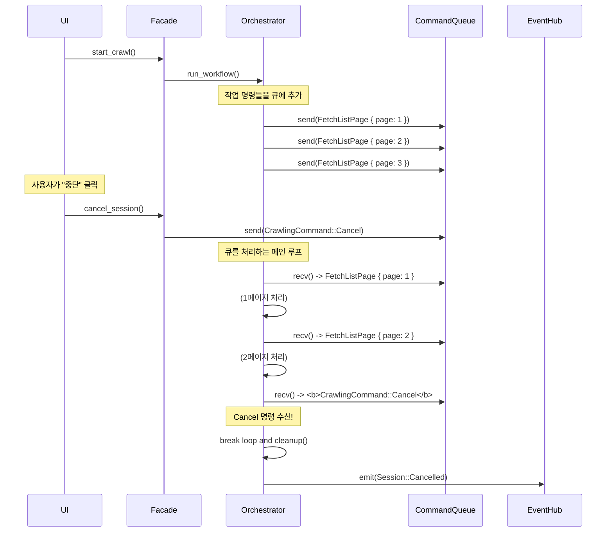

# 검토 보고서: `re-arch-plan2.md` 제어 흐름 개선을 위한 명령 큐 아키텍처 제안

*본 문서는 `re-arch-plan2.md`의 완성도 높은 설계를 인정하면서도, 사용자 제어(중단/일시정지) 메커니즘을 더욱 단순하고 반응적으로 만들기 위해 **명령 큐(Command Queue) 기반 아키텍처** 도입을 제안합니다.*

## 1. 종합 평가: 훌륭한 설계, 그러나 제어 방식은 더 개선될 수 있다

`re-arch-plan2.md`는 도메인 지식과 UI 상호작용을 통합한 매우 뛰어난 계획입니다. 하지만 현재의 `SharedSessionState`와 `cancellation_token`을 통한 제어 방식은 각 작업 단위에 취소 로직을 확인해야 하는 책임을 부여하여, 미세한 반응성 지연과 코드 복잡성을 유발할 수 있습니다.

제안하신 **"작업 큐에 중단이라는 다음 작업을 넣는"** 아이디어는 이 문제를 해결할 매우 강력하고 우아한 접근법입니다. 이를 더욱 발전시켜, 시스템의 모든 동작을 '명령'으로 취급하는 아키텍처를 제안합니다.

## 2. 해결책: 명령 큐(Command Queue) 기반 제어 아키텍처

### 2.1. 핵심 아이디어: 모든 것을 '명령'으로 추상화

크롤링 작업(예: "10번 페이지를 가져와라")과 사용자 제어(예: "즉시 중단하라")를 구분하지 않고, 모두 동일한 `CrawlingCommand` 열거형(enum)으로 취급합니다. `SessionOrchestrator`는 이 명령들을 순차적으로 처리하는 단일 워커(Single Worker)처럼 동작합니다.

```mermaid
graph TD
    subgraph "Command Producers"
        A[CrawlingPlanner<br/>"1~100페이지 수집해"] --> C
        B[UI<br/>"지금 당장 중단해!"] --> C
    end

    subgraph "Command Queue (MPSC Channel)"
        C["<b>CrawlingCommand Queue</b><br/>(tokio::sync::mpsc::channel)"]
    end

    subgraph "Command Processor (Single Worker)"
        D["<b>SessionOrchestrator</b><br/>(loop { let cmd = queue.recv().await; ... })"]
    end

    C --> D
```

### 2.2. `CrawlingCommand` 정의

```rust
// in new_architecture/commands.rs

pub enum CrawlingCommand {
    // 작업 명령
    FetchListPage { page: u32 },
    ParseListPage { page: u32, content: String },
    FetchProductDetail { url: String },
    SaveToDatabase { data: Vec<Product> },

    // 제어 명령 (사용자 또는 시스템이 발행)
    Pause,          // 현재 진행 중인 배치를 완료하고 대기
    Resume,         // 일시정지 상태에서 다시 시작
    Cancel,         // 모든 작업을 즉시 중단하고 큐를 비움
    Shutdown,       // 정상적으로 모든 작업을 완료하고 종료
}
```

### 2.3. 새로운 아키텍처: 단순화된 제어 흐름

이 구조에서 `SessionOrchestrator`의 역할은 매우 단순해집니다. 큐에서 명령을 하나씩 꺼내 처리하고, `Cancel`이나 `Shutdown` 명령을 받으면 루프를 종료합니다. 더 이상 복잡한 공유 상태(SharedState)를 모든 작업에 전파할 필요가 없습니다.



### 2.4. `SessionOrchestrator`의 새로운 구현

```rust
// in new_architecture/orchestrator.rs

pub struct SessionOrchestrator {
    // ... dependencies
    cmd_tx: mpsc::Sender<CrawlingCommand>,
    cmd_rx: mpsc::Receiver<CrawlingCommand>,
}

impl SessionOrchestrator {
    pub async fn run_workflow(&mut self) -> Result<WorkflowResult> {
        // ... 분석 및 계획 단계 ...
        let plan = self.planner.create_plan(...).await?;

        // 계획에 따라 작업 명령들을 큐에 채움
        for page in plan.target_pages {
            self.cmd_tx.send(CrawlingCommand::FetchListPage { page }).await?;
        }
        self.cmd_tx.send(CrawlingCommand::Shutdown).await?;

        // 메인 명령 처리 루프
        while let Some(command) = self.cmd_rx.recv().await {
            match command {
                CrawlingCommand::FetchListPage { page } => {
                    // ... 페이지 가져오기 작업 실행 ...
                }
                CrawlingCommand::Cancel => {
                    // **핵심 로직:** 즉시 루프를 탈출하고 정리
                    println!("Cancellation command received. Shutting down...");
                    break;
                }
                CrawlingCommand::Shutdown => {
                    println!("Graceful shutdown command received.");
                    break;
                }
                // ... 다른 명령 처리 ...
            }
        }

        self.cleanup().await;
        Ok(WorkflowResult::completed())
    }

    // Facade에서 호출될 함수
    pub async fn request_cancellation(&self) {
        // 큐의 맨 앞에 Cancel 명령을 삽입 (우선순위 처리 필요 시)
        // 또는 단순히 send
        let _ = self.cmd_tx.send(CrawlingCommand::Cancel).await;
    }
}
```

## 3. 기대 효과 및 장점

*   **극도로 단순화된 제어 로직:** 복잡한 `Arc<Mutex<State>>`와 `AtomicBool`을 통한 상태 공유 및 확인 로직이 사라지고, 단일 명령 큐 처리 로직으로 통일됩니다.
*   **향상된 반응성:** 사용자의 중단 요청이 큐에 들어오면, 현재 진행 중인 단일 작업만 완료된 후 즉시 처리됩니다. 긴 작업 중간에 취소 확인을 기다릴 필요가 없습니다.
*   **결합도 감소:** 개별 `AsyncTask`들은 더 이상 세션의 전체 상태(중단 여부 등)를 알 필요가 없으며, 오직 자신의 작업만 수행하면 됩니다.
*   **확장성:** 새로운 종류의 제어(예: `ChangePriority`)를 추가하고 싶을 때, `CrawlingCommand` 열거형에 새로운 variant를 추가하고 `match` 문에서 처리하기만 하면 됩니다.

## 4. 결론: 더 단순하고, 더 강력하며, 더 우아한 설계로의 진화

`re-arch-plan2.md`는 이미 훌륭한 계획이지만, **명령 큐 기반 아키텍처**를 도입함으로써 시스템의 제어 흐름을 한 차원 더 높은 수준으로 끌어올릴 수 있습니다. 이는 시스템의 복잡도를 크게 낮추면서도, 더 빠르고 안정적인 사용자 상호작용을 보장하는 매우 효과적인 설계 패턴입니다.

`re-arch-plan-improved.md`의 최종 버전에는 이 **명령 큐 아키텍처**를 핵심 제어 메커니즘으로 채택할 것을 강력히 제안합니다.