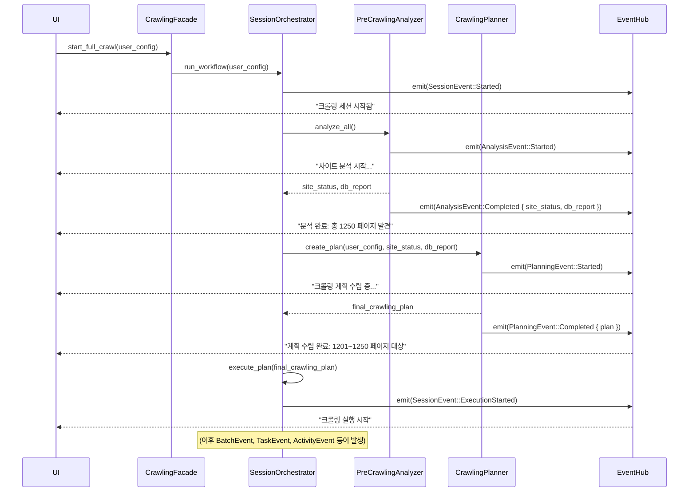

# 검토 보고서: UI 피드백을 위한 이벤트 발행 아키텍처 보완 제안

*본 문서는 `re-arch-plan.md` 및 이전 논의들이 **UI 피드백 메커니즘**을 간과한 심각한 문제를 지적하고, 각 컴포넌트의 상태 변화를 UI에 투명하게 전달하기 위한 **구체적인 이벤트 발행 아키텍처**를 제안합니다.*

## 1. 문제점: "깜깜이" 시스템 - UI 피드백의 부재

현재까지의 설계는 시스템 내부의 데이터 처리와 로직에만 집중한 나머지, 사용자에게 "지금 무슨 일이 일어나고 있는가?"를 알려주는 가장 기본적인 메커니즘이 빠져있습니다. `EventHub`라는 이름만 존재할 뿐, 다음과 같은 핵심 질문에 대한 답이 없습니다.

*   **언제 (When):** 분석, 계획, 실행 등 각 단계의 시작, 진행, 완료 시점 중 정확히 언제 이벤트를 보내는가?
*   **누가 (Who):** `PreCrawlingAnalyzer`, `CrawlingPlanner`, `SessionOrchestrator` 중 누가 이벤트 발행의 최종 책임을 지는가?
*   **무엇을 (What):** UI가 상태를 표시하는 데 필요한 구체적인 데이터(예: "사이트 분석 중...", "총 1250 페이지 발견", "크롤링 계획 수립 완료")가 이벤트에 포함되는가?

이 설계대로라면, 사용자는 크롤링 시작 버튼을 누른 후, 시스템이 모든 것을 마칠 때까지 아무런 피드백도 받지 못하는 **"깜깜이" 시스템**이 될 것입니다.

## 2. 해결책: 책임 기반의 명시적 이벤트 발행 아키텍처

각 주요 컴포넌트가 자신의 **핵심 책임(Responsibility)을 완수하는 시점**에, 그 결과를 담은 **명시적인 이벤트를 발행**하도록 아키텍처를 재설계해야 합니다.

### 2.1. 이벤트 발행 주체와 시점 정의

| 발행 주체 | 발행 시점 (책임 완수 시점) | 발행 이벤트 | UI 표시 예시 |
| :--- | :--- | :--- | :--- |
| **`PreCrawlingAnalyzer`** | 각 하위 분석기(`SiteStatusChecker` 등)의 작업 시작/완료 시 | `AnalysisEvent` | "사이트 상태 확인 중...", "DB 분석 완료" |
| **`CrawlingPlanner`** | 최종 `CrawlingPlan` 수립 완료 시 | `PlanningEvent` | "크롤링 계획 수립 완료: 1201~1250 페이지 대상" |
| **`SessionOrchestrator`** | 전체 워크플로우 및 주요 단계(Stage) 시작/종료 시 | `SessionEvent` | "크롤링 세션 시작됨", "분석 단계 완료, 실행 단계 시작" |
| **`BatchManager`** | 개별 배치(Batch) 시작/진행/종료 시 | `BatchEvent` | "배치 1/10 처리 중 (50/100)" |

### 2.2. 구체적인 이벤트 발행 흐름 (Sequence Diagram)

이벤트 발행 책임을 포함한 새로운 시퀀스는 다음과 같습니다.



### 2.3. UI 피드백을 위한 이벤트 타입 상세 설계

UI가 풍부한 정보를 표시할 수 있도록, 각 이벤트는 구체적인 데이터를 포함해야 합니다.

```rust
// in new_architecture/events/types.rs

#[derive(Debug, Clone, Serialize)]
#[serde(tag = "type", content = "payload")]
pub enum AppEvent {
    Session(SessionEvent),
    Analysis(AnalysisEvent),
    Planning(PlanningEvent),
    Batch(BatchEvent),
    // ... Task, Activity events
}

#[derive(Debug, Clone, Serialize)]
pub enum AnalysisEvent {
    Started,
    Progress { stage: String, message: String }, // e.g., stage: "SiteStatus", message: "Checking last page..."
    Completed { 
        site_status: SiteStatus,
        db_report: DBStateReport,
    },
    Failed { error: String },
}

#[derive(Debug, Clone, Serialize)]
pub enum PlanningEvent {
    Started,
    Completed { plan: CrawlingPlan },
    Failed { error: String },
}

#[derive(Debug, Clone, Serialize)]
pub enum SessionEvent {
    Started { session_id: String },
    StageChanged { from: Stage, to: Stage }, // e.g., from: Analysis, to: Execution
    ExecutionStarted { plan: CrawlingPlan },
    Completed { result: WorkflowResult },
    Failed { error: String },
}
```

## 3. 결론: 투명하고 신뢰할 수 있는 시스템으로의 발전

이번 제안은 **"모든 의미 있는 상태 변화는 반드시 이벤트를 통해 외부에 알려져야 한다"**는 원칙을 아키텍처에 명시적으로 적용합니다.

*   **투명성 확보:** 사용자는 더 이상 시스템 내부에서 어떤 일이 일어나는지 추측할 필요 없이, 분석, 계획, 실행의 모든 단계를 실시간으로 확인할 수 있습니다.
*   **책임의 명확화:** 각 컴포넌트는 자신의 핵심 책임을 완수한 후, 그 결과를 담은 이벤트를 발행할 명확한 의무를 가집니다. 이는 코드의 구조를 더 예측 가능하게 만듭니다.
*   **UI-백엔드 연동의 기반 마련:** 구체적인 이벤트 설계를 통해, 프론트엔드 개발자는 어떤 데이터를 받아 어떻게 UI를 구성해야 할지 명확하게 알 수 있습니다.

`re-arch-plan.md`는 이처럼 구체적인 이벤트 발행 아키텍처가 추가될 때, 비로소 내부적으로만 완결된 시스템이 아닌, 사용자와 소통하는 살아있는 시스템으로 완성될 수 있습니다. 최종 실행 계획에는 반드시 이 내용이 반영되어야 합니다.