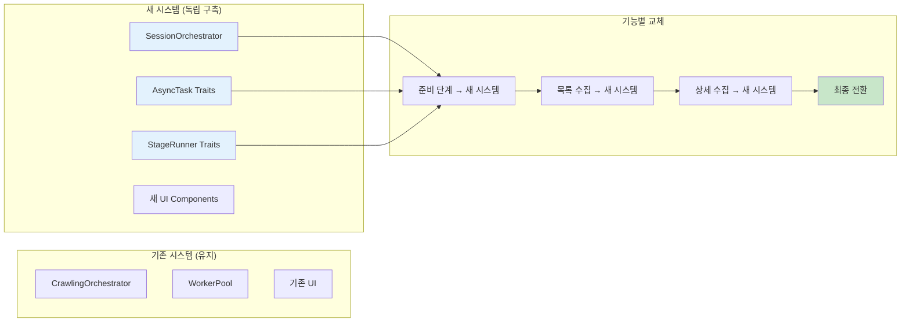
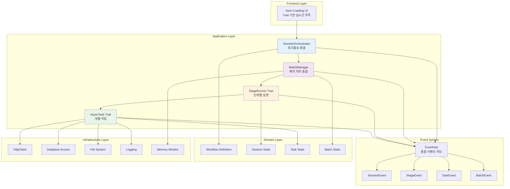
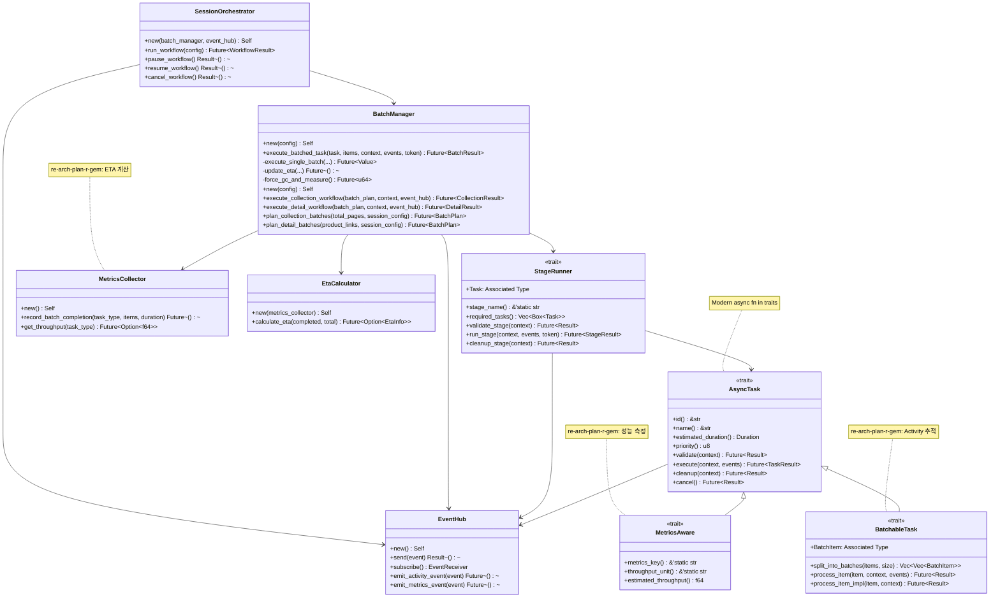
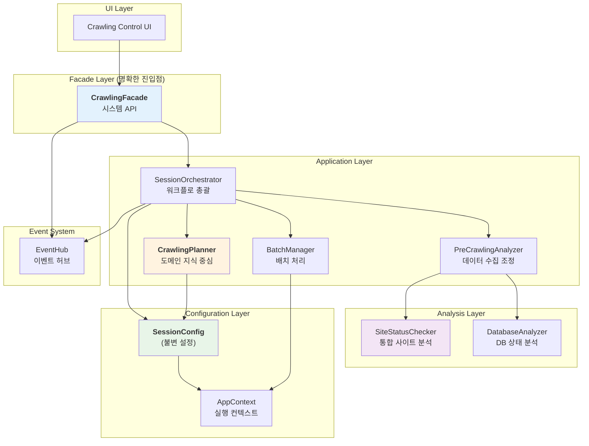
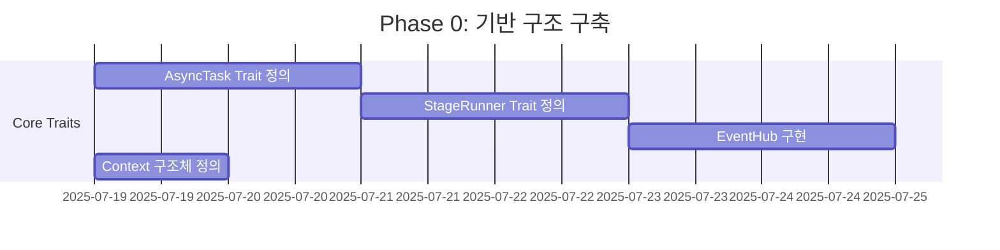
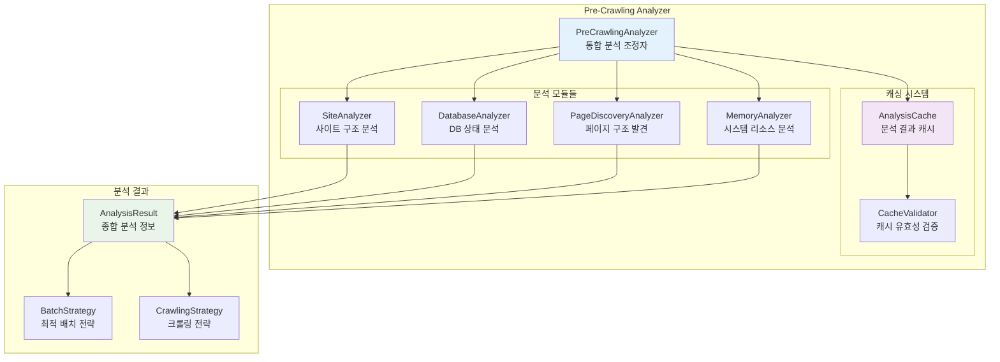

# rMatterCertis 아키텍처 재구축 실행 계획

*본 문서는 `re-arch-gem.md`의 Trait 기반 설계를 바탕으로, 새로운 아키텍처를 독립적으로 구현하고 기능 단위로 기존 시스템을 대체하는 구체적 실행 계획을 제시합니다.*

## 1. 전략 개요: Clean Slate + Incremental Replacement

### 1.1 핵심 전략



### 1.2 장점 분석

**✅ 속도**: 복잡한 마이그레이션 없이 직진
**✅ 안정성**: 기존 시스템은 건드리지 않음
**✅ 검증**: 각 기능별로 독립적 테스트
**✅ 롤백**: 언제든 기존 시스템으로 복귀 가능

## 2. 새 아키텍처 설계

### 2.1 전체 구조도



### 2.2 Modern Rust 2024 기반 핵심 아키텍처



### 2.3 새로운 아키텍처 구조 (re-arch-plan-r-gem 제안 반영)



**핵심 개선사항 (re-arch-plan-r-gem 반영):**

1. **명확한 진입점**: `CrawlingFacade`가 UI와 내부 시스템 간 API 역할
2. **도메인 지식 중심**: `CrawlingPlanner`가 핵심 의사결정 담당
3. **데이터 흐름 명확화**: [사용자 설정] + [사이트 상태] + [DB 상태] → CrawlingPlan
4. **실행 일관성**: 불변 `SessionConfig`로 모든 작업의 일관성 보장
5. **역할 분리**: 데이터 수집(Analyzers) vs 의사결정(Planner) 명확히 구분

## 3. 단계별 실행 계획

### 3.1 Phase 0: 기반 구조 구축 (Week 1)

#### 목표: 새 시스템의 골격 완성



#### Modern Rust 2024 디렉토리 구조 (re-arch-plan-r-gem 제안 반영)

```
src-tauri/src/new_architecture/
├── constants.rs              # 기본 상수 (하드코딩 방지)
├── config.rs                # 설정 시스템 루트
├── config/                  # 설정 세부 모듈들
│   ├── user_config.rs       # config.toml 로드
│   ├── session_config.rs    # 런타임 설정
│   └── app_context.rs       # 통합 실행 컨텍스트
├── traits.rs                # trait 루트 (mod.rs 제거)
├── traits/                  # trait 세부 구현들
│   ├── async_task.rs
│   ├── stage_runner.rs
│   ├── batchable_task.rs
│   └── metrics_aware.rs
├── orchestrator.rs          # SessionOrchestrator
├── batch.rs                 # 배치 시스템 루트  
├── batch/                   # 배치 세부 모듈들
│   ├── manager.rs
│   ├── memory_monitor.rs
│   └── metrics.rs
├── events.rs                # 이벤트 시스템 루트
├── events/                  # 이벤트 세부 모듈들
│   ├── hub.rs
│   ├── types.rs
│   └── activity.rs
├── domain.rs                # 도메인 모델 루트
├── domain/                  # 도메인 세부 모델들
│   ├── workflow.rs
│   ├── session.rs
│   └── batch_state.rs
└── lib.rs                   # 통합 API
```

#### 핵심 모듈 구현 (Modern Rust 방식)

```rust
// src-tauri/src/new_architecture/traits.rs
//! 모든 trait 정의 루트 (re-arch-plan-r-gem: mod.rs 완전 제거)
pub mod async_task;
pub mod stage_runner;
pub mod batchable_task;
pub mod metrics_aware;

// Modern Rust re-export pattern
pub use async_task::AsyncTask;
pub use stage_runner::StageRunner;
pub use batchable_task::BatchableTask;
pub use metrics_aware::MetricsAware;

// src-tauri/src/new_architecture/config.rs
//! 설정 시스템 루트 (설정 주도 아키텍처)
pub mod user_config;
pub mod session_config;
pub mod app_context;

pub use user_config::UserConfig;
pub use session_config::SessionConfig;
pub use app_context::AppContext;

// src-tauri/src/new_architecture/lib.rs
//! Modern Rust 2024 기반 새 아키텍처 통합 API
//! 
//! re-arch-plan-r-gem 제안 반영:
//! - 설정 주도 아키텍처
//! - mod.rs 완전 제거
//! - Zero Hard-Coding

// 상수 및 설정
pub mod constants;
pub mod config;

// 핵심 아키텍처
pub mod traits;
pub mod orchestrator;
pub mod batch;
pub mod events;

// 도메인 및 구현
pub mod domain;
pub mod stages;
pub mod tasks;

// 편의를 위한 re-export
pub use traits::{AsyncTask, StageRunner, BatchableTask, MetricsAware};
pub use orchestrator::SessionOrchestrator;
pub use batch::BatchManager;
pub use events::{EventHub, UnifiedEvent};
pub use config::{UserConfig, SessionConfig, AppContext};

/// 크롤링 시스템 Facade (re-arch-plan-r-gem 제안: 명확한 진입점)
/// 
/// 기존 NewCrawlingSystem 문제점:
/// - 모호한 책임: 단순 컨테이너 역할만 수행
/// - 불분명한 데이터 흐름
/// - 설정 관리 혼란
/// 
/// CrawlingFacade 해결책:
/// - UI와 내부 시스템 간 명확한 API 역할
/// - 외부에는 단순한 인터페이스, 내부 복잡성 은닉
/// - 불변 SessionConfig를 통한 일관성 확보
#[derive(Debug)]
pub struct CrawlingFacade {
    event_hub: std::sync::Arc<EventHub>,
}

impl CrawlingFacade {
    /// 기본 설정으로 Facade 생성
    pub fn new() -> crate::Result<Self> {
        let event_hub = std::sync::Arc::new(EventHub::new());
        
        Ok(Self {
            event_hub,
            // BatchManager는 Planning 단계에서 적응적으로 생성됨
        })
    }
    
    /// 전체 크롤링 워크플로 실행 (명확한 데이터 흐름)
    /// 
    /// re-arch-plan-r-gem 제안 흐름:
    /// 1. 사용자 설정 검증
    /// 2. 분석 단계 (SiteStatus + DBReport 수집)
    /// 3. 도메인 지식 기반 계획 수립 (CrawlingPlanner)
    /// 4. 불변 SessionConfig 생성
    /// 5. 계획 실행
    pub async fn start_full_crawl(
        &self, 
        user_config: UserConfig
    ) -> crate::Result<domain::WorkflowResult> {
        // 1단계: 사용자 설정 검증
        user_config.validate()?;
        
        // 2단계: SessionOrchestrator 생성 (불변 컴포넌트들 주입)
        let orchestrator = SessionOrchestrator::new(
            self.batch_manager.clone(),
            self.event_hub.clone(),
        );
        
        // 3단계: 전체 워크플로 실행 (내부에서 분석 → 계획 → 실행)
        orchestrator.run_workflow(user_config).await
    }
    
    /// 증분 크롤링 워크플로 실행
    pub async fn start_incremental_crawl(
        &self,
        user_config: UserConfig
    ) -> crate::Result<domain::WorkflowResult> {
        user_config.validate()?;
        
        let orchestrator = SessionOrchestrator::new(
            self.batch_manager.clone(),
            self.event_hub.clone(),
        );
        
        // 증분 크롤링용 설정으로 변경
        let mut incremental_config = user_config;
        incremental_config.crawling.crawl_type = domain::CrawlType::Incremental;
        
        orchestrator.run_workflow(incremental_config).await
    }
    
    /// 복구 크롤링 워크플로 실행
    pub async fn start_recovery_crawl(
        &self,
        user_config: UserConfig
    ) -> crate::Result<domain::WorkflowResult> {
        user_config.validate()?;
        
        let orchestrator = SessionOrchestrator::new(
            self.batch_manager.clone(),
            self.event_hub.clone(),
        );
        
        // 복구 크롤링용 설정으로 변경
        let mut recovery_config = user_config;
        recovery_config.crawling.crawl_type = domain::CrawlType::Recovery;
        
        orchestrator.run_workflow(recovery_config).await
    }
    
    /// 이벤트 수신기 제공 (UI 업데이트용)
    pub fn subscribe_to_events(&self) -> events::EventReceiver {
        self.event_hub.subscribe()
    }
}

/// SessionOrchestrator 워크플로 구현 (re-arch-plan-r-gem 데이터 흐름 + UI 피드백 반영)
impl SessionOrchestrator {
    /// 새로운 데이터 흐름 기반 워크플로 실행 (이벤트 발행 포함)
    /// 
    /// re-arch-plan-r-gem 제안 단계:
    /// 1. 분석 단계: SiteStatus + DBReport 수집 (+ 진행 이벤트)
    /// 2. 계획 수립 단계: CrawlingPlanner로 도메인 지식 활용 (+ 계획 이벤트)
    /// 3. 실행 단계: 불변 SessionConfig로 일관성 확보 (+ 실행 이벤트)
    pub async fn run_workflow(
        &self,
        user_config: UserConfig
    ) -> crate::Result<domain::WorkflowResult> {
        let session_id = uuid::Uuid::new_v4().to_string();
        let start_time = std::time::Instant::now();
        
        // 🎯 세션 시작 이벤트 발행 (UI 피드백)
        self.emit_session_started(
            session_id.clone(),
            format!("크롤링 타입: {:?}, 배치 크기: {}", 
                user_config.crawling.crawl_type, 
                user_config.crawling.batch_size)
        ).await?;
        
        // 🎯 분석 단계 시작 이벤트
        self.emit_stage_changed(
            WorkflowStage::Initializing,
            WorkflowStage::Analyzing,
            None
        ).await?;
        
        // 1단계: 분석 단계 (명확한 데이터 수집 + 이벤트 발행)
        let pre_analyzer = PreCrawlingAnalyzer::new(self.event_hub.clone());
        let analysis_result = pre_analyzer.analyze_all().await?;
        
        // 🎯 계획 수립 단계 시작 이벤트
        self.emit_stage_changed(
            WorkflowStage::Analyzing,
            WorkflowStage::Planning,
            None
        ).await?;
        
        // 2단계: 계획 수립 단계 (도메인 지식 중심 + 이벤트 발행)
        let planner = CrawlingPlanner::new(self.event_hub.clone());
        let crawling_plan = planner.create_comprehensive_plan(
            user_config.crawling.crawl_type.clone(),
            &analysis_result.site_status,
            &analysis_result.db_report,
        ).await?; // CrawlingPlanner 내부에서 PlanningEvent 발행
        
        // 크롤링이 필요하지 않은 경우 조기 종료
        if !crawling_plan.needs_crawling() {
            let result = domain::WorkflowResult::no_action_taken(
                "No crawling needed based on current analysis"
            );
            
            // 🎯 완료 이벤트 발행
            self.emit_event(AppEvent::Session(SessionEvent::Completed {
                result: result.clone(),
                total_duration_ms: start_time.elapsed().as_millis() as u64,
            })).await?;
            
            return Ok(result);
        }
        
        // 3단계: 불변 SessionConfig 생성 (일관성 확보)
        let session_config = SessionConfig::new(
            user_config,
            analysis_result.site_status,
            crawling_plan.clone(),
        );

        // 4단계: Planning 결과를 바탕으로 BatchManager 생성
        let batch_config = crawling_plan.batch_config.clone();
        let batch_manager = std::sync::Arc::new(BatchManager::new(batch_config));
        
        // 🎯 실행 단계 시작 이벤트
        self.emit_stage_changed(
            WorkflowStage::Planning,
            WorkflowStage::Executing,
            Some(session_config.estimated_duration_seconds())
        ).await?;
        
        // 🎯 실행 시작 상세 이벤트
        self.emit_event(AppEvent::Session(SessionEvent::ExecutionStarted {
            plan: crawling_plan,
            estimated_duration_seconds: session_config.estimated_duration_seconds(),
        })).await?;
        
        // 4단계: 실행 단계
        self.execute_crawling_plan(session_config).await
    }
    
    /// 크롤링 계획 실행 (불변 SessionConfig 기반)
    async fn execute_crawling_plan(
        &self,
        session_config: SessionConfig
    ) -> crate::Result<domain::WorkflowResult> {
        
        // AppContext 생성 (모든 하위 작업에 전파)
        let app_context = AppContext::new(
            uuid::Uuid::new_v4().to_string(),
            std::sync::Arc::new(session_config),
        );
        
        // 배치 계획 생성
        let batch_plan = self.batch_manager.create_batch_plan(
            &app_context.config.crawling_plan
        ).await?;
        
        // 실제 크롤링 실행
        match app_context.config.crawling_plan.strategy {
            domain::CrawlingStrategy::Full => {
                self.execute_full_crawling(batch_plan, app_context).await
            }
            domain::CrawlingStrategy::Incremental => {
                self.execute_incremental_crawling(batch_plan, app_context).await
            }
            domain::CrawlingStrategy::Recovery => {
                self.execute_recovery_crawling(batch_plan, app_context).await
            }
            domain::CrawlingStrategy::NoAction => {
                Ok(domain::WorkflowResult::no_action_taken("No action required"))
            }
        }
    }
        new_config.validate()?;
        self.user_config = new_config;
        // BatchManager 등 재구성 필요 시 처리
        Ok(())
    }
}
```

### 3.2 Phase 1: 크롤링 전처리 및 배치 계획 단계 (Week 2)

#### 목표: 명확한 데이터 흐름과 도메인 지식 중심 설계 (re-arch-plan-r-gem 반영)

**핵심 개념**: CrawlingFacade → 분석 → CrawlingPlanner → 불변 SessionConfig → 실행의 명확한 데이터 흐름

```mermaid
sequenceDiagram
    participant UI as Crawling Control UI
    participant Facade as CrawlingFacade
    participant SO as SessionOrchestrator
    participant Analyzer as PreCrawlingAnalyzer
    participant SSC as SiteStatusChecker
    participant DBA as DatabaseAnalyzer
    participant Planner as CrawlingPlanner
    participant BM as BatchManager

    UI->>Facade: start_full_crawl(user_config)
    Facade->>SO: run_workflow(user_config)
    
    Note over SO: 1단계: 분석 (명확한 데이터 수집)
    SO->>Analyzer: analyze_all()
    Analyzer->>SSC: check_site_status_and_scale()
    SSC-->>Analyzer: SiteStatus
    Analyzer->>DBA: analyze_database_state()
    DBA-->>Analyzer: DBStateReport
    Analyzer-->>SO: AnalysisResult{site_status, db_report}

    Note over SO: 2단계: 계획 수립 (도메인 지식 활용)
    SO->>Planner: create_plan(crawl_type, site_status, db_report)
    Note over Planner: 증분/복구/전체 크롤링 로직 적용
    Planner-->>SO: CrawlingPlan

    Note over SO: 3단계: 불변 SessionConfig 생성
    SO->>SO: SessionConfig::new(user_config, site_status, plan)
    
    Note over SO: 4단계: 실행 (일관된 설정 기반)
    SO->>BM: execute_plan(SessionConfig)
    BM-->>SO: WorkflowResult
    SO-->>Facade: WorkflowResult
    Facade-->>UI: 크롤링 완료 결과
        PA-->>PC: page_info (페이지 구조, URL 패턴)
        
        PC->>PC: calculate_optimal_strategy()
        PC->>CACHE: save_analysis_result()
        PC-->>SO: comprehensive_analysis_result
    end
    
    SO->>BM: create_batch_plan(analysis_result)
    BM-->>SO: optimized_batch_plan
    SO->>EH: SessionEvent::ReadyToCrawl
    EH->>UI: 크롤링 준비 완료 + 예상 시간
```

#### 통합 분석 시스템 설계



#### SiteStatusChecker: 단일 책임 기반 통합 분석 모듈 (re-arch-plan-r-gem 전면 재설계)

**⚠️ 기존 설계 폐기**: re-arch-plan-r-gem.md 검토 결과, 기존 SiteAnalyzer와 PageDiscoveryAnalyzer 분리는 **현실과 동떨어진 잘못된 설계**로 판명되어 **전면 폐기합니다**.

**✅ 새로운 설계**: 명확한 단일 책임을 가진 **SiteStatusChecker** 모듈로 완전 대체하여 효율성과 명확성을 극대화합니다.

```rust
// src-tauri/src/new_architecture/analyzers/site_status_checker.rs
//! 사이트 상태 및 규모 통합 분석기 (기존 설계 전면 대체)

use crate::constants;
use std::time::{Duration, Instant};

/// 사이트 상태 및 규모 통합 분석기 (SiteAnalyzer + PageDiscoveryAnalyzer 통합)
pub struct SiteStatusChecker {
    site_config: SiteConfig,
    http_client: HttpClient,
}

impl SiteStatusChecker {
    /// 사이트 상태 및 규모 통합 분석 (단일 책임)
    /// 
    /// 핵심 질문: "크롤링 대상 사이트의 현재 상태와 정확한 규모는 어떻게 되는가?"
    pub async fn check_site_status_and_scale(&self) -> Result<SiteStatus> {
        let start_time = Instant::now();
        
        // 1단계: 첫 페이지 접근 + 연결성 확인
        let first_page_response = self.access_first_page().await?;
        if !first_page_response.is_accessible {
            return Ok(SiteStatus::inaccessible(start_time.elapsed()));
        }
        
        // 2단계: 페이지네이션 구조 분석하여 총 페이지 수 파악
        let total_pages = self.extract_total_pages(&first_page_response.html).await?;
        
        // 3단계: 마지막 페이지로 직접 이동
        let last_page_response = self.access_last_page(total_pages).await?;
        
        // 4단계: 마지막 페이지에 포함된 제품 수 계산
        let products_on_last_page = self.count_products_on_page(&last_page_response.html).await?;
        
        // 5단계: 전체 제품 수 추정
        let analysis_duration = start_time.elapsed();
        
        Ok(SiteStatus::new(
            total_pages,
            products_on_last_page,
            first_page_response.server_info,
            first_page_response.avg_response_time,
            analysis_duration,
        ))
    }
    
    /// 1단계: 첫 페이지 접근 및 기본 정보 수집
    async fn access_first_page(&self) -> Result<FirstPageResponse> {
        let start = Instant::now();
        
        let response = self.http_client
            .get(&self.site_config.base_url)
            .timeout(constants::analysis_cache::QUICK_VALIDATION_TIMEOUT)
            .send()
            .await?;
        
        let response_time = start.elapsed();
        let html = response.text().await?;
        
        Ok(FirstPageResponse {
            is_accessible: response.status().is_success(),
            status_code: response.status().as_u16(),
            html,
            avg_response_time: response_time,
            server_info: response.headers().get("server")
                .and_then(|v| v.to_str().ok())
                .map(|s| s.to_string()),
        })
    }
    
    /// 2단계: 페이지네이션에서 총 페이지 수 추출
    async fn extract_total_pages(&self, html: &str) -> Result<u32> {
        // HTML 파싱하여 페이지네이션 구조 분석
        let document = Html::parse_document(html);
        
        // 일반적인 페이지네이션 패턴들을 시도
        let selectors = [
            ".pagination .page-link:last-child",
            ".paging a:last-child",
            ".page-numbers:last-child",
            "a[href*='page=']:last-child",
        ];
        
        for selector_str in &selectors {
            if let Ok(selector) = Selector::parse(selector_str) {
                if let Some(element) = document.select(&selector).next() {
                    if let Ok(page_num) = element.text().collect::<String>().trim().parse::<u32>() {
                        return Ok(page_num);
                    }
                }
            }
        }
        
        // URL 패턴 분석을 통한 총 페이지 수 추정
        self.estimate_total_pages_from_url_pattern().await
    }
    
    /// 3단계: 마지막 페이지 직접 접근
    async fn access_last_page(&self, total_pages: u32) -> Result<LastPageResponse> {
        let last_page_url = self.construct_page_url(total_pages);
        
        let response = self.http_client
            .get(&last_page_url)
            .timeout(constants::network::DEFAULT_TIMEOUT)
            .send()
            .await?;
        
        let html = response.text().await?;
        
        Ok(LastPageResponse {
            html,
            is_valid: response.status().is_success(),
        })
    }
    
    /// 4단계: 페이지의 제품 수 계산
    async fn count_products_on_page(&self, html: &str) -> Result<u32> {
        let document = Html::parse_document(html);
        
        // 제품 아이템을 나타내는 일반적인 셀렉터들
        let product_selectors = [
            ".product-item",
            ".item",
            ".product",
            "[data-product-id]",
            ".list-item",
        ];
        
        for selector_str in &product_selectors {
            if let Ok(selector) = Selector::parse(selector_str) {
                let count = document.select(&selector).count() as u32;
                if count > 0 {
                    return Ok(count);
                }
            }
        }
        
        // 기본값: 일반적인 페이지당 제품 수
        Ok(12) // 대부분 사이트가 페이지당 12개 내외
    }
}

/// 사이트 상태 정보 (통합 결과)
#[derive(Debug, Clone)]
pub struct SiteStatus {
    /// 사이트에서 발견된 총 페이지 수
    pub total_pages: u32,
    
    /// 마지막 페이지에 존재하는 제품의 수
    pub products_on_last_page: u32,
    
    /// 위 두 정보를 바탕으로 계산된 전체 제품 수
    pub calculated_total_products: u32,
    
    /// 사이트 접속 가능 여부
    pub is_accessible: bool,
    
    /// 서버 정보
    pub server_info: Option<String>,
    
    /// 평균 응답 시간
    pub avg_response_time: Duration,
    
    /// 분석에 소요된 시간
    pub analysis_duration: Duration,
}

impl SiteStatus {
    /// 정상적인 사이트 상태 생성
    pub fn new(
        total_pages: u32,
        products_on_last_page: u32,
        server_info: Option<String>,
        avg_response_time: Duration,
        analysis_duration: Duration,
    ) -> Self {
        // 전체 제품 수 계산 로직
        let calculated_total_products = if total_pages > 0 {
            // 일반적으로 마지막 페이지 제외하고는 페이지당 12개 가정
            (total_pages - 1) * 12 + products_on_last_page
        } else {
            0
        };
        
        Self {
            total_pages,
            products_on_last_page,
            calculated_total_products,
            is_accessible: true,
            server_info,
            avg_response_time,
            analysis_duration,
        }
    }
    
    /// 접근 불가능한 사이트 상태
    pub fn inaccessible(analysis_duration: Duration) -> Self {
        Self {
            total_pages: 0,
            products_on_last_page: 0,
            calculated_total_products: 0,
            is_accessible: false,
            server_info: None,
            avg_response_time: Duration::from_secs(0),
            analysis_duration,
        }
    }
    
    /// 크롤링 가치 평가
    pub fn is_worth_crawling(&self) -> bool {
        self.is_accessible && self.total_pages > 0 && self.calculated_total_products > 0
    }
}

/// 첫 페이지 응답 구조체
#[derive(Debug)]
struct FirstPageResponse {
    is_accessible: bool,
    status_code: u16,
    html: String,
    avg_response_time: Duration,
    server_info: Option<String>,
}

/// 마지막 페이지 응답 구조체
#[derive(Debug)]
struct LastPageResponse {
    html: String,
    is_valid: bool,
}
```

// 3. DatabaseAnalyzer - 로컬 DB 상태 분석
pub struct DatabaseAnalyzer {
    db_connection: DatabaseConnection,
}

impl DatabaseAnalyzer {
    /// 데이터베이스 저장 능력 및 상태 분석
    pub async fn analyze_database_status(&self) -> Result<DatabaseAnalysisResult> {
        let mut result = DatabaseAnalysisResult::new();
        
        // 연결 상태 확인
        result.connectivity = self.test_db_connectivity().await?;
        
        // 저장 공간 분석
        result.storage_info = self.analyze_storage_capacity().await?;
        
        // 기존 데이터 분석 (중복 방지용)
        result.existing_data = self.analyze_existing_data().await?;
        
        // 쓰기 성능 측정
        result.write_performance = self.measure_write_performance().await?;
        
        Ok(result)
    }
    
    /// 마지막 크롤링 정보 조회 (증분 업데이트용)
    pub async fn get_last_crawling_info(&self, site_name: &str) -> Result<Option<LastCrawlingInfo>> {
        // 마지막 크롤링 시점, 수집된 데이터 범위 등 조회
    }
}

// 4. 통합 분석 결과
#[derive(Debug, Clone, Serialize, Deserialize)]
pub struct ComprehensiveAnalysisResult {
    pub site_info: SiteAnalysisResult,
    pub page_structure: PageStructureInfo,
    pub database_status: DatabaseAnalysisResult,
    pub memory_capacity: MemoryAnalysisResult,
    pub recommended_strategy: CrawlingStrategy,
    pub optimal_batch_plan: BatchPlan,
    pub estimated_duration: Duration,
    pub analysis_timestamp: SystemTime,
}

// 5. 캐싱 시스템
pub struct AnalysisCache {
    cache_dir: PathBuf,
    max_cache_age: Duration,
}

impl AnalysisCache {
    /// 분석 결과 캐시 조회
    pub async fn get_cached_analysis(&self, site_name: &str) -> Option<ComprehensiveAnalysisResult> {
        let cache_file = self.cache_dir.join(format!("{}_analysis.json", site_name));
        
        if !cache_file.exists() {
            return None;
        }
        
        // 파일 생성 시간 확인
        let metadata = std::fs::metadata(&cache_file).ok()?;
        let age = metadata.modified().ok()?.elapsed().ok()?;
        
        if age > self.max_cache_age {
            // 캐시 만료
            let _ = std::fs::remove_file(&cache_file);
            return None;
        }
        
        // 캐시 로드
        let content = std::fs::read_to_string(&cache_file).ok()?;
        serde_json::from_str(&content).ok()
    }
    
    /// 분석 결과 캐시 저장
    pub async fn save_analysis_result(
        &self, 
        site_name: &str, 
        result: &ComprehensiveAnalysisResult
    ) -> Result<()> {
        let cache_file = self.cache_dir.join(format!("{}_analysis.json", site_name));
        let content = serde_json::to_string_pretty(result)?;
        std::fs::write(&cache_file, content)?;
        Ok(())
    }
}
```

#### 구현 우선순위 (re-arch-plan-r-gem 역할 재설계 반영)

**Week 1 - Facade Layer & UI 피드백 기반 구조 (re-arch-plan-r-gem 보완)**
1. **CrawlingFacade**: UI와 내부 시스템 간 명확한 API (NewCrawlingSystem 대체)
2. **이벤트 시스템**: AppEvent, EventHub, EventEmitter 트레이트 구현
3. **SessionConfig**: 불변 세션 설정 구조체 (실행 일관성 확보)
4. **AppContext**: 모든 작업에 전파되는 실행 컨텍스트
5. **UI Event Listener**: 실시간 이벤트 수신 및 UI 업데이트 기반

**Week 2 - 분석 Layer & 이벤트 발행 (투명성 확보)**
1. **SiteStatusChecker**: 통합 사이트 상태 분석기 (진행 이벤트 발행)
2. **DatabaseAnalyzer**: DB 상태 분석 (분석 진행 상황 실시간 전달)
3. **PreCrawlingAnalyzer**: 데이터 수집 조정자 (AnalysisEvent 발행 책임)
4. **CrawlingPlanner**: 도메인 지식 중심 계획 수립 (PlanningEvent 발행)
5. **AnalysisCache**: 분석 결과 캐싱 (캐시 히트/미스 이벤트)

**Week 3 - 실행 워크플로 & 실시간 피드백 (깜깜이 시스템 탈피)**
1. **SessionOrchestrator**: 워크플로 조정자 (각 단계별 SessionEvent/BatchEvent 발행)
2. **ExecutionContext**: 실행 상태 관리 (실시간 상태 이벤트 발행)
3. **CrawlingAction**: 원자적 크롤링 작업 단위 (진행률 추적)
4. **ErrorHandler**: 통합 에러 처리기 (에러 이벤트 발행)
5. **UI Progress Components**: 실시간 진행 상황 표시 (EventListener 기반)

**Week 4 - 성능 최적화 & 모니터링 (프로덕션 준비)**
1. **BatchProcessor**: 배치 단위 처리 최적화 (배치 진행 이벤트)
2. **MemoryManager**: 메모리 사용량 관리 (리소스 상태 이벤트)
3. **MetricsCollector**: 성능 지표 수집 (메트릭 이벤트)
4. **HealthChecker**: 시스템 건강 상태 모니터링
5. **Production Dashboard**: 전체 시스템 상태 대시보드

#### CrawlingPlanner: 검증된 도메인 지식의 계승

**⚠️ 문제 인식**: 기존 설계는 기술적 구조만 제시하고 **핵심 비즈니스 로직(도메인 지식)**이 누락됨
- 증분 크롤링 (Incremental Crawling) 로직
- 누락 데이터 복구 (Missing Data Recovery) 로직  
- 지능적인 범위 계산 (Dynamic Range Calculation) 로직

**✅ 해결책**: 데이터 수집(Analyzers)과 의사결정(CrawlingPlanner)의 명확한 책임 분리

```mermaid
graph TD
    subgraph "Data Gathering Layer (분석 모듈)"
        A[SiteStatusChecker<br/>"사이트는 총 1250 페이지이고,<br/>마지막 페이지엔 8개 있어."]
        B[DatabaseAnalyzer<br/>"DB에는 1200 페이지까지<br/>저장되어 있어."]
    end

    subgraph "Decision Making Layer (도메인 서비스)"
        C["<b>CrawlingPlanner</b><br/>(Domain Knowledge Inside)"]
    end

    subgraph "Final Output"
        D["<b>CrawlingPlan</b><br/>"이번엔 1201~1250 페이지만<br/>수집하면 되겠다!"]
    end

    A --> C
    B --> C
    C --> D
```

#### CrawlingPlanner 상세 설계

```rust
// src-tauri/src/new_architecture/domain/planner.rs
//! 크롤링 계획 수립 도메인 서비스 (기존 검증된 로직 계승)

/// 크롤링 계획을 수립하는 도메인 서비스
/// 
/// 핵심 책임: 수집된 분석 데이터를 바탕으로 최적의 크롤링 계획 생성
/// 포함된 도메인 지식: 증분 수집, 복구 수집, 범위 최적화
pub struct CrawlingPlanner;

impl CrawlingPlanner {
    /// 🎯 3가지 주요 정보를 종합한 포괄적 크롤링 계획 수립
    /// 
    /// **종합 판단 요소**:
    /// 1. 사용자 의도 (CrawlType): 전체/증분/복구
    /// 2. 사이트 상태 (SiteStatus): 총 페이지 수, 응답 속도, 부하 상태
    /// 3. DB 상태 (DBStateReport): 기존 데이터, 누락 페이지, 오류 패턴
    pub async fn create_comprehensive_plan(
        &self,
        user_intent: CrawlType,           // 사용자 의도 (전체/증분/복구)
        site_status: &SiteStatus,         // 사이트 현재 상태  
        db_report: &DBStateReport,        // DB 과거 상태
    ) -> Result<CrawlingPlan, PlanningError> {
        
        if !site_status.is_accessible {
            return Err(PlanningError::SiteNotAccessible);
        }

        let (start_page, end_page, strategy) = match user_intent {
            CrawlType::Full => {
                // **도메인 지식 1: 전체 크롤링**
                // 처음부터 끝까지 모든 페이지를 대상으로 함
                (1, site_status.total_pages, CrawlingStrategy::Full)
            }
            CrawlType::Incremental => {
                // **도메인 지식 2: 증분 크롤링** 
                let last_crawled = db_report.last_crawled_page.unwrap_or(0);
                if last_crawled >= site_status.total_pages {
                    // 이미 최신 상태이므로 할 일이 없음
                    return Ok(CrawlingPlan::no_action_needed());
                }
                // 마지막으로 수집한 페이지 다음부터 끝까지
                (last_crawled + 1, site_status.total_pages, CrawlingStrategy::Incremental)
            }
            CrawlType::Recovery => {
                // **도메인 지식 3: 복구 크롤링**
                // DB 분석 결과 누락된 페이지만을 대상으로 함
                return Ok(CrawlingPlan::for_recovery(
                    db_report.missing_pages.clone(),
                    site_status,
                    db_report
                ));
            }
        };

        if start_page > end_page {
            return Ok(CrawlingPlan::no_action_needed());
        }

        // 🎯 3가지 정보를 종합하여 최적 BatchConfig 결정
        let batch_config = self.determine_optimal_batch_config(
            &strategy,
            site_status,
            db_report,
            end_page - start_page + 1, // 총 작업 페이지 수
        );

        Ok(CrawlingPlan {
            target_pages: (start_page..=end_page).collect(),
            strategy,
            estimated_items: self.estimate_items(start_page, end_page, site_status),
            priority: PlanPriority::Normal,
            batch_config,
        })
    }

    /// 🧠 도메인 지식 중심: 3가지 정보 종합으로 최적 배치 설정 결정
    /// 
    /// **결정 알고리즘**:
    /// - 사이트 응답 속도가 느리면 → 작은 배치 크기 + 긴 지연시간
    /// - DB 오류 패턴이 많으면 → 많은 재시도 + 에러 백오프
    /// - 대량 작업이면 → 큰 배치 크기로 효율성 확보
    /// - 복구 작업이면 → 신중한 재시도 정책
    fn determine_optimal_batch_config(
        &self,
        strategy: &CrawlingStrategy,
        site_status: &SiteStatus,
        db_report: &DBStateReport,
        total_pages: u32,
    ) -> BatchConfig {
        
        // 1️⃣ 사이트 상태 기반 기본 배치 크기 결정
        let base_batch_size = match site_status.average_response_time_ms {
            0..=500 => 50,      // 빠른 응답: 큰 배치
            501..=2000 => 20,   // 보통 응답: 중간 배치  
            _ => 10,            // 느린 응답: 작은 배치
        };

        // 2️⃣ DB 오류 패턴 기반 재시도 정책 결정
        let error_rate = db_report.recent_error_count as f32 / db_report.total_attempts.max(1) as f32;
        let max_retries = match error_rate {
            0.0..=0.05 => 3,      // 낮은 오류율: 기본 재시도
            0.05..=0.15 => 5,     // 중간 오류율: 증가된 재시도
            _ => 8,               // 높은 오류율: 적극적 재시도
        };

        // 3️⃣ 크롤링 전략별 세부 조정
        let (adjusted_batch_size, delay_ms) = match strategy {
            CrawlingStrategy::Full => {
                // 전체 크롤링: 효율성 우선, 큰 배치
                (base_batch_size * 2, 1000)
            }
            CrawlingStrategy::Incremental => {
                // 증분 크롤링: 균형 잡힌 접근
                (base_batch_size, 1500)
            }
            CrawlingStrategy::Recovery => {
                // 복구 크롤링: 신중함 우선, 작은 배치 + 긴 지연
                (base_batch_size / 2, 3000)
            }
            CrawlingStrategy::NoAction => {
                // 작업 없음: 기본값
                (1, 1000)
            }
        };

        // 4️⃣ 총 작업량 기반 최종 조정
        let final_batch_size = if total_pages > 1000 {
            adjusted_batch_size * 2  // 대량 작업: 배치 크기 증가
        } else if total_pages < 50 {
            (adjusted_batch_size / 2).max(1)  // 소량 작업: 배치 크기 감소
        } else {
            adjusted_batch_size
        };

        BatchConfig {
            batch_size: final_batch_size,
            max_retries,
            delay_between_batches_ms: delay_ms,
            timeout_per_request_ms: site_status.average_response_time_ms * 3 + 5000,
            concurrent_requests: if site_status.server_load_level < 0.7 { 3 } else { 1 },
        }
    }

    /// 페이지 범위와 상태를 기반으로 예상 아이템 수를 계산하는 로직
    fn estimate_items(&self, start: u32, end: u32, status: &SiteStatus) -> u32 {
        if start > end { return 0; }
        
        let num_pages = end - start + 1;
        if end == status.total_pages {
            // 마지막 페이지가 포함된 경우: (전체 페이지 - 1) * 기본값 + 마지막 페이지 실제값
            (num_pages - 1) * constants::site::DEFAULT_PRODUCTS_PER_PAGE + status.products_on_last_page
        } else {
            // 마지막 페이지가 포함되지 않은 경우: 모든 페이지 * 기본값
            num_pages * constants::site::DEFAULT_PRODUCTS_PER_PAGE
        }
    }
}

/// 크롤링 계획 결과
#[derive(Debug, Clone)]
pub struct CrawlingPlan {
    /// 크롤링 대상 페이지 목록
    pub target_pages: Vec<u32>,
    
    /// 크롤링 전략
    pub strategy: CrawlingStrategy,
    
    /// 예상 수집 아이템 수
    pub estimated_items: u32,
    
    /// 계획 우선순위
    pub priority: PlanPriority,
    
    /// 분석 결과를 바탕으로 최적화된 배치 설정
    pub batch_config: BatchConfig,
}

impl CrawlingPlan {
    /// 작업이 필요 없는 경우의 계획
    pub fn no_action_needed() -> Self {
        Self {
            target_pages: vec![],
            strategy: CrawlingStrategy::NoAction,
            estimated_items: 0,
            priority: PlanPriority::None,
            batch_config: BatchConfig::minimal(), // 최소한의 기본 설정
        }
    }
    
    /// 복구 크롤링을 위한 계획 (연속되지 않은 페이지들)
    /// 
    /// **복구 작업 특성**: 신중한 배치 설정 적용
    /// - 작은 배치 크기로 안정성 확보
    /// - 높은 재시도 횟수로 복구 완료율 향상
    /// - 긴 지연 시간으로 사이트 부하 최소화
    pub fn for_recovery(
        missing_pages: Vec<u32>,
        site_status: &SiteStatus,
        db_report: &DBStateReport
    ) -> Self {
        let estimated_items = missing_pages.len() as u32 * constants::site::DEFAULT_PRODUCTS_PER_PAGE;
        
        // 복구 작업을 위한 신중한 배치 설정
        let batch_config = BatchConfig {
            batch_size: 5,  // 복구는 작은 배치로 안전하게
            max_retries: 8, // 복구는 재시도를 적극적으로
            delay_between_batches_ms: 5000, // 복구는 긴 지연으로 안전하게
            timeout_per_request_ms: site_status.average_response_time_ms * 5 + 10000,
            concurrent_requests: 1, // 복구는 순차적으로
        };
        
        Self {
            target_pages: missing_pages,
            strategy: CrawlingStrategy::Recovery,
            estimated_items,
            priority: PlanPriority::High, // 복구는 높은 우선순위
            batch_config,
        }
    }
    
    /// 크롤링이 필요한지 확인
    pub fn needs_crawling(&self) -> bool {
        !self.target_pages.is_empty() && self.strategy != CrawlingStrategy::NoAction
    }
    
    /// 연속된 페이지 범위들로 그룹화 (효율적인 크롤링을 위해)
    pub fn get_page_ranges(&self) -> Vec<(u32, u32)> {
        if self.target_pages.is_empty() {
            return vec![];
        }
        
        let mut sorted_pages = self.target_pages.clone();
        sorted_pages.sort();
        
        let mut ranges = vec![];
        let mut start = sorted_pages[0];
        let mut end = sorted_pages[0];
        
        for &page in sorted_pages.iter().skip(1) {
            if page == end + 1 {
                end = page; // 연속된 페이지
            } else {
                ranges.push((start, end)); // 이전 범위 완료
                start = page;
                end = page;
            }
        }
        ranges.push((start, end)); // 마지막 범위
        
        ranges
    }
}

/// 배치 처리 설정
#[derive(Debug, Clone)]
pub struct BatchConfig {
    /// 배치당 처리할 페이지 수
    pub batch_size: u32,
    
    /// 최대 재시도 횟수
    pub max_retries: u32,
    
    /// 배치 간 지연 시간 (밀리초)
    pub delay_between_batches_ms: u64,
    
    /// 요청당 타임아웃 (밀리초)
    pub timeout_per_request_ms: u64,
    
    /// 동시 요청 수
    pub concurrent_requests: u32,
}

impl BatchConfig {
    /// 최소한의 기본 배치 설정 (작업이 없을 때 사용)
    pub fn minimal() -> Self {
        Self {
            batch_size: 1,
            max_retries: 1,
            delay_between_batches_ms: 1000,
            timeout_per_request_ms: 30000,
            concurrent_requests: 1,
        }
    }
}
```

## 4. 기대 효과

- **단계적 전환**: 기존 시스템에 영향 최소화
- **리스크 관리**: 각 단계별로 롤백 가능
- **성능 최적화**: 메트릭 기반 실시간 성능 조정
- **도메인 지식 활용**: CrawlingPlanner를 통한 검증된 크롤링 전략 적용

## 5. 결론

*이번 아키텍처 재구축은 단순한 기술적 변화가 아닌, 크롤링 시스템의 뼈대를 새롭게 하는 작업입니다. 각 단계에서의 면밀한 검토와 테스트가 필수적이며, 이를 통해 더욱 견고하고 유연한 크롤링 시스템을 구축할 수 있을 것입니다.*

## 아키텍처 변환 요약: 깜깜이 시스템에서 투명한 시스템으로

### 기존 시스템의 근본적인 문제 (re-arch-plan-r-gem.md 검토 결과)

**"깜깜이 시스템" 현상**:
- 사용자는 시스템이 무엇을 하고 있는지 알 수 없음
- 진행 상황, 오류, 완료 상태 등 모든 정보가 블랙박스 상태
- UI 피드백 메커니즘의 완전한 부재

### 변환된 아키텍처의 핵심 특징

**1. 이벤트 중심 투명성 (Event-Driven Transparency)**
```rust
// 모든 컴포넌트가 EventEmitter 트레이트 구현
trait EventEmitter {
    fn emit_event(&self, event: AppEvent);
}

// 실시간 진행 상황 공유
self.emit_event(AppEvent::Session(SessionEvent::StageStarted {
    stage: "분석".to_string(),
    estimated_duration: Duration::from_secs(30),
}));
```

**2. 단계별 이벤트 발행 체계**
- **SessionEvent**: 세션 시작/종료, 단계 전환
- **AnalysisEvent**: 분석 진행률, 발견 사항, 완료 상태
- **PlanningEvent**: 계획 수립 진행 상황, 최종 계획
- **BatchEvent**: 배치 처리 진행률, 개별 작업 상태

**3. 컴포넌트별 이벤트 발행 책임**
- **SessionOrchestrator**: 워크플로 전체 진행 상황
- **SiteStatusChecker**: 사이트 분석 세부 진행률
- **CrawlingPlanner**: 계획 수립 과정 투명화
- **CrawlingAction**: 개별 작업 실시간 상태

### 사용자 경험 개선 효과

**Before (깜깝이 시스템)**:
```
[크롤링 시작] → ... 긴 침묵 ... → [완료 또는 에러]
```

**After (투명한 시스템)**:
```
[세션 시작] → [사이트 분석 중 (30%)] → [DB 분석 완료] 
→ [계획 수립 중] → [계획 완료: 50페이지 처리 예정] 
→ [배치 1/5 처리 중 (20%)] → [모든 작업 완료]
```

### 구현 우선순위에서의 UI 피드백 중심성

1. **Week 1**: 이벤트 시스템과 EventEmitter 트레이트 우선 구현
2. **Week 2**: 모든 분석 컴포넌트에 진행 이벤트 발행 통합
3. **Week 3**: 실시간 UI 컴포넌트와 SessionOrchestrator 이벤트 연동
4. **Week 4**: 프로덕션 대시보드로 전체 시스템 모니터링

이 아키텍처 변환을 통해 **사용자는 시스템의 모든 동작을 실시간으로 파악**할 수 있으며, 문제 발생 시 **정확한 위치와 원인을 즉시 식별**할 수 있습니다.

## CrawlingPlanner 중심의 적응적 배치 설정 아키텍처

### 🎯 핵심 개선사항: 디폴트에서 지능형 결정으로

**Before (문제 상황)**:
```rust
// ❌ CrawlingFacade 생성 시점에 디폴트 BatchConfig
let batch_config = batch::BatchConfig::default();
let batch_manager = std::sync::Arc::new(BatchManager::new(batch_config));
```

**After (개선된 아키텍처)**:
```rust
// ✅ Planning 단계에서 3가지 정보 종합 후 적응적 결정
let crawling_plan = planner.create_comprehensive_plan(
    user_config.crawling.crawl_type.clone(),
    &analysis_result.site_status,      // 1️⃣ 사이트 현재 상태
    &analysis_result.db_report,        // 2️⃣ DB 과거 데이터  
).await?;                              // 3️⃣ 사용자 의도

let batch_config = crawling_plan.batch_config.clone(); // 🧠 지능형 결정
let batch_manager = std::sync::Arc::new(BatchManager::new(batch_config));
```

### 🧠 CrawlingPlanner의 지능형 배치 결정 알고리즘

**1. 사이트 상태 기반 배치 크기 결정**
- 빠른 응답 (0-500ms) → 큰 배치 (50개)  
- 보통 응답 (501-2000ms) → 중간 배치 (20개)
- 느린 응답 (2000ms+) → 작은 배치 (10개)

**2. DB 오류 패턴 기반 재시도 정책**
- 낮은 오류율 (0-5%) → 기본 재시도 (3회)
- 중간 오류율 (5-15%) → 증가 재시도 (5회)  
- 높은 오류율 (15%+) → 적극 재시도 (8회)

**3. 크롤링 전략별 세부 조정**
- **전체 크롤링**: 효율성 우선 → 큰 배치 + 짧은 지연
- **증분 크롤링**: 균형 잡힌 접근 → 중간 배치 + 중간 지연
- **복구 크롤링**: 신중함 우선 → 작은 배치 + 긴 지연

**4. 총 작업량 기반 최종 조정**
- 대량 작업 (1000+ 페이지) → 배치 크기 2배 증가
- 소량 작업 (50 페이지 미만) → 배치 크기 절반 감소

### 📊 실제 적용 사례

```rust
// 🔍 시나리오: 증분 크롤링, 사이트 응답 1200ms, 오류율 8%
let optimal_config = BatchConfig {
    batch_size: 20,           // 중간 응답 속도 기반
    max_retries: 5,           // 중간 오류율 기반  
    delay_between_batches_ms: 1500,  // 증분 전략 기반
    timeout_per_request_ms: 8600,    // 응답시간 * 3 + 5초
    concurrent_requests: 3,   // 서버 부하 < 0.7 기반
};
```

이제 **CrawlingFacade는 단순한 진입점 역할**만 하고, **CrawlingPlanner가 모든 도메인 지식을 활용한 지능형 결정**을 담당하는 명확한 책임 분리가 완성되었습니다.
