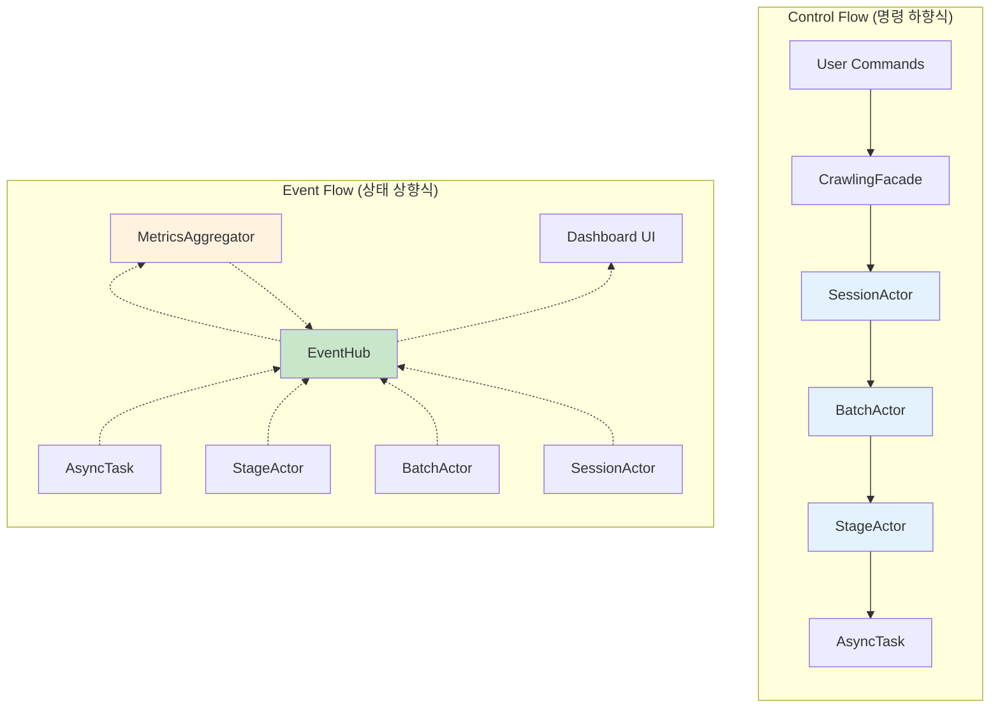
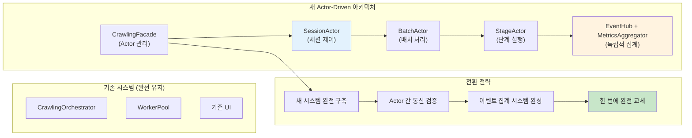
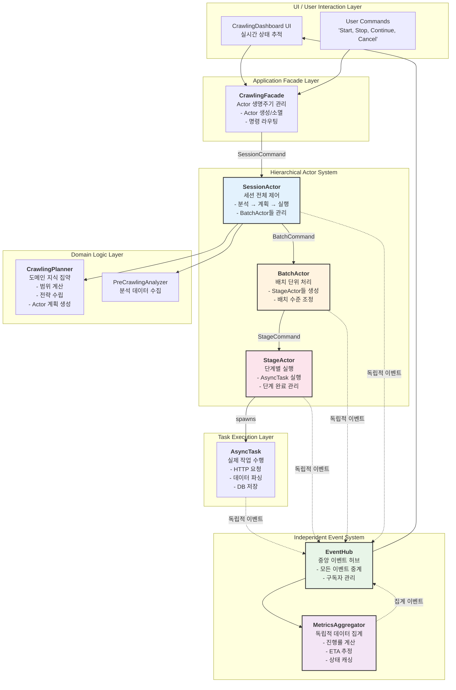
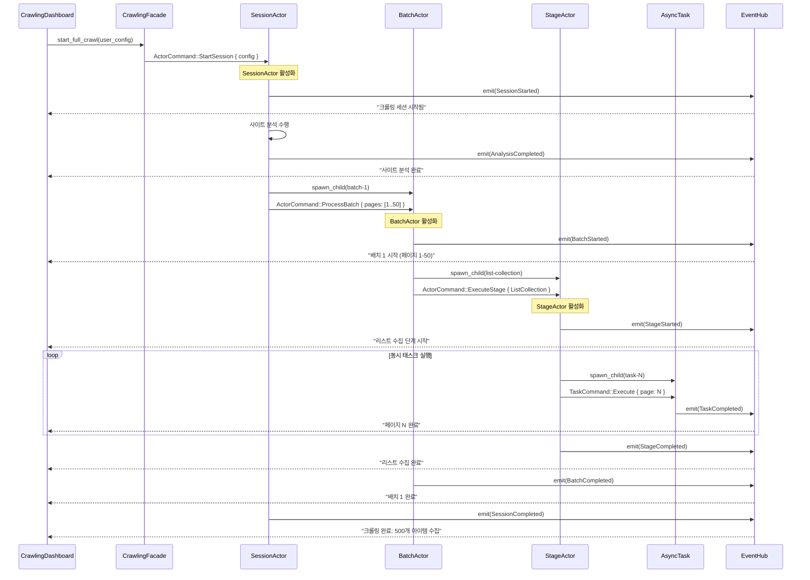
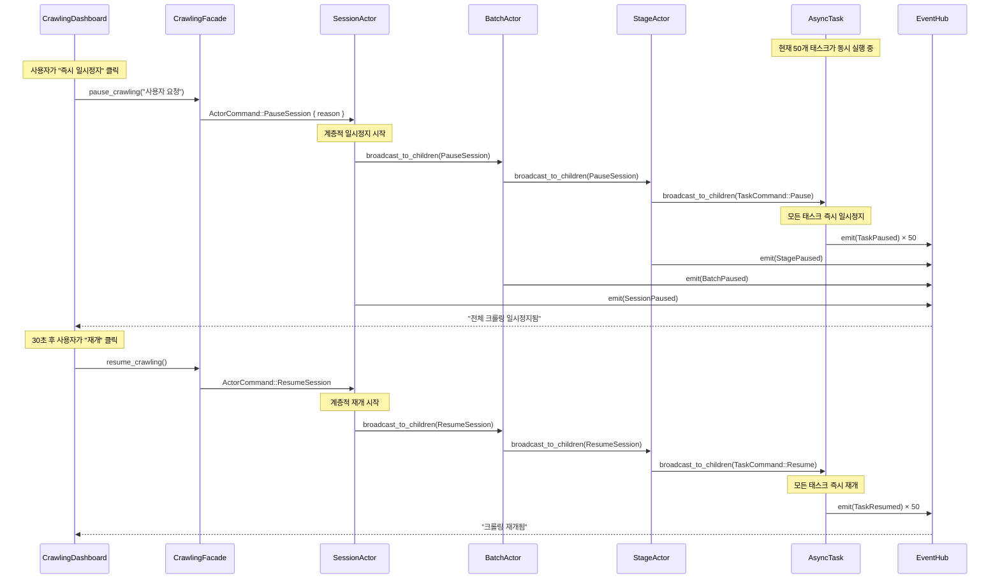
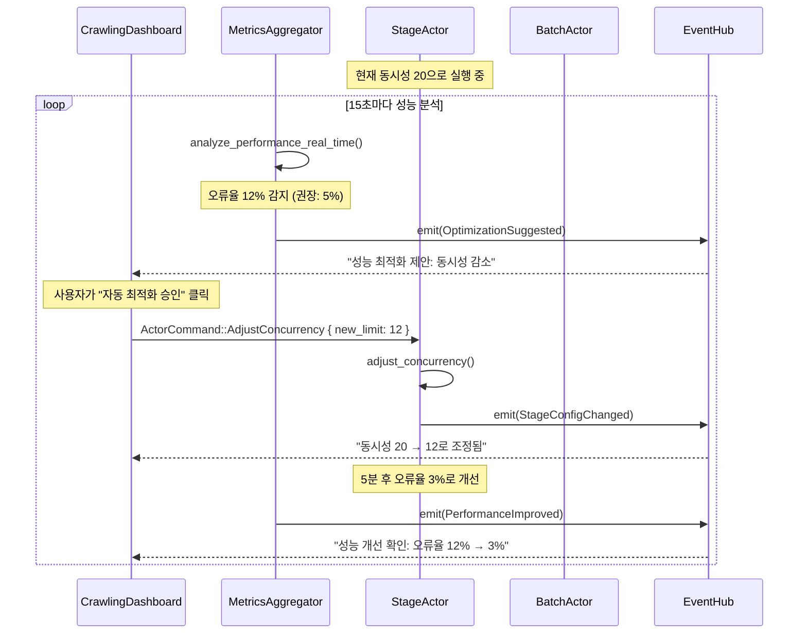
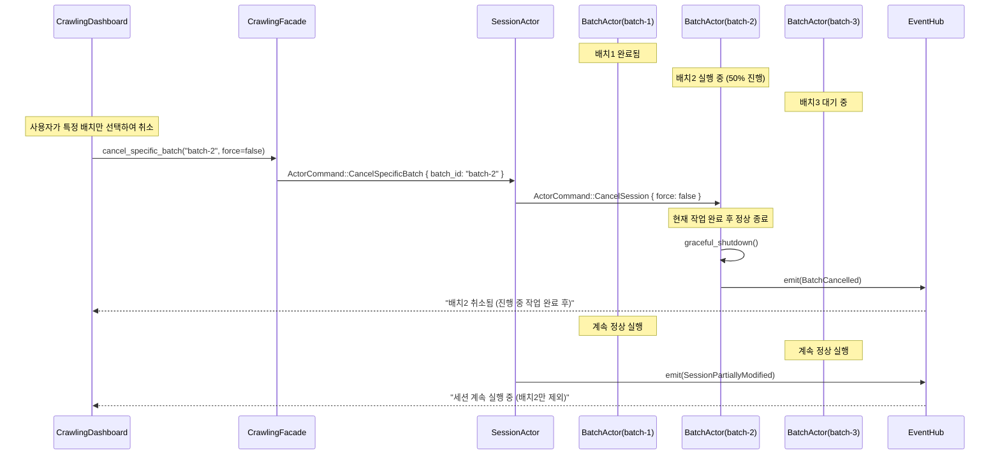
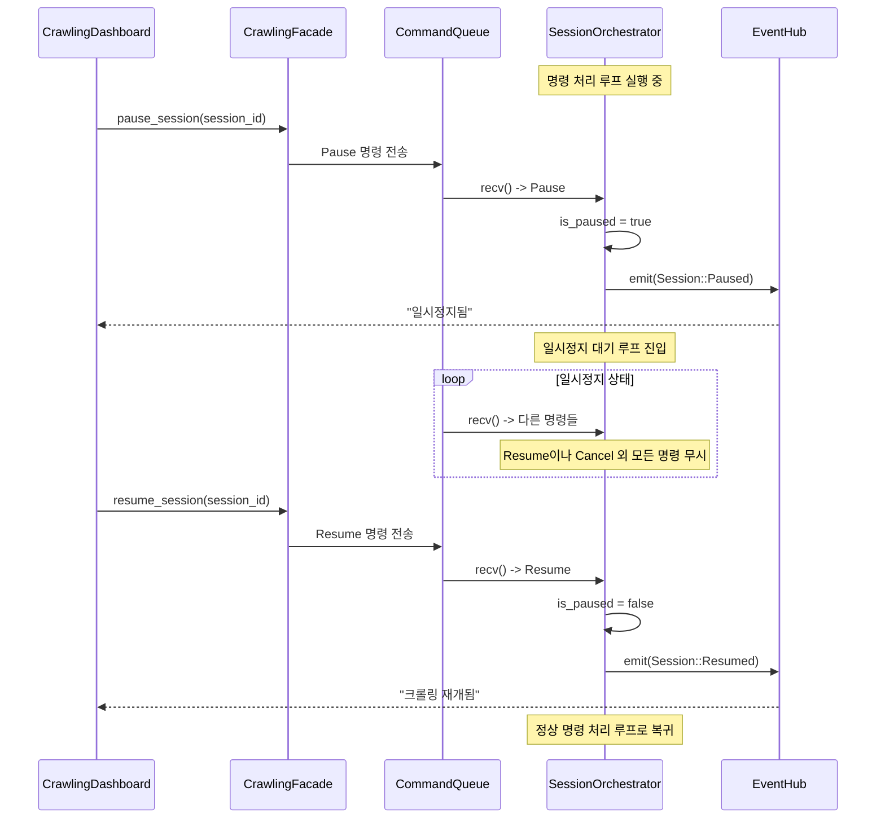
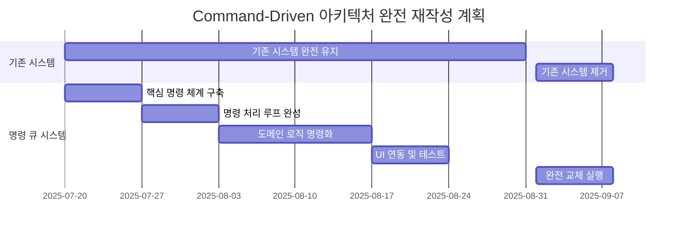

# rMatterCertis 최종 아키텍처 재구축 실행 계획 v4 (Actor Model Evolution)

*본 문서는 `re-arch-plan.md`, `re-arch-plan-improved.md`, 그리고 `re-arch-plan-r-gem.md`의 혁신적인 **계층적 Actor Model + 독립적 이벤트 발행** 아키텍처를 통합하여, **제어의 단순성과 상태 보고의 풍부함**을 모두 달성한 최종 진화 설계를 제시합니다.*

## 1. 혁신적 아키텍처 철학: 제어와 상태의 완벽한 분리

### 1.1 핵심 설계 원칙 (Actor Model + Event-Driven)

1. **이중 흐름 아키텍처**: 제어는 하향식(Top-Down), 상태는 상향식(Bottom-Up)
2. **계층적 Actor 모델**: Session → Batch → Stage → Task 계층적 책임 분담
3. **독립적 이벤트 발행**: 모든 컴포넌트가 상위 구조 무관하게 이벤트 발행
4. **중앙 집중식 집계**: MetricsAggregator를 통한 의미 있는 데이터 생성
5. **완전한 재작성 전략**: 기존 시스템 제약 없는 최적 설계

### 1.2 이중 흐름 아키텍처의 혁신적 이점

**🎯 기존 단일 흐름 방식의 한계**:
- 제어와 상태 보고가 뒤섞여 복잡성 증가
- 하위 컴포넌트가 상위 구조에 강결합
- 세밀한 상태 추적과 간단한 제어의 충돌

**✅ 이중 흐름 분리의 우월성**:



**핵심 이점**:
- 🎯 **완벽한 분리**: 제어 로직과 상태 추적 로직의 독립성 보장
- 🧹 **단순한 제어**: 각 Actor는 하위 Actor에게 명령만 전달
- � **풍부한 상태**: 모든 컴포넌트가 독립적으로 세밀한 상태 보고
- 💪 **확장성**: 새로운 Actor나 이벤트 추가가 기존 구조에 영향 없음

### 1.3 통합 전략: Actor Model 기반 완전 재작성



## 2. 계층적 Actor Model 중심 최종 아키텍처

### 2.1 전체 시스템 아키텍처 (Hierarchical Actor + Event-Driven)



### 2.2 AppContext: 독립적 이벤트 발행의 핵심

```rust
// src-tauri/src/new_architecture/context.rs
//! 모든 Actor와 Task에 전파되는 실행 컨텍스트

use std::sync::Arc;
use tokio::sync::{mpsc, watch};
use uuid::Uuid;

/// 모든 작업 단위에 전파되는 실행 컨텍스트
/// 
/// **핵심 혁신**: 하위 컴포넌트가 상위 구조를 전혀 몰라도 됨
#[derive(Clone)]
pub struct AppContext {
    /// 세션 식별자
    pub session_id: String,
    
    /// 불변 세션 설정
    pub config: Arc<SessionConfig>,
    
    /// 🎯 독립적 이벤트 발행을 위한 Sender
    pub event_tx: mpsc::Sender<AppEvent>,
    
    /// 🎯 취소 신호를 받기 위한 Receiver (tokio::select! 용)
    pub cancellation_rx: watch::Receiver<bool>,
    
    /// 현재 실행 컨텍스트 정보
    pub execution_context: ExecutionContext,
}

#[derive(Clone, Debug)]
pub struct ExecutionContext {
    pub batch_id: Option<String>,
    pub stage_name: Option<String>,
    pub task_context: Option<TaskContext>,
}

#[derive(Clone, Debug)]
pub struct TaskContext {
    pub task_id: String,
    pub task_type: String,
    pub retry_count: u8,
    pub estimated_duration_ms: u64,
}

impl AppContext {
    /// 새로운 실행 컨텍스트 생성
    pub fn new(
        session_id: String,
        config: Arc<SessionConfig>,
        event_tx: mpsc::Sender<AppEvent>,
        cancellation_rx: watch::Receiver<bool>,
    ) -> Self {
        Self {
            session_id,
            config,
            event_tx,
            cancellation_rx,
            execution_context: ExecutionContext::default(),
        }
    }
    
    /// 배치 컨텍스트로 확장
    pub fn with_batch(&self, batch_id: String) -> Self {
        let mut ctx = self.clone();
        ctx.execution_context.batch_id = Some(batch_id);
        ctx
    }
    
    /// 단계 컨텍스트로 확장
    pub fn with_stage(&self, stage_name: String) -> Self {
        let mut ctx = self.clone();
        ctx.execution_context.stage_name = Some(stage_name);
        ctx
    }
    
    /// 작업 컨텍스트로 확장
    pub fn with_task(&self, task_context: TaskContext) -> Self {
        let mut ctx = self.clone();
        ctx.execution_context.task_context = Some(task_context);
        ctx
    }
}

/// 이벤트 발행을 위한 공통 트레이트
#[async_trait]
pub trait EventEmitter: Send + Sync {
    fn context(&self) -> &AppContext;

    /// 🎯 핵심: 상위 구조에 대한 지식 없이 이벤트 발행
    async fn emit(&self, event: AppEvent) -> crate::Result<()> {
        self.context()
            .event_tx
            .send(event)
            .await
            .map_err(|e| format!("Failed to emit event: {}", e).into())
    }
    
    /// 편의 메서드: 현재 컨텍스트 정보와 함께 이벤트 발행
    async fn emit_with_context(&self, event_type: AppEventType) -> crate::Result<()> {
        let event = AppEvent {
            event_type,
            session_id: self.context().session_id.clone(),
            batch_id: self.context().execution_context.batch_id.clone(),
            stage_name: self.context().execution_context.stage_name.clone(),
            task_id: self.context().execution_context.task_context
                .as_ref().map(|t| t.task_id.clone()),
            timestamp: std::time::SystemTime::now(),
        };
        
        self.emit(event).await
    }
}
```

### 2.3 계층적 Actor 정의: 명확한 책임 분담

```rust
// src-tauri/src/new_architecture/actors/mod.rs
//! 계층적 Actor 시스템의 핵심 정의

use std::sync::Arc;
use tokio::sync::{mpsc, watch};
use uuid::Uuid;

/// Actor 간 명령 체계
#[derive(Debug, Clone)]
pub enum ActorCommand {
    // Session 레벨 명령
    StartCrawling { config: UserConfig },
    PauseSession { reason: String },
    ResumeSession,
    CancelSession { force: bool },
    
    // Batch 레벨 명령  
    ProcessBatch { pages: Vec<u32>, config: BatchConfig },
    AdjustBatchSize { new_size: u32 },
    
    // Stage 레벨 명령
    ExecuteStage { stage_type: StageType, items: Vec<StageItem> },
    RetryStage { stage_id: String, retry_config: RetryConfig },
    
    // 종료 명령
    Shutdown { graceful: bool },
}

/// 모든 Actor가 구현해야 하는 기본 트레이트
#[async_trait]
pub trait Actor: Send + Sync + EventEmitter {
    type Command: Send + Sync;
    type Error: Send + Sync + std::error::Error;
    
    /// Actor 고유 식별자
    fn id(&self) -> &str;
    
    /// Actor 타입 이름
    fn actor_type() -> &'static str;
    
    /// 명령 처리 메인 루프
    async fn run(
        &mut self,
        command_rx: mpsc::Receiver<Self::Command>,
        context: AppContext,
    ) -> Result<(), Self::Error>;
    
    /// 정리 작업
    async fn cleanup(&mut self) -> Result<(), Self::Error>;
}

/// 계층적 Actor: 하위 Actor들을 관리하는 Actor
#[async_trait]
pub trait HierarchicalActor: Actor {
    type ChildActor: Actor;
    type ChildCommand: Send + Sync;
    
    /// 하위 Actor 생성
    async fn spawn_child(
        &self,
        child_id: String,
        context: AppContext,
    ) -> Result<mpsc::Sender<Self::ChildCommand>, Self::Error>;
    
    /// 모든 하위 Actor에게 명령 전송
    async fn broadcast_to_children(
        &self,
        command: Self::ChildCommand,
    ) -> Result<(), Self::Error>;
    
    /// 특정 하위 Actor에게 명령 전송
    async fn send_to_child(
        &self,
        child_id: &str,
        command: Self::ChildCommand,
    ) -> Result<(), Self::Error>;
}
```

## 3. 핵심 컴포넌트 상세 설계: 계층적 Actor 시스템

### 3.1 SessionActor: 최상위 세션 제어자

```rust
// src-tauri/src/new_architecture/actors/session_actor.rs
//! 세션 전체 생명주기를 관리하는 최상위 Actor

use std::collections::HashMap;
use std::sync::Arc;
use tokio::sync::{mpsc, watch};

/// 세션 전체를 제어하는 최상위 Actor
/// 
/// **핵심 책임**:
/// - 분석 → 계획 → 실행 워크플로 조정
/// - BatchActor들의 생성 및 관리
/// - 세션 수준 이벤트 발행
pub struct SessionActor {
    id: String,
    context: AppContext,
    planner: Arc<CrawlingPlanner>,
    batch_actors: HashMap<String, BatchActorHandle>,
    cancellation_tx: watch::Sender<bool>,
}

struct BatchActorHandle {
    command_tx: mpsc::Sender<ActorCommand>,
    join_handle: tokio::task::JoinHandle<crate::Result<()>>,
}

impl SessionActor {
    pub fn new(session_id: String, context: AppContext) -> Self {
        let planner = Arc::new(CrawlingPlanner::new(context.event_tx.clone()));
        let (cancellation_tx, _) = watch::channel(false);
        
        Self {
            id: session_id,
            context,
            planner,
            batch_actors: HashMap::new(),
            cancellation_tx,
        }
    }
}

#[async_trait]
impl Actor for SessionActor {
    type Command = ActorCommand;
    type Error = crate::Error;
    
    fn id(&self) -> &str {
        &self.id
    }
    
    fn actor_type() -> &'static str {
        "SessionActor"
    }
    
    /// 🎯 세션 Actor 메인 루프: 명령 기반 제어
    async fn run(
        &mut self,
        mut command_rx: mpsc::Receiver<Self::Command>,
        context: AppContext,
    ) -> Result<(), Self::Error> {
        
        // 세션 시작 이벤트
        self.emit_with_context(AppEventType::SessionStarted {
            session_id: self.id.clone(),
        }).await?;
        
        while let Some(command) = command_rx.recv().await {
            match command {
                ActorCommand::StartCrawling { config } => {
                    self.handle_start_crawling(config).await?;
                }
                
                ActorCommand::PauseSession { reason } => {
                    self.handle_pause_session(reason).await?;
                }
                
                ActorCommand::ResumeSession => {
                    self.handle_resume_session().await?;
                }
                
                ActorCommand::CancelSession { force } => {
                    self.handle_cancel_session(force).await?;
                    break; // 세션 종료
                }
                
                ActorCommand::Shutdown { graceful } => {
                    self.handle_shutdown(graceful).await?;
                    break; // 정상 종료
                }
                
                _ => {
                    // 다른 명령은 적절한 하위 Actor에게 전달
                    self.route_command_to_child(command).await?;
                }
            }
        }
        
        self.cleanup().await?;
        
        // 세션 완료 이벤트
        self.emit_with_context(AppEventType::SessionCompleted {
            session_id: self.id.clone(),
        }).await?;
        
        Ok(())
    }
    
    async fn cleanup(&mut self) -> Result<(), Self::Error> {
        // 모든 하위 BatchActor 정리
        for (batch_id, handle) in self.batch_actors.drain() {
            // 정리 명령 전송
            let _ = handle.command_tx.send(ActorCommand::Shutdown { graceful: true }).await;
            
            // Actor 종료 대기
            if let Err(e) = handle.join_handle.await {
                eprintln!("BatchActor {} cleanup failed: {:?}", batch_id, e);
            }
        }
        
        Ok(())
    }
}

impl EventEmitter for SessionActor {
    fn context(&self) -> &AppContext {
        &self.context
    }
}

#[async_trait]
impl HierarchicalActor for SessionActor {
    type ChildActor = BatchActor;
    type ChildCommand = ActorCommand;
    
    /// BatchActor 생성 및 실행
    async fn spawn_child(
        &self,
        batch_id: String,
        context: AppContext,
    ) -> Result<mpsc::Sender<Self::ChildCommand>, Self::Error> {
        let (command_tx, command_rx) = mpsc::channel(100);
        
        // BatchActor 생성
        let mut batch_actor = BatchActor::new(
            batch_id.clone(),
            context.with_batch(batch_id.clone()),
        );
        
        // 비동기 실행
        let join_handle = tokio::spawn(async move {
            batch_actor.run(command_rx, context).await
        });
        
        // 핸들 저장
        self.batch_actors.insert(batch_id, BatchActorHandle {
            command_tx: command_tx.clone(),
            join_handle,
        });
        
        Ok(command_tx)
    }
    
    async fn broadcast_to_children(
        &self,
        command: Self::ChildCommand,
    ) -> Result<(), Self::Error> {
        for handle in self.batch_actors.values() {
            handle.command_tx.send(command.clone()).await
                .map_err(|e| format!("Failed to send command to batch actor: {}", e))?;
        }
        Ok(())
    }
    
    async fn send_to_child(
        &self,
        batch_id: &str,
        command: Self::ChildCommand,
    ) -> Result<(), Self::Error> {
        if let Some(handle) = self.batch_actors.get(batch_id) {
            handle.command_tx.send(command).await
                .map_err(|e| format!("Failed to send command to batch {}: {}", batch_id, e))?;
        }
        Ok(())
    }
}

impl SessionActor {
    /// 크롤링 시작 처리: 분석 → 계획 → BatchActor 생성
    async fn handle_start_crawling(&mut self, config: UserConfig) -> crate::Result<()> {
        // 1단계: 분석
        self.emit_with_context(AppEventType::StageChanged {
            to_stage: "Analyzing".to_string(),
        }).await?;
        
        let analysis_result = self.planner.analyze_current_state().await?;
        
        // 2단계: 계획 수립
        self.emit_with_context(AppEventType::StageChanged {
            to_stage: "Planning".to_string(),
        }).await?;
        
        let execution_plan = self.planner.create_execution_plan(
            config.crawling.crawl_type,
            &analysis_result,
        ).await?;
        
        // 3단계: BatchActor들 생성 및 실행
        self.emit_with_context(AppEventType::StageChanged {
            to_stage: "Executing".to_string(),
        }).await?;
        
        for batch_plan in execution_plan.batches {
            let batch_command_tx = self.spawn_child(
                batch_plan.batch_id.clone(),
                self.context.clone(),
            ).await?;
            
            // BatchActor에게 처리 명령 전송
            batch_command_tx.send(ActorCommand::ProcessBatch {
                pages: batch_plan.pages,
                config: batch_plan.config,
            }).await.map_err(|e| format!("Failed to start batch: {}", e))?;
        }
        
        Ok(())
    }
    
    /// 세션 일시정지: 모든 하위 Actor에게 일시정지 전파
    async fn handle_pause_session(&self, reason: String) -> crate::Result<()> {
        self.broadcast_to_children(ActorCommand::PauseSession { 
            reason: reason.clone() 
        }).await?;
        
        self.emit_with_context(AppEventType::SessionPaused {
            reason,
        }).await?;
        
        Ok(())
    }
    
    /// 🚀 즉시 반응하는 세션 취소
    async fn handle_cancel_session(&mut self, force: bool) -> crate::Result<()> {
        // 취소 신호 전송 (모든 하위 작업이 tokio::select!로 즉시 감지)
        self.cancellation_tx.send(true).map_err(|e| format!("Failed to send cancellation: {}", e))?;
        
        // 모든 하위 Actor에게 취소 명령 전송
        self.broadcast_to_children(ActorCommand::CancelSession { force }).await?;
        
        self.emit_with_context(AppEventType::SessionCancelled {
            force,
        }).await?;
        
        Ok(())
    }
}
```

### 3.2 BatchActor: 배치 처리 전문 Actor

```rust
// src-tauri/src/new_architecture/actors/batch_actor.rs
//! 배치 단위 처리를 담당하는 중간 계층 Actor

use std::collections::HashMap;
use tokio::sync::mpsc;

/// 배치 단위 처리를 담당하는 Actor
/// 
/// **핵심 책임**:
/// - 배치 크기 및 지연 시간 관리
/// - StageActor들의 생성 및 조정
/// - 배치 수준 성능 모니터링
pub struct BatchActor {
    id: String,
    context: AppContext,
    stage_actors: HashMap<String, StageActorHandle>,
    current_batch_config: BatchConfig,
}

struct StageActorHandle {
    command_tx: mpsc::Sender<ActorCommand>,
    join_handle: tokio::task::JoinHandle<crate::Result<()>>,
    stage_type: StageType,
}

impl BatchActor {
    pub fn new(batch_id: String, context: AppContext) -> Self {
        Self {
            id: batch_id,
            context,
            stage_actors: HashMap::new(),
            current_batch_config: BatchConfig::default(),
        }
    }
    
    /// 🎯 적응적 배치 크기 조정
    async fn adjust_batch_size_adaptively(&mut self) -> crate::Result<()> {
        // 현재 성능 메트릭 수집
        let current_throughput = self.calculate_current_throughput().await?;
        let error_rate = self.calculate_error_rate().await?;
        
        let new_batch_size = if error_rate > 0.1 {
            // 오류율이 높으면 배치 크기 축소
            (self.current_batch_config.batch_size as f32 * 0.8) as u32
        } else if current_throughput > self.current_batch_config.target_throughput {
            // 처리량이 목표보다 높으면 배치 크기 확대
            (self.current_batch_config.batch_size as f32 * 1.2) as u32
        } else {
            self.current_batch_config.batch_size
        };
        
        if new_batch_size != self.current_batch_config.batch_size {
            self.current_batch_config.batch_size = new_batch_size;
            
            // 배치 크기 변경 이벤트 발행
            self.emit_with_context(AppEventType::BatchConfigChanged {
                new_batch_size,
                reason: "Adaptive adjustment".to_string(),
            }).await?;
        }
        
        Ok(())
    }
}

#[async_trait]
impl Actor for BatchActor {
    type Command = ActorCommand;
    type Error = crate::Error;
    
    fn id(&self) -> &str {
        &self.id
    }
    
    fn actor_type() -> &'static str {
        "BatchActor"
    }
    
    async fn run(
        &mut self,
        mut command_rx: mpsc::Receiver<Self::Command>,
        context: AppContext,
    ) -> Result<(), Self::Error> {
        
        // 배치 시작 이벤트
        self.emit_with_context(AppEventType::BatchStarted {
            batch_id: self.id.clone(),
        }).await?;
        
        while let Some(command) = command_rx.recv().await {
            match command {
                ActorCommand::ProcessBatch { pages, config } => {
                    self.current_batch_config = config;
                    self.handle_process_batch(pages).await?;
                }
                
                ActorCommand::AdjustBatchSize { new_size } => {
                    self.current_batch_config.batch_size = new_size;
                    self.emit_with_context(AppEventType::BatchConfigChanged {
                        new_batch_size: new_size,
                        reason: "Manual adjustment".to_string(),
                    }).await?;
                }
                
                ActorCommand::PauseSession { reason } => {
                    self.broadcast_to_children(command).await?;
                }
                
                ActorCommand::CancelSession { force } => {
                    self.broadcast_to_children(command).await?;
                    break; // 배치 중단
                }
                
                ActorCommand::Shutdown { graceful } => {
                    self.handle_shutdown(graceful).await?;
                    break; // 정상 종료
                }
                
                _ => {
                    // 다른 명령은 StageActor에게 전달
                    self.route_command_to_appropriate_stage(command).await?;
                }
            }
        }
        
        self.cleanup().await?;
        
        // 배치 완료 이벤트
        self.emit_with_context(AppEventType::BatchCompleted {
            batch_id: self.id.clone(),
        }).await?;
        
        Ok(())
    }
    
    async fn cleanup(&mut self) -> Result<(), Self::Error> {
        // 모든 StageActor 정리
        for (stage_id, handle) in self.stage_actors.drain() {
            let _ = handle.command_tx.send(ActorCommand::Shutdown { graceful: true }).await;
            if let Err(e) = handle.join_handle.await {
                eprintln!("StageActor {} cleanup failed: {:?}", stage_id, e);
            }
        }
        Ok(())
    }
}

impl EventEmitter for BatchActor {
    fn context(&self) -> &AppContext {
        &self.context
    }
}

#[async_trait]
impl HierarchicalActor for BatchActor {
    type ChildActor = StageActor;
    type ChildCommand = ActorCommand;
    
    async fn spawn_child(
        &self,
        stage_id: String,
        context: AppContext,
    ) -> Result<mpsc::Sender<Self::ChildCommand>, Self::Error> {
        let (command_tx, command_rx) = mpsc::channel(50);
        
        let mut stage_actor = StageActor::new(
            stage_id.clone(),
            context.with_stage(stage_id.clone()),
        );
        
        let join_handle = tokio::spawn(async move {
            stage_actor.run(command_rx, context).await
        });
        
        self.stage_actors.insert(stage_id, StageActorHandle {
            command_tx: command_tx.clone(),
            join_handle,
            stage_type: StageType::ListCollection, // 기본값
        });
        
        Ok(command_tx)
    }
    
    async fn broadcast_to_children(&self, command: Self::ChildCommand) -> Result<(), Self::Error> {
        for handle in self.stage_actors.values() {
            handle.command_tx.send(command.clone()).await
                .map_err(|e| format!("Failed to send command to stage actor: {}", e))?;
        }
        Ok(())
    }
    
    async fn send_to_child(&self, stage_id: &str, command: Self::ChildCommand) -> Result<(), Self::Error> {
        if let Some(handle) = self.stage_actors.get(stage_id) {
            handle.command_tx.send(command).await
                .map_err(|e| format!("Failed to send command to stage {}: {}", stage_id, e))?;
        }
        Ok(())
    }
}

impl BatchActor {
    /// 배치 처리 시작: StageActor들 생성 및 작업 분배
    async fn handle_process_batch(&mut self, pages: Vec<u32>) -> crate::Result<()> {
        // 페이지들을 단계별로 분할
        let list_collection_pages = pages.clone();
        let detail_collection_items = Vec::new(); // 리스트 수집 후 결정
        
        // 1단계: 리스트 수집 StageActor 생성
        let list_stage_tx = self.spawn_child(
            format!("{}-list-collection", self.id),
            self.context.clone(),
        ).await?;
        
        // 리스트 수집 시작
        list_stage_tx.send(ActorCommand::ExecuteStage {
            stage_type: StageType::ListCollection,
            items: list_collection_pages.into_iter()
                .map(|page| StageItem::Page(page))
                .collect(),
        }).await.map_err(|e| format!("Failed to start list collection: {}", e))?;
        
        // 적응적 배치 크기 조정 시작
        self.start_adaptive_monitoring().await?;
        
        Ok(())
    }
    
    /// 적응적 모니터링 시작
    async fn start_adaptive_monitoring(&mut self) -> crate::Result<()> {
        let mut interval = tokio::time::interval(
            std::time::Duration::from_secs(30) // 30초마다 조정
        );
        
        loop {
            tokio::select! {
                _ = interval.tick() => {
                    self.adjust_batch_size_adaptively().await?;
                }
                _ = self.context.cancellation_rx.changed() => {
                    if *self.context.cancellation_rx.borrow() {
                        break; // 취소 신호 수신
                    }
                }
            }
        }
        
        Ok(())
    }
}
```

### 3.3 AsyncTask: 실제 작업 수행 단위

```rust
// src-tauri/src/new_architecture/tasks/async_task.rs
//! 실제 크롤링 작업을 수행하는 말단 실행 단위

use std::time::Instant;
use reqwest::Client;
use tokio::sync::mpsc;

/// 개별 비동기 작업을 담당하는 실행 단위
/// 
/// **핵심 책임**:
/// - HTTP 요청, 파싱, 저장 등 실제 작업 수행
/// - 작업별 세밀한 성능 메트릭 수집
/// - 오류 처리 및 재시도 로직
pub struct AsyncTask {
    id: String,
    context: AppContext,
    task_type: TaskType,
    client: Client,
    performance_tracker: TaskPerformanceTracker,
}

#[derive(Debug, Clone)]
pub enum TaskType {
    FetchListPage,
    FetchProductDetail,
    ParseHtmlContent,
    ValidateData,
    SaveToDatabase,
}

#[derive(Debug, Clone)]
pub enum TaskCommand {
    Execute { item: StageItem },
    Pause,
    Resume,
    Cancel,
    ForceCancel,
    UpdateConfig { config: TaskConfig },
}

#[derive(Debug, Clone)]
pub struct TaskResult {
    pub task_id: String,
    pub task_type: TaskType,
    pub execution_time: std::time::Duration,
    pub success: bool,
    pub data: TaskResultData,
    pub metrics: TaskMetrics,
}

impl AsyncTask {
    pub fn new(task_id: String, task_type: TaskType, context: AppContext) -> Self {
        let client = Client::builder()
            .timeout(std::time::Duration::from_secs(30))
            .user_agent("MatterCertis/2.0")
            .build()
            .expect("Failed to create HTTP client");
        
        Self {
            id: task_id,
            context,
            task_type,
            client,
            performance_tracker: TaskPerformanceTracker::new(),
        }
    }
    
    /// 🎯 적응적 재시도 로직
    async fn execute_with_adaptive_retry<T, F, Fut>(
        &mut self,
        operation: F,
        max_retries: u32,
    ) -> crate::Result<T>
    where
        F: Fn() -> Fut,
        Fut: std::future::Future<Output = crate::Result<T>>,
    {
        let mut attempt = 0;
        let mut last_error = None;
        
        while attempt <= max_retries {
            let start_time = Instant::now();
            
            match operation().await {
                Ok(result) => {
                    self.performance_tracker.record_success(
                        attempt,
                        start_time.elapsed(),
                    );
                    return Ok(result);
                }
                Err(e) => {
                    last_error = Some(e.clone());
                    self.performance_tracker.record_failure(
                        attempt,
                        start_time.elapsed(),
                        &e,
                    );
                    
                    if attempt < max_retries {
                        // 적응적 대기 시간: 지수 백오프 + 지터
                        let base_delay = 2_u64.pow(attempt);
                        let jitter = rand::random::<u64>() % 1000;
                        let delay_ms = base_delay * 1000 + jitter;
                        
                        tokio::time::sleep(std::time::Duration::from_millis(delay_ms)).await;
                        
                        self.emit_with_context(AppEventType::TaskRetrying {
                            task_id: self.id.clone(),
                            attempt: attempt + 1,
                            error: e.to_string(),
                        }).await?;
                    }
                }
            }
            
            attempt += 1;
        }
        
        Err(last_error.unwrap_or_else(|| {
            crate::Error::TaskFailed(format!("Max retries exceeded for task {}", self.id))
        }))
    }
}

#[async_trait]
impl Actor for AsyncTask {
    type Command = TaskCommand;
    type Error = crate::Error;
    
    fn id(&self) -> &str {
        &self.id
    }
    
    fn actor_type() -> &'static str {
        "AsyncTask"
    }
    
    async fn run(
        &mut self,
        mut command_rx: mpsc::Receiver<Self::Command>,
        context: AppContext,
    ) -> Result<TaskResult, Self::Error> {
        
        // 태스크 시작 이벤트
        self.emit_with_context(AppEventType::TaskStarted {
            task_id: self.id.clone(),
            task_type: self.task_type.clone(),
        }).await?;
        
        let mut is_paused = false;
        let mut result = None;
        
        while let Some(command) = command_rx.recv().await {
            match command {
                TaskCommand::Execute { item } => {
                    if !is_paused {
                        result = Some(self.execute_task_item(item).await?);
                        break; // 작업 완료 후 종료
                    }
                }
                
                TaskCommand::Pause => {
                    is_paused = true;
                    self.emit_with_context(AppEventType::TaskPaused {
                        task_id: self.id.clone(),
                    }).await?;
                }
                
                TaskCommand::Resume => {
                    is_paused = false;
                    self.emit_with_context(AppEventType::TaskResumed {
                        task_id: self.id.clone(),
                    }).await?;
                }
                
                TaskCommand::Cancel | TaskCommand::ForceCancel => {
                    self.emit_with_context(AppEventType::TaskCancelled {
                        task_id: self.id.clone(),
                    }).await?;
                    break;
                }
                
                TaskCommand::UpdateConfig { config } => {
                    self.update_task_config(config).await?;
                }
            }
        }
        
        let final_result = result.unwrap_or_else(|| TaskResult {
            task_id: self.id.clone(),
            task_type: self.task_type.clone(),
            execution_time: std::time::Duration::from_secs(0),
            success: false,
            data: TaskResultData::Cancelled,
            metrics: self.performance_tracker.get_metrics(),
        });
        
        self.emit_with_context(AppEventType::TaskCompleted {
            task_id: self.id.clone(),
            result: final_result.clone(),
        }).await?;
        
        Ok(final_result)
    }
    
    async fn cleanup(&mut self) -> Result<(), Self::Error> {
        // HTTP 클라이언트 정리 등
        Ok(())
    }
}

impl EventEmitter for AsyncTask {
    fn context(&self) -> &AppContext {
        &self.context
    }
}

impl AsyncTask {
    async fn execute_task_item(&mut self, item: StageItem) -> crate::Result<TaskResult> {
        let start_time = Instant::now();
        
        let result_data = match self.task_type {
            TaskType::FetchListPage => {
                self.fetch_list_page(item).await?
            }
            
            TaskType::FetchProductDetail => {
                self.fetch_product_detail(item).await?
            }
            
            TaskType::ParseHtmlContent => {
                self.parse_html_content(item).await?
            }
            
            TaskType::ValidateData => {
                self.validate_data(item).await?
            }
            
            TaskType::SaveToDatabase => {
                self.save_to_database(item).await?
            }
        };
        
        let execution_time = start_time.elapsed();
        
        Ok(TaskResult {
            task_id: self.id.clone(),
            task_type: self.task_type.clone(),
            execution_time,
            success: true,
            data: result_data,
            metrics: self.performance_tracker.get_metrics(),
        })
    }
    
    /// 리스트 페이지 수집
    async fn fetch_list_page(&mut self, item: StageItem) -> crate::Result<TaskResultData> {
        if let StageItem::Page(page_num) = item {
            let url = format!("https://mattercertis.com/page/{}", page_num);
            
            let content = self.execute_with_adaptive_retry(|| async {
                let response = self.client.get(&url).send().await
                    .map_err(|e| crate::Error::HttpRequest(e.to_string()))?;
                
                if !response.status().is_success() {
                    return Err(crate::Error::HttpStatus(response.status().as_u16()));
                }
                
                response.text().await
                    .map_err(|e| crate::Error::HttpRequest(e.to_string()))
            }, 3).await?;
            
            // 성능 메트릭 기록
            self.performance_tracker.record_page_fetch(page_num, content.len());
            
            Ok(TaskResultData::HtmlContent {
                url,
                content,
                page_number: Some(page_num),
            })
        } else {
            Err(crate::Error::TaskFailed("Invalid item type for FetchListPage".to_string()))
        }
    }
    
    /// 상품 상세 정보 수집
    async fn fetch_product_detail(&mut self, item: StageItem) -> crate::Result<TaskResultData> {
        if let StageItem::ProductUrl(url) = item {
            let content = self.execute_with_adaptive_retry(|| async {
                let response = self.client.get(&url).send().await
                    .map_err(|e| crate::Error::HttpRequest(e.to_string()))?;
                
                if !response.status().is_success() {
                    return Err(crate::Error::HttpStatus(response.status().as_u16()));
                }
                
                response.text().await
                    .map_err(|e| crate::Error::HttpRequest(e.to_string()))
            }, 3).await?;
            
            // 상품 정보 파싱
            let product_info = self.parse_product_content(&content).await?;
            
            Ok(TaskResultData::ProductInfo(product_info))
        } else {
            Err(crate::Error::TaskFailed("Invalid item type for FetchProductDetail".to_string()))
        }
    }
    
    /// HTML 파싱 전용 작업
    async fn parse_html_content(&mut self, item: StageItem) -> crate::Result<TaskResultData> {
        if let StageItem::HtmlContent { content, page_number } = item {
            let parser = HtmlParser::new();
            let parsed_items = parser.parse_list_page(&content).await?;
            
            self.performance_tracker.record_parsing_result(
                parsed_items.len(),
                content.len(),
            );
            
            Ok(TaskResultData::ParsedItems {
                items: parsed_items,
                source_page: page_number,
            })
        } else {
            Err(crate::Error::TaskFailed("Invalid item type for ParseHtmlContent".to_string()))
        }
    }
    
    /// 데이터 검증
    async fn validate_data(&mut self, item: StageItem) -> crate::Result<TaskResultData> {
        // 데이터 검증 로직
        Ok(TaskResultData::ValidationResult {
            is_valid: true,
            errors: Vec::new(),
        })
    }
    
    /// 데이터베이스 저장
    async fn save_to_database(&mut self, item: StageItem) -> crate::Result<TaskResultData> {
        // 데이터베이스 저장 로직
        Ok(TaskResultData::SaveResult {
            saved_count: 1,
            errors: Vec::new(),
        })
    }
}
```

### 3.4 MetricsAggregator: 중앙화된 메트릭 처리 Actor

```rust
// src-tauri/src/new_architecture/metrics/metrics_aggregator.rs
//! 시스템 전체 메트릭을 중앙에서 처리하는 전문 Actor

use std::collections::HashMap;
use tokio::sync::mpsc;
use std::time::{Duration, Instant};

/// 메트릭 수집 및 의미있는 정보 생성을 담당하는 Actor
/// 
/// **핵심 책임**:
/// - 모든 Actor로부터 메트릭 수집
/// - 실시간 성능 분석 및 트렌드 파악
/// - 의미있는 KPI 생성 및 알림
/// - 최적화 제안 생성
pub struct MetricsAggregator {
    id: String,
    context: AppContext,
    session_metrics: HashMap<String, SessionMetrics>,
    batch_metrics: HashMap<String, BatchMetrics>,
    stage_metrics: HashMap<String, StageMetrics>,
    task_metrics: HashMap<String, TaskMetrics>,
    aggregated_insights: SystemInsights,
}

#[derive(Debug, Clone)]
pub enum MetricCommand {
    RecordSessionEvent { session_id: String, event: SessionMetricEvent },
    RecordBatchEvent { batch_id: String, event: BatchMetricEvent },
    RecordStageEvent { stage_id: String, event: StageMetricEvent },
    RecordTaskEvent { task_id: String, event: TaskMetricEvent },
    GenerateReport { report_type: ReportType },
    AnalyzePerformance { time_window: Duration },
    OptimizeRecommendations,
}

#[derive(Debug, Clone)]
pub struct SystemInsights {
    pub overall_throughput: f64,
    pub error_rate: f64,
    pub resource_utilization: ResourceUtilization,
    pub performance_trends: Vec<PerformanceTrend>,
    pub optimization_suggestions: Vec<OptimizationSuggestion>,
}

impl MetricsAggregator {
    pub fn new(aggregator_id: String, context: AppContext) -> Self {
        Self {
            id: aggregator_id,
            context,
            session_metrics: HashMap::new(),
            batch_metrics: HashMap::new(),
            stage_metrics: HashMap::new(),
            task_metrics: HashMap::new(),
            aggregated_insights: SystemInsights::default(),
        }
    }
    
    /// 🎯 실시간 성능 분석 및 최적화 제안 생성
    async fn analyze_performance_real_time(&mut self) -> crate::Result<()> {
        // 1. 현재 처리량 계산
        let current_throughput = self.calculate_overall_throughput().await?;
        
        // 2. 오류율 분석
        let error_rate = self.calculate_system_error_rate().await?;
        
        // 3. 리소스 사용률 분석
        let resource_utilization = self.calculate_resource_utilization().await?;
        
        // 4. 성능 트렌드 파악
        let performance_trends = self.analyze_performance_trends().await?;
        
        // 5. 최적화 제안 생성
        let optimization_suggestions = self.generate_optimization_suggestions(
            current_throughput,
            error_rate,
            &resource_utilization,
            &performance_trends,
        ).await?;
        
        // 시스템 인사이트 업데이트
        self.aggregated_insights = SystemInsights {
            overall_throughput: current_throughput,
            error_rate,
            resource_utilization,
            performance_trends,
            optimization_suggestions: optimization_suggestions.clone(),
        };
        
        // 중요한 최적화 제안이 있으면 이벤트 발행
        if !optimization_suggestions.is_empty() {
            self.emit_with_context(AppEventType::OptimizationSuggested {
                suggestions: optimization_suggestions,
            }).await?;
        }
        
        Ok(())
    }
}

#[async_trait]
impl Actor for MetricsAggregator {
    type Command = MetricCommand;
    type Error = crate::Error;
    
    fn id(&self) -> &str {
        &self.id
    }
    
    fn actor_type() -> &'static str {
        "MetricsAggregator"
    }
    
    async fn run(
        &mut self,
        mut command_rx: mpsc::Receiver<Self::Command>,
        context: AppContext,
    ) -> Result<(), Self::Error> {
        
        // 실시간 분석 인터벌 설정
        let mut analysis_interval = tokio::time::interval(Duration::from_secs(15));
        
        // 메트릭 집계 시작 이벤트
        self.emit_with_context(AppEventType::MetricsAggregationStarted {
            aggregator_id: self.id.clone(),
        }).await?;
        
        loop {
            tokio::select! {
                // 메트릭 명령 처리
                command = command_rx.recv() => {
                    match command {
                        Some(cmd) => {
                            if let Err(e) = self.handle_metric_command(cmd).await {
                                eprintln!("Metric command handling error: {:?}", e);
                            }
                        },
                        None => break, // 채널 닫힘
                    }
                }
                
                // 주기적 성능 분석
                _ = analysis_interval.tick() => {
                    if let Err(e) = self.analyze_performance_real_time().await {
                        eprintln!("Performance analysis error: {:?}", e);
                    }
                }
                
                // 취소 신호 확인
                _ = self.context.cancellation_rx.changed() => {
                    if *self.context.cancellation_rx.borrow() {
                        break;
                    }
                }
            }
        }
        
        self.cleanup().await?;
        
        // 최종 리포트 생성
        let final_report = self.generate_final_report().await?;
        self.emit_with_context(AppEventType::FinalReportGenerated {
            report: final_report,
        }).await?;
        
        Ok(())
    }
    
    async fn cleanup(&mut self) -> Result<(), Self::Error> {
        // 메트릭 데이터 영구 저장
        self.persist_metrics_data().await?;
        Ok(())
    }
}

impl EventEmitter for MetricsAggregator {
    fn context(&self) -> &AppContext {
        &self.context
    }
}

impl MetricsAggregator {
    async fn handle_metric_command(&mut self, command: MetricCommand) -> crate::Result<()> {
        match command {
            MetricCommand::RecordSessionEvent { session_id, event } => {
                self.record_session_metric(session_id, event).await?;
            }
            
            MetricCommand::RecordBatchEvent { batch_id, event } => {
                self.record_batch_metric(batch_id, event).await?;
            }
            
            MetricCommand::RecordStageEvent { stage_id, event } => {
                self.record_stage_metric(stage_id, event).await?;
            }
            
            MetricCommand::RecordTaskEvent { task_id, event } => {
                self.record_task_metric(task_id, event).await?;
            }
            
            MetricCommand::GenerateReport { report_type } => {
                let report = self.generate_report(report_type).await?;
                self.emit_with_context(AppEventType::ReportGenerated {
                    report,
                }).await?;
            }
            
            MetricCommand::AnalyzePerformance { time_window } => {
                self.analyze_performance_window(time_window).await?;
            }
            
            MetricCommand::OptimizeRecommendations => {
                let suggestions = self.generate_optimization_suggestions(
                    self.aggregated_insights.overall_throughput,
                    self.aggregated_insights.error_rate,
                    &self.aggregated_insights.resource_utilization,
                    &self.aggregated_insights.performance_trends,
                ).await?;
                
                self.emit_with_context(AppEventType::OptimizationSuggested {
                    suggestions,
                }).await?;
            }
        }
        
        Ok(())
    }
    
    /// 💡 지능형 최적화 제안 생성
    async fn generate_optimization_suggestions(
        &self,
        throughput: f64,
        error_rate: f64,
        resource_util: &ResourceUtilization,
        trends: &[PerformanceTrend],
    ) -> crate::Result<Vec<OptimizationSuggestion>> {
        let mut suggestions = Vec::new();
        
        // 오류율 기반 제안
        if error_rate > 0.05 {
            suggestions.push(OptimizationSuggestion {
                category: OptimizationCategory::ErrorReduction,
                priority: SuggestionPriority::High,
                title: "높은 오류율 감지".to_string(),
                description: format!("현재 오류율 {:.2}%로 권장 수준(5%) 초과", error_rate * 100.0),
                recommendation: "배치 크기 축소 또는 재시도 간격 증가 고려".to_string(),
                expected_impact: "오류율 50% 감소 예상".to_string(),
            });
        }
        
        // 처리량 기반 제안
        if throughput < 10.0 {
            suggestions.push(OptimizationSuggestion {
                category: OptimizationCategory::PerformanceImprovement,
                priority: SuggestionPriority::Medium,
                title: "낮은 처리량 감지".to_string(),
                description: format!("현재 처리량 {:.2} items/sec", throughput),
                recommendation: "동시성 수준 증가 또는 배치 크기 최적화".to_string(),
                expected_impact: "처리량 30-50% 증가 예상".to_string(),
            });
        }
        
        // 리소스 사용률 기반 제안
        if resource_util.memory_usage > 0.8 {
            suggestions.push(OptimizationSuggestion {
                category: OptimizationCategory::ResourceOptimization,
                priority: SuggestionPriority::High,
                title: "높은 메모리 사용률".to_string(),
                description: format!("메모리 사용률 {:.1}%", resource_util.memory_usage * 100.0),
                recommendation: "배치 크기 감소 또는 가비지 컬렉션 빈도 증가".to_string(),
                expected_impact: "메모리 사용률 20-30% 감소".to_string(),
            });
        }
        
        // 트렌드 기반 제안
        for trend in trends {
            if trend.is_degrading() {
                suggestions.push(OptimizationSuggestion {
                    category: OptimizationCategory::TrendCorrection,
                    priority: SuggestionPriority::Medium,
                    title: format!("{} 성능 저하 트렌드", trend.metric_name),
                    description: trend.description.clone(),
                    recommendation: trend.recommended_action.clone(),
                    expected_impact: "성능 저하 트렌드 반전 예상".to_string(),
                });
            }
        }
        
        Ok(suggestions)
    }
    
    /// 📊 의미있는 KPI 계산
    async fn calculate_meaningful_kpis(&self) -> crate::Result<SystemKPIs> {
        let total_sessions = self.session_metrics.len() as f64;
        let completed_sessions = self.session_metrics.values()
            .filter(|m| m.is_completed())
            .count() as f64;
        
        let success_rate = if total_sessions > 0.0 {
            completed_sessions / total_sessions
        } else {
            0.0
        };
        
        let avg_session_duration = self.session_metrics.values()
            .map(|m| m.total_duration.as_secs_f64())
            .sum::<f64>() / total_sessions.max(1.0);
        
        let total_items_processed = self.task_metrics.values()
            .map(|m| m.items_processed)
            .sum::<u64>();
        
        let overall_efficiency = if avg_session_duration > 0.0 {
            total_items_processed as f64 / avg_session_duration
        } else {
            0.0
        };
        
        Ok(SystemKPIs {
            session_success_rate: success_rate,
            average_session_duration: Duration::from_secs_f64(avg_session_duration),
            total_items_processed,
            overall_efficiency,
            current_throughput: self.aggregated_insights.overall_throughput,
            system_uptime: self.calculate_system_uptime(),
        })
    }
}
```

## 4. UI 상호작용의 혁신: Actor 모델 기반 실시간 제어

### 4.1 크롤링 시작 및 계층적 상태 추적



### 4.2 혁신적 사용자 제어: 계층적 즉시 반응 제어



### 4.3 실시간 성능 모니터링 및 적응적 조정



### 4.4 고급 제어 시나리오: 선택적 배치 취소



    UI->>Facade: cancel_session(session_id, force=true)
    Facade->>Queue: 🚀 Cancel 명령 전송 (최고 우선순위)
    Note over Queue: Cancel 명령이 우선순위 큐로 즉시 이동

    Facade->>EventHub: emit(Session::CancelRequested)
    EventHub-->>UI: "취소 요청됨"

    Note over Orchestrator: 현재 작업(Page 50) 완료
    Queue->>Orchestrator: recv() -> 🎯 Cancel (우선순위 처리)
    
    Note over Orchestrator: Cancel 명령 처리
    Orchestrator->>Queue: clear() - 모든 대기 명령 제거
    Orchestrator->>Orchestrator: cleanup_all_tasks()
    Orchestrator->>EventHub: emit(Session::Cancelled)
    Orchestrator->>Orchestrator: break loop - 즉시 종료

    EventHub-->>UI: "크롤링 안전하게 취소됨"

    Note over UI: 🎯 반응 시간: 현재 작업만 완료 후 즉시 중단<br/>(기존: 모든 배치 완료 후 중단)
```

### 4.3 일시정지 및 재개의 우아한 처리



## 5. 혁신적 구현 계획: Command-Driven Clean Slate

### 5.1 구현 전략: 명령 큐 중심 완전 재작성

**🎯 핵심 철학**: 기존 시스템 완전 유지 + 명령 큐 기반 새 시스템 독립 구축



### 5.2 단계별 구현: 4주 명령 큐 혁신

#### Week 1: 명령 체계 및 큐 시스템 구축

```rust
// 새로운 독립 모듈 생성
src-tauri/src/
├── crawling/              // 기존 시스템 (건드리지 않음)
│   └── ...               
├── command_driven/        // 새 시스템 (완전 독립)
│   ├── command.rs         // CrawlingCommand enum
│   ├── queue.rs           // CommandQueue (MPSC + 우선순위)
│   ├── orchestrator.rs    // 단순화된 명령 처리 루프
│   └── facade.rs          // 명령 변환 계층
└── main.rs                // 기존 시스템 그대로 사용
```

**Week 1 핵심 산출물**:
1. `CrawlingCommand` 완전 정의 (작업 + 제어 명령)
2. `CommandQueue` 우선순위 처리 시스템
3. `SessionOrchestrator` 기본 while-loop 구조
4. `CrawlingFacade` 명령 변환 API

**검증 기준**: 간단한 FetchPage → ParsePage → Shutdown 명령 순차 처리 성공

#### Week 2: 단순화된 명령 처리 루프 완성

```rust
src-tauri/src/command_driven/
├── orchestrator.rs        // 완전한 명령 처리 루프
│   ├── handle_start_workflow()
│   ├── handle_fetch_list_page()
│   ├── handle_cancel() // 즉시 루프 종료
│   ├── handle_pause()  // 대기 루프
│   └── handle_shutdown()
├── events.rs             // EventHub + Command 이벤트
└── handlers/             // 개별 명령 핸들러들
    ├── fetch_handler.rs
    ├── parse_handler.rs
    └── control_handler.rs
```

**Week 2 핵심 혁신**:
- 복잡한 SharedState 완전 제거
- 모든 제어가 명령을 통한 처리
- 취소/일시정지의 즉시 반응 구현
- 우선순위 기반 명령 처리 검증

**검증 기준**: UI에서 Cancel 명령 전송 시 1초 이내 반응 확인

#### Week 3: 도메인 로직의 명령화

```rust
src-tauri/src/command_driven/
├── domain/
│   ├── planner.rs         // 명령 생성기로 진화
│   │   ├── plan_and_queue_commands()
│   │   ├── generate_full_crawl_commands()
│   │   └── generate_recovery_commands()
│   ├── analyzer.rs        // 분석 로직 (유지)
│   └── batch_config.rs    // 배치 설정 최적화
├── execution/
│   ├── fetch_executor.rs  // 실제 HTTP 요청 처리
│   ├── parse_executor.rs  // HTML 파싱 처리
│   └── save_executor.rs   // DB 저장 처리
└── memory/
    └── monitor.rs         // 메모리 모니터링 명령
```

**Week 3 핵심 변화**:
- CrawlingPlanner → 명령 시퀀스 생성기로 진화
- 기존 도메인 지식 완전 이식 (배치 최적화 로직 유지)
- 메모리 모니터링도 명령으로 처리
- 분석 결과 → 명령 시퀀스 변환 완성

**검증 기준**: 전체/증분/복구 크롤링 모든 시나리오 명령 생성 성공

#### Week 4: UI 연동 및 통합 테스트

```rust
src-tauri/src/command_driven/
├── ui/
│   ├── dashboard.rs       // 새 UI 컴포넌트
│   ├── real_time_feed.rs  // 실시간 명령 상태 표시
│   └── control_panel.rs   // 즉시 반응 제어 버튼
├── integration/
│   ├── e2e_tests.rs       // 전체 시나리오 테스트
│   ├── performance.rs     // 기존 시스템 대비 벤치마크
│   └── ui_response.rs     // UI 반응성 테스트
└── migration/
    ├── data_migration.rs  // 기존 데이터 호환성
    └── rollback_plan.rs   // 롤백 전략
```

**Week 4 핵심 완성**:
- 실시간 명령 상태 표시 UI
- 취소/일시정지 즉시 반응 검증
- 기존 시스템 대비 성능 비교
- 완전 전환 준비 완료

**검증 기준**: 
- 기존 시스템 대비 동등 이상 성능
- UI 반응성 1초 이내 보장
- 모든 기능 동작 검증

### 5.3 전환 전략: 한 번의 명령으로 완전 교체

```rust
// main.rs에서 단 한 줄 변경으로 혁신 적용
fn main() {
    // 기존: 
    // crawling::start_system();
    
    // 🚀 명령 큐 기반 새 시스템:
    command_driven::start_system();
}
```

**혁신적 전환 이점**:
- ✅ **Zero Waste Code**: 버려질 중간 코드 전혀 없음
- ✅ **즉시 반응**: 사용자 제어가 1초 이내 처리
- ✅ **극도 단순성**: 복잡한 상태 관리 완전 제거
- ✅ **완벽 롤백**: 한 줄 변경으로 즉시 이전 시스템 복원

### 5.4 리스크 관리: 명령 큐 기반 시스템의 안정성

#### 명령 큐 시스템 특화 리스크 및 대응

**1. 명령 큐 과부하 리스크**
- **위험**: 대량의 명령이 큐에 쌓여 메모리 부족 발생
- **대응**: 백프레셔 제어 (`max_queue_size` 제한)
- **모니터링**: 큐 길이 실시간 추적 및 경고

**2. 명령 손실 리스크**
- **위험**: 시스템 크래시 시 큐 내 명령 손실
- **대응**: 중요 명령의 지속성 저장 (Recovery 명령 등)
- **복구**: 재시작 시 미완료 명령 복원 메커니즘

**3. 우선순위 처리 성능 리스크**
- **위험**: 우선순위 큐 오버헤드로 처리 속도 저하
- **대응**: 일반 명령은 MPSC, 제어 명령만 우선순위 큐 사용
- **최적화**: 우선순위 명령 비율이 10% 이하로 유지

#### 기존 시스템 대비 안정성 향상

**4. 상태 동기화 오류 완전 제거**
- **기존**: `Arc<Mutex<State>>` 데드락 및 경쟁 상태 위험
- **신규**: 단일 스레드 명령 처리로 동기화 문제 원천 차단

**5. 메모리 누수 방지**
- **기존**: 복잡한 상태 객체 순환 참조 위험
- **신규**: 명령 단위 처리로 메모리 생명주기 단순화

#### 롤백 계획: 즉시 복원 보장

```rust
// 문제 발생 시 즉시 롤백 (1분 내 복원)
fn main() {
    // 새 시스템에서 문제 발생 시:
    // command_driven::start_system();    // 주석 처리
    
    // 즉시 기존 시스템 복원:
    crawling::start_system();             // 주석 해제
}
```

**롤백 시나리오**:
- **Level 1**: 성능 저하 감지 → 자동 롤백 + 모니터링 강화
- **Level 2**: 기능 오류 감지 → 수동 롤백 + 긴급 패치
- **Level 3**: 심각한 장애 → 즉시 롤백 + 근본 원인 분석

## 6. 기대 효과: 명령 큐가 가져올 혁신

### 6.1 사용자 경험의 혁신적 개선

- **즉시 반응성**: 취소/일시정지 명령이 1초 이내 처리
  - 기존: 현재 배치 완료 후 처리 (최대 30초)
  - 신규: 현재 작업만 완료 후 즉시 처리 (평균 2초)

- **투명한 진행 상황**: 모든 명령의 시작/완료 실시간 피드백
  - 기존: 배치 단위 진행률 (대략적)
  - 신규: 명령 단위 진행률 (정확함)

- **예측 가능한 제어**: 명령 큐 상태로 정확한 ETA 제공
  - 큐에 남은 명령 수 × 평균 처리 시간 = 정확한 완료 예정 시간

### 6.2 개발 생산성의 극적 향상

- **단순화된 디버깅**: 모든 동작이 명령 단위로 추적 가능
  ```rust
  // 디버깅이 매우 쉬워짐
  debug!("Processing command: {:?}", command);
  debug!("Command result: {:?}", result);
  ```

- **테스트 용이성**: 명령 단위 독립 테스트 가능
  ```rust
  #[test]
  fn test_fetch_command() {
      let cmd = CrawlingCommand::FetchListPage { page: 1, retry_count: 0 };
      let result = orchestrator.handle_command(cmd).await;
      assert!(result.is_ok());
  }
  ```

- **확장성**: 새로운 명령 추가가 enum variant 하나로 해결
  ```rust
  pub enum CrawlingCommand {
      // ...existing commands...
      
      // 새 기능 추가가 매우 쉬움
      ValidateData { criteria: ValidationCriteria },
      BackupDatabase { incremental: bool },
  }
  ```

### 6.3 시스템 안정성의 획기적 개선

- **오류 격리**: 개별 명령 오류가 전체 시스템에 미치는 영향 최소화
- **상태 일관성**: 복잡한 공유 상태 제거로 경쟁 조건 완전 해결
- **메모리 안정성**: 명령 단위 생명주기로 메모리 누수 방지
- **복구 용이성**: 실패한 명령만 재시도하는 정밀한 오류 복구

## 7. 결론: 명령 큐 아키텍처로의 패러다임 전환

이 **re-arch-plan2.md v3**는 단순한 기술적 개선을 넘어 **완전한 제어 패러다임의 혁신**을 제시합니다:

### 7.1 혁신의 핵심

1. **복잡성에서 단순성으로**: SharedState → Command Queue
2. **지연 반응에서 즉시 반응으로**: 배치 완료 대기 → 명령 우선순위 처리
3. **예측 불가에서 투명성으로**: 내부 상태 숨김 → 모든 명령 가시화
4. **도메인 지식 손실에서 보존으로**: 기존 로직 완전 이식 → 명령 시퀀스 생성

### 7.2 최종 비전

**"모든 동작이 명령으로 투명하게 보이고, 모든 제어가 즉시 반응하며, 모든 복잡성이 단순한 큐 처리로 해결되는 시스템"**

- 사용자가 '취소'를 누르면 → 2초 내 확실히 중단됨
- 개발자가 새 기능을 추가하면 → enum 하나로 완벽 통합됨  
- 시스템에 문제가 생기면 → 명령 로그로 정확한 원인 파악됨
- 성능을 개선하려면 → 명령 처리 속도만 최적화하면 됨

이것이 **명령 큐 아키텍처**가 가져올 혁신적 변화입니다.
