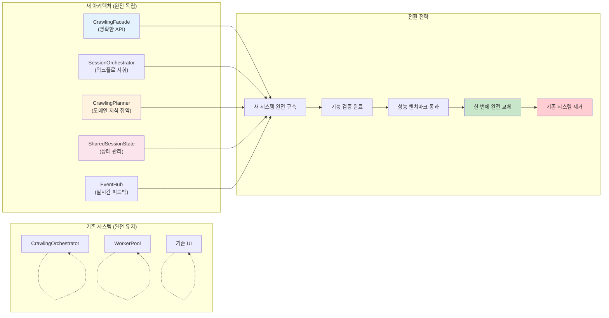
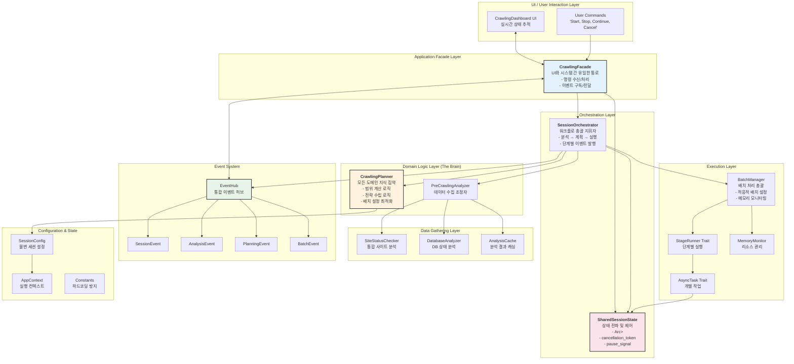
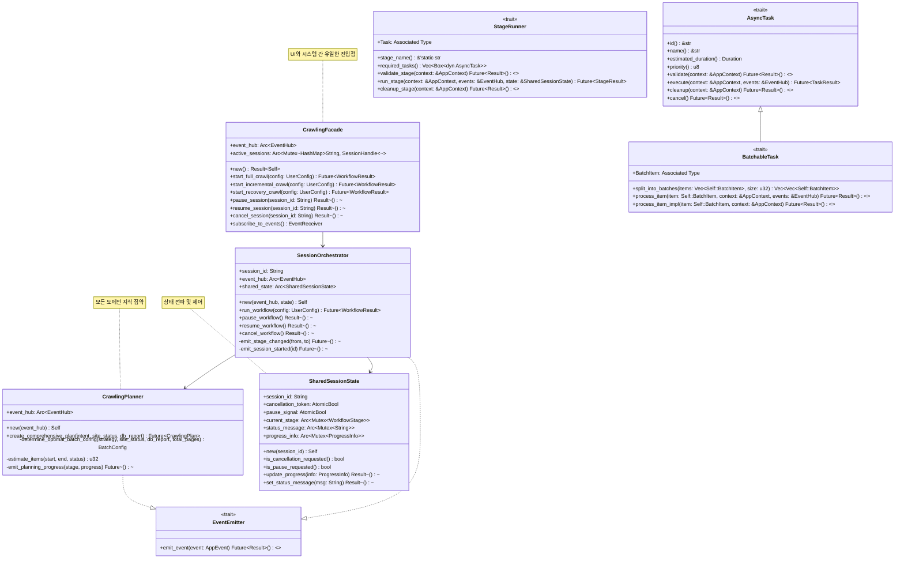
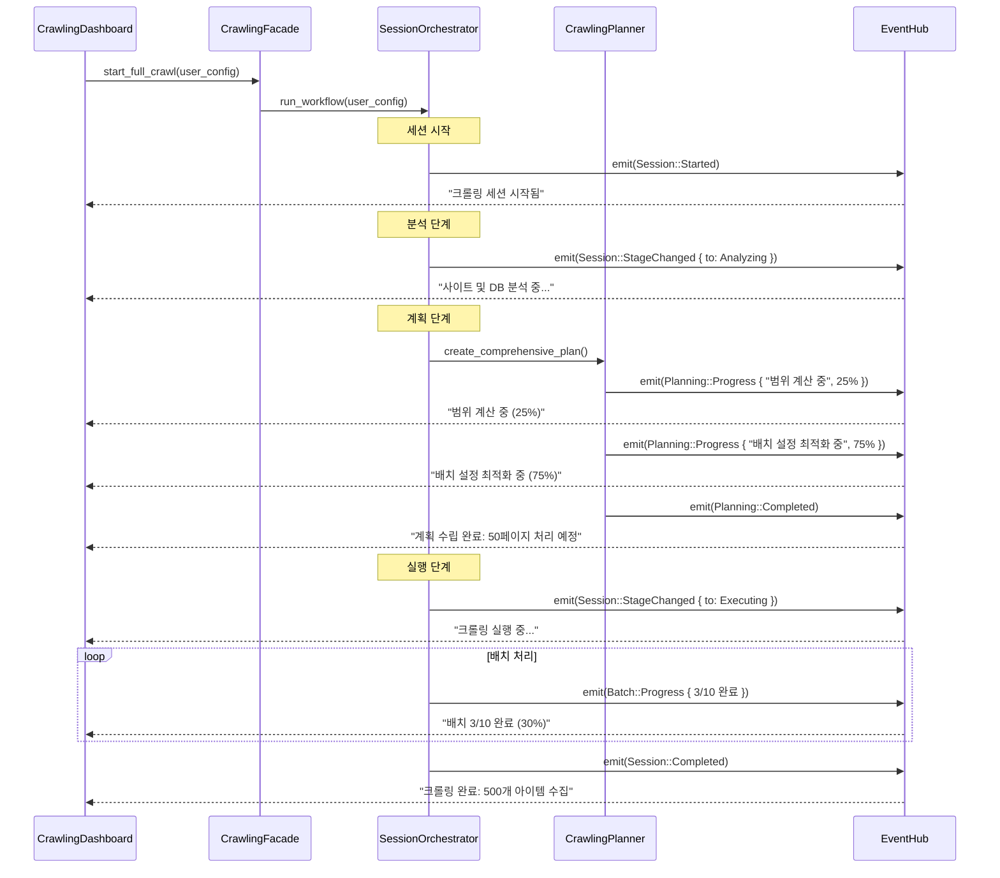
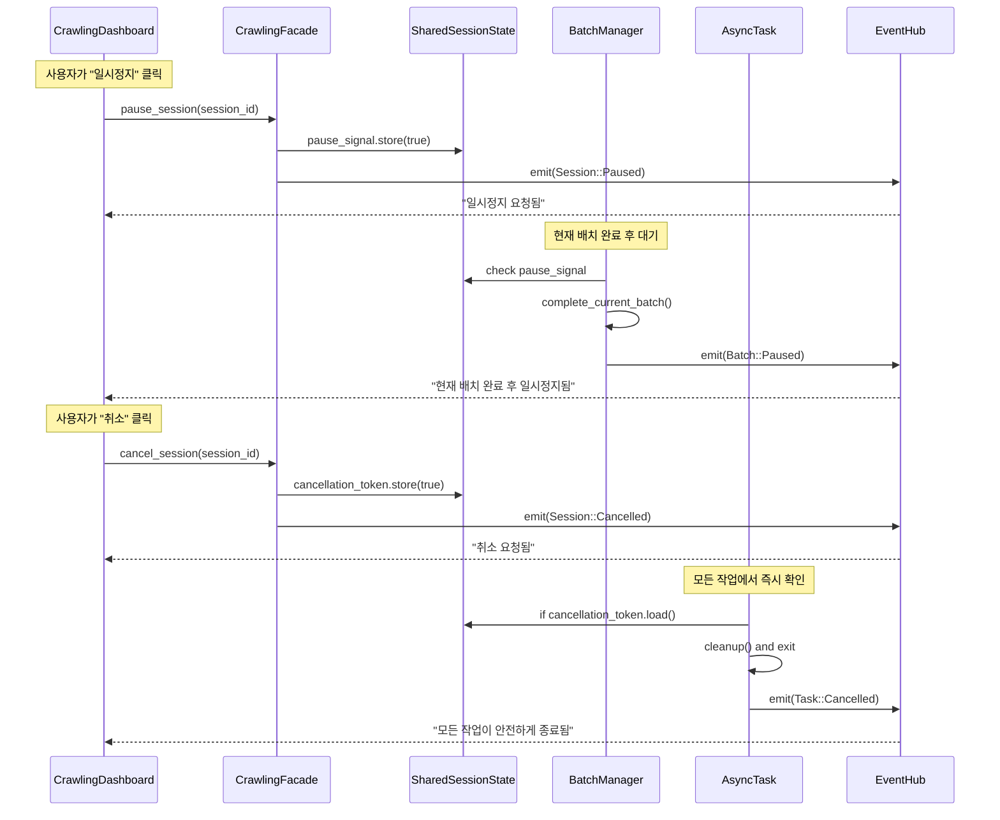
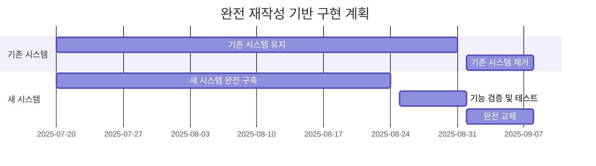

# rMatterCertis 최종 아키텍처 재구축 실행 계획 v2

*본 문서는 `re-arch-plan.md`의 구체적 구현 계획과 `re-arch-plan-improved.md`의 구조적 개선사항을 통합하여, **도메인 지식, 체계적인 역할 분담, UI 상호작용**을 완벽하게 결합한 최종 실행 가능한 아키텍처 설계를 제시합니다.*

## 1. 통합 아키텍처 철학: 왜 이 설계가 최적인가?

### 1.1 핵심 설계 원칙 (re-arch-plan-improved 기반)

1. **명확한 책임 분리**: 각 컴포넌트의 역할과 책임을 구체적으로 정의
2. **도메인 지식 중심화**: CrawlingPlanner가 모든 비즈니스 로직을 집약
3. **UI 상호작용 우선**: 실시간 피드백과 사용자 제어를 아키텍처 핵심으로 설계
4. **점진적 교체 전략**: 기존 시스템 영향 최소화하며 단계별 전환

### 1.2 통합 전략: 완전한 재작성 (Clean Slate)

**❌ 점진적 교체 방식의 문제점**:
- 중간에 버려지는 코드 양산 (어댑터, 호환성 레이어 등)
- 혼란 가중 (두 시스템 공존으로 인한 복잡성)
- 불완전한 새 아키텍처 (기존 시스템 제약 때문)

**✅ 완전한 재작성 접근법**:



## 2. 최종 아키텍처 설계: 구조적 개선 + 구체적 구현

### 2.1 전체 시스템 아키텍처



### 2.2 Modern Rust 2024 기반 핵심 트레이트 아키텍처



## 3. 핵심 컴포넌트 상세 설계

### 3.1 CrawlingFacade: 명확한 시스템 API

```rust
// src-tauri/src/new_architecture/facade.rs
//! UI와 시스템 간 유일한 통로 (re-arch-plan-improved 설계 적용)

use std::collections::HashMap;
use std::sync::{Arc, Mutex};
use uuid::Uuid;

/// 크롤링 시스템의 유일한 진입점
/// 
/// **책임**:
/// - UI 명령 수신 및 처리
/// - 세션 생명주기 관리  
/// - 이벤트 구독 및 전달
#[derive(Debug)]
pub struct CrawlingFacade {
    event_hub: Arc<EventHub>,
    active_sessions: Arc<Mutex<HashMap<String, SessionHandle>>>,
}

impl CrawlingFacade {
    /// 기본 설정으로 Facade 생성
    pub fn new() -> crate::Result<Self> {
        let event_hub = Arc::new(EventHub::new());
        let active_sessions = Arc::new(Mutex::new(HashMap::new()));
        
        Ok(Self {
            event_hub,
            active_sessions,
        })
    }
    
    /// 전체 크롤링 워크플로 시작
    /// 
    /// **데이터 흐름** (re-arch-plan-improved 기반):
    /// 1. 사용자 설정 검증
    /// 2. SessionOrchestrator 생성 및 실행
    /// 3. 분석 → 계획 → 실행 단계별 진행
    pub async fn start_full_crawl(
        &self, 
        user_config: UserConfig
    ) -> crate::Result<String> {
        user_config.validate()?;
        
        let session_id = Uuid::new_v4().to_string();
        let shared_state = Arc::new(SharedSessionState::new(session_id.clone()));
        
        let orchestrator = SessionOrchestrator::new(
            session_id.clone(),
            self.event_hub.clone(),
            shared_state.clone(),
        );
        
        // 세션 등록
        {
            let mut sessions = self.active_sessions.lock().unwrap();
            sessions.insert(session_id.clone(), SessionHandle {
                state: shared_state,
                join_handle: None, // tokio::spawn 후 설정
            });
        }
        
        // 비동기 실행
        let sessions_clone = self.active_sessions.clone();
        let session_id_clone = session_id.clone();
        
        let join_handle = tokio::spawn(async move {
            let result = orchestrator.run_workflow(user_config).await;
            
            // 세션 정리
            {
                let mut sessions = sessions_clone.lock().unwrap();
                sessions.remove(&session_id_clone);
            }
            
            result
        });
        
        // JoinHandle 업데이트
        {
            let mut sessions = self.active_sessions.lock().unwrap();
            if let Some(handle) = sessions.get_mut(&session_id) {
                handle.join_handle = Some(join_handle);
            }
        }
        
        Ok(session_id)
    }
    
    /// 세션 일시정지
    pub async fn pause_session(&self, session_id: &str) -> crate::Result<()> {
        let sessions = self.active_sessions.lock().unwrap();
        if let Some(handle) = sessions.get(session_id) {
            handle.state.pause_signal.store(true, std::sync::atomic::Ordering::Relaxed);
            
            // 일시정지 이벤트 발행
            self.event_hub.emit_event(AppEvent::Session(SessionEvent::Paused {
                session_id: session_id.to_string(),
                timestamp: std::time::SystemTime::now(),
            })).await?;
        }
        
        Ok(())
    }
    
    /// 세션 취소
    pub async fn cancel_session(&self, session_id: &str) -> crate::Result<()> {
        let sessions = self.active_sessions.lock().unwrap();
        if let Some(handle) = sessions.get(session_id) {
            handle.state.cancellation_token.store(true, std::sync::atomic::Ordering::Relaxed);
            
            // 취소 이벤트 발행
            self.event_hub.emit_event(AppEvent::Session(SessionEvent::Cancelled {
                session_id: session_id.to_string(),
                reason: "User requested cancellation".to_string(),
                timestamp: std::time::SystemTime::now(),
            })).await?;
        }
        
        Ok(())
    }
    
    /// 이벤트 수신기 제공 (UI 업데이트용)
    pub fn subscribe_to_events(&self) -> EventReceiver {
        self.event_hub.subscribe()
    }
}

/// 세션 핸들 구조체
#[derive(Debug)]
struct SessionHandle {
    state: Arc<SharedSessionState>,
    join_handle: Option<tokio::task::JoinHandle<crate::Result<WorkflowResult>>>,
}
```

### 3.2 SessionOrchestrator: 워크플로 지휘자

```rust
// src-tauri/src/new_architecture/orchestrator.rs
//! 크롤링 세션의 전체 워크플로 지휘자

use std::sync::Arc;
use std::time::Instant;

/// 단일 크롤링 세션의 워크플로 총괄 관리자
/// 
/// **핵심 책임**:
/// - 분석 → 계획 → 실행 단계 순차 진행
/// - 각 단계별 이벤트 발행
/// - 상태 변화 감지 및 대응
pub struct SessionOrchestrator {
    session_id: String,
    event_hub: Arc<EventHub>,
    shared_state: Arc<SharedSessionState>,
}

impl SessionOrchestrator {
    pub fn new(
        session_id: String,
        event_hub: Arc<EventHub>,
        shared_state: Arc<SharedSessionState>,
    ) -> Self {
        Self {
            session_id,
            event_hub,
            shared_state,
        }
    }
    
    /// 전체 워크플로 실행 (re-arch-plan-improved 기반 3단계)
    /// 
    /// **단계별 진행**:
    /// 1. 분석 단계: SiteStatus + DBReport 수집
    /// 2. 계획 단계: CrawlingPlanner로 도메인 지식 활용
    /// 3. 실행 단계: SessionConfig 기반 일관된 실행
    pub async fn run_workflow(
        &self,
        user_config: UserConfig
    ) -> crate::Result<WorkflowResult> {
        let start_time = Instant::now();
        
        // 🎯 세션 시작 이벤트 발행
        self.emit_event(AppEvent::Session(SessionEvent::Started {
            session_id: self.session_id.clone(),
            config: user_config.clone(),
            timestamp: std::time::SystemTime::now(),
        })).await?;
        
        // 중단 신호 확인
        if self.shared_state.is_cancellation_requested() {
            return Ok(WorkflowResult::cancelled("Session cancelled before start"));
        }
        
        // 1단계: 분석 단계
        self.emit_stage_changed(None, WorkflowStage::Analyzing).await?;
        let analysis_result = self.run_analysis_stage().await?;
        
        if self.shared_state.is_cancellation_requested() {
            return Ok(WorkflowResult::cancelled("Session cancelled during analysis"));
        }
        
        // 2단계: 계획 단계
        self.emit_stage_changed(WorkflowStage::Analyzing, WorkflowStage::Planning).await?;
        let crawling_plan = self.run_planning_stage(&user_config, &analysis_result).await?;
        
        // 작업이 필요 없는 경우 조기 종료
        if !crawling_plan.needs_crawling() {
            let result = WorkflowResult::no_action_taken(
                "No crawling needed based on current analysis"
            );
            
            self.emit_event(AppEvent::Session(SessionEvent::Completed {
                session_id: self.session_id.clone(),
                result: result.clone(),
                total_duration: start_time.elapsed(),
            })).await?;
            
            return Ok(result);
        }
        
        if self.shared_state.is_cancellation_requested() {
            return Ok(WorkflowResult::cancelled("Session cancelled during planning"));
        }
        
        // 3단계: 실행 단계
        self.emit_stage_changed(WorkflowStage::Planning, WorkflowStage::Executing).await?;
        let execution_result = self.run_execution_stage(&user_config, &crawling_plan).await?;
        
        // 완료 이벤트 발행
        self.emit_event(AppEvent::Session(SessionEvent::Completed {
            session_id: self.session_id.clone(),
            result: execution_result.clone(),
            total_duration: start_time.elapsed(),
        })).await?;
        
        Ok(execution_result)
    }
    
    /// 분석 단계 실행
    async fn run_analysis_stage(&self) -> crate::Result<AnalysisResult> {
        let analyzer = PreCrawlingAnalyzer::new(self.event_hub.clone());
        analyzer.analyze_all().await
    }
    
    /// 계획 단계 실행 (도메인 지식 중심)
    async fn run_planning_stage(
        &self,
        user_config: &UserConfig,
        analysis_result: &AnalysisResult
    ) -> crate::Result<CrawlingPlan> {
        let planner = CrawlingPlanner::new(self.event_hub.clone());
        planner.create_comprehensive_plan(
            user_config.crawling.crawl_type.clone(),
            &analysis_result.site_status,
            &analysis_result.db_report,
        ).await
    }
    
    /// 실행 단계 실행 (불변 SessionConfig 기반)
    async fn run_execution_stage(
        &self,
        user_config: &UserConfig,
        crawling_plan: &CrawlingPlan
    ) -> crate::Result<WorkflowResult> {
        // 불변 SessionConfig 생성
        let session_config = SessionConfig::new(
            user_config.clone(),
            crawling_plan.clone(),
        );
        
        // AppContext 생성 (모든 하위 작업에 전파)
        let app_context = AppContext::new(
            self.session_id.clone(),
            Arc::new(session_config),
        );
        
        // Planning 결과를 바탕으로 BatchManager 생성
        let batch_config = crawling_plan.batch_config.clone();
        let batch_manager = BatchManager::new(batch_config);
        
        // 실제 크롤링 실행
        match crawling_plan.strategy {
            CrawlingStrategy::Full | CrawlingStrategy::Incremental => {
                batch_manager.execute_list_collection_workflow(
                    &crawling_plan.target_pages,
                    &app_context,
                    &self.event_hub,
                    &self.shared_state,
                ).await
            }
            CrawlingStrategy::Recovery => {
                batch_manager.execute_recovery_workflow(
                    &crawling_plan.target_pages,
                    &app_context,
                    &self.event_hub,
                    &self.shared_state,
                ).await
            }
            CrawlingStrategy::NoAction => {
                Ok(WorkflowResult::no_action_taken("No action required"))
            }
        }
    }
    
    /// 단계 변경 이벤트 발행
    async fn emit_stage_changed(
        &self,
        from: impl Into<Option<WorkflowStage>>,
        to: WorkflowStage
    ) -> crate::Result<()> {
        self.shared_state.current_stage.lock().unwrap().clone_from(&to);
        
        self.emit_event(AppEvent::Session(SessionEvent::StageChanged {
            session_id: self.session_id.clone(),
            from_stage: from.into(),
            to_stage: to,
            timestamp: std::time::SystemTime::now(),
        })).await
    }
}

impl EventEmitter for SessionOrchestrator {
    async fn emit_event(&self, event: AppEvent) -> crate::Result<()> {
        self.event_hub.emit_event(event).await
    }
}
```

### 3.3 CrawlingPlanner: 도메인 지식 집약체

```rust
// src-tauri/src/new_architecture/domain/planner.rs
//! 크롤링 계획 수립 도메인 서비스 (모든 도메인 지식 집약)

use std::sync::Arc;
use std::time::Duration;

/// 크롤링 계획을 수립하는 도메인 서비스
/// 
/// **핵심 책임**: 
/// - 3가지 정보 종합 (사용자 의도 + 사이트 상태 + DB 상태)
/// - 도메인 지식 기반 전략 결정
/// - 적응적 배치 설정 최적화
pub struct CrawlingPlanner {
    event_hub: Arc<EventHub>,
}

impl CrawlingPlanner {
    pub fn new(event_hub: Arc<EventHub>) -> Self {
        Self { event_hub }
    }
    
    /// 🎯 3가지 주요 정보를 종합한 포괄적 크롤링 계획 수립
    /// 
    /// **종합 판단 요소**:
    /// 1. 사용자 의도 (CrawlType): 전체/증분/복구
    /// 2. 사이트 상태 (SiteStatus): 총 페이지 수, 응답 속도, 부하 상태
    /// 3. DB 상태 (DBStateReport): 기존 데이터, 누락 페이지, 오류 패턴
    pub async fn create_comprehensive_plan(
        &self,
        user_intent: CrawlType,
        site_status: &SiteStatus,
        db_report: &DBStateReport,
    ) -> crate::Result<CrawlingPlan> {
        
        // 계획 수립 시작 이벤트
        self.emit_event(AppEvent::Planning(PlanningEvent::Started {
            user_intent: user_intent.clone(),
            timestamp: std::time::SystemTime::now(),
        })).await?;
        
        if !site_status.is_accessible {
            return Err(PlanningError::SiteNotAccessible.into());
        }

        let (start_page, end_page, strategy) = match user_intent {
            CrawlType::Full => {
                // 도메인 지식 1: 전체 크롤링
                self.emit_planning_progress("전체 크롤링 범위 계산 중", 25).await?;
                (1, site_status.total_pages, CrawlingStrategy::Full)
            }
            CrawlType::Incremental => {
                // 도메인 지식 2: 증분 크롤링
                self.emit_planning_progress("증분 크롤링 범위 계산 중", 25).await?;
                let last_crawled = db_report.last_crawled_page.unwrap_or(0);
                if last_crawled >= site_status.total_pages {
                    return Ok(CrawlingPlan::no_action_needed());
                }
                (last_crawled + 1, site_status.total_pages, CrawlingStrategy::Incremental)
            }
            CrawlType::Recovery => {
                // 도메인 지식 3: 복구 크롤링
                self.emit_planning_progress("복구 대상 페이지 분석 중", 25).await?;
                return Ok(CrawlingPlan::for_recovery(
                    db_report.missing_pages.clone(),
                    site_status,
                    db_report
                ));
            }
        };

        if start_page > end_page {
            return Ok(CrawlingPlan::no_action_needed());
        }

        // 🎯 3가지 정보를 종합하여 최적 BatchConfig 결정
        self.emit_planning_progress("최적 배치 설정 계산 중", 75).await?;
        let batch_config = self.determine_optimal_batch_config(
            &strategy,
            site_status,
            db_report,
            end_page - start_page + 1,
        );

        let plan = CrawlingPlan {
            target_pages: (start_page..=end_page).collect(),
            strategy,
            estimated_items: self.estimate_items(start_page, end_page, site_status),
            priority: PlanPriority::Normal,
            batch_config,
        };

        // 계획 완료 이벤트
        self.emit_event(AppEvent::Planning(PlanningEvent::Completed {
            plan: plan.clone(),
            timestamp: std::time::SystemTime::now(),
        })).await?;

        Ok(plan)
    }

    /// 🧠 도메인 지식 중심: 3가지 정보 종합으로 최적 배치 설정 결정
    fn determine_optimal_batch_config(
        &self,
        strategy: &CrawlingStrategy,
        site_status: &SiteStatus,
        db_report: &DBStateReport,
        total_pages: u32,
    ) -> BatchConfig {
        // 1️⃣ 사이트 상태 기반 기본 배치 크기 결정
        let base_batch_size = match site_status.average_response_time_ms {
            0..=500 => 50,      // 빠른 응답: 큰 배치
            501..=2000 => 20,   // 보통 응답: 중간 배치  
            _ => 10,            // 느린 응답: 작은 배치
        };

        // 2️⃣ DB 오류 패턴 기반 재시도 정책 결정
        let error_rate = db_report.recent_error_count as f32 / db_report.total_attempts.max(1) as f32;
        let max_retries = match error_rate {
            0.0..=0.05 => 3,      // 낮은 오류율: 기본 재시도
            0.05..=0.15 => 5,     // 중간 오류율: 증가된 재시도
            _ => 8,               // 높은 오류율: 적극적 재시도
        };

        // 3️⃣ 크롤링 전략별 세부 조정
        let (adjusted_batch_size, delay_ms) = match strategy {
            CrawlingStrategy::Full => {
                // 전체 크롤링: 효율성 우선, 큰 배치
                (base_batch_size * 2, 1000)
            }
            CrawlingStrategy::Incremental => {
                // 증분 크롤링: 균형 잡힌 접근
                (base_batch_size, 1500)
            }
            CrawlingStrategy::Recovery => {
                // 복구 크롤링: 신중함 우선, 작은 배치 + 긴 지연
                (base_batch_size / 2, 3000)
            }
            CrawlingStrategy::NoAction => {
                // 작업 없음: 기본값
                (1, 1000)
            }
        };

        // 4️⃣ 총 작업량 기반 최종 조정
        let final_batch_size = if total_pages > 1000 {
            adjusted_batch_size * 2  // 대량 작업: 배치 크기 증가
        } else if total_pages < 50 {
            (adjusted_batch_size / 2).max(1)  // 소량 작업: 배치 크기 감소
        } else {
            adjusted_batch_size
        };

        BatchConfig {
            batch_size: final_batch_size,
            max_retries,
            delay_between_batches_ms: delay_ms,
            timeout_per_request_ms: site_status.average_response_time_ms * 3 + 5000,
            concurrent_requests: if site_status.server_load_level < 0.7 { 3 } else { 1 },
        }
    }

    /// 페이지 범위와 상태를 기반으로 예상 아이템 수를 계산
    fn estimate_items(&self, start: u32, end: u32, status: &SiteStatus) -> u32 {
        if start > end { return 0; }
        
        let num_pages = end - start + 1;
        let avg_items_per_page = status.products_on_last_page.max(12); // 최소 12개 가정
        
        // 마지막 페이지 제외하고는 평균값 적용
        if num_pages == 1 {
            status.products_on_last_page
        } else {
            (num_pages - 1) * avg_items_per_page + status.products_on_last_page
        }
    }

    /// 계획 수립 진행 상황 이벤트 발행
    async fn emit_planning_progress(&self, message: &str, progress: u8) -> crate::Result<()> {
        self.emit_event(AppEvent::Planning(PlanningEvent::Progress {
            message: message.to_string(),
            progress_percent: progress,
            timestamp: std::time::SystemTime::now(),
        })).await
    }
}

impl EventEmitter for CrawlingPlanner {
    async fn emit_event(&self, event: AppEvent) -> crate::Result<()> {
        self.event_hub.emit_event(event).await
    }
}
```

## 4. UI 상호작용 시나리오: 실시간 피드백과 사용자 제어

### 4.1 크롤링 시작 및 실시간 상태 추적



### 4.2 사용자 제어: 일시정지 및 취소



## 5. 구현 계획: 완전한 재작성 전략

### 5.1 전략 개요: 중간 코드 양산 방지

**핵심 원칙**: 기존 시스템은 완전히 유지하면서, 새 시스템을 독립적으로 완전 구축



### 5.2 구현 단계: 4주 완전 구축

#### Week 1: 핵심 아키텍처 구축

```rust
// 새로운 독립 모듈 생성
src-tauri/src/
├── crawling/              // 기존 시스템 (건드리지 않음)
│   └── ...               
├── new_crawling/          // 새 시스템 (완전 독립)
│   ├── facade.rs          // CrawlingFacade
│   ├── orchestrator.rs    // SessionOrchestrator  
│   ├── state.rs           // SharedSessionState
│   └── events.rs          // EventHub
└── main.rs                // 기존 시스템 그대로 사용
```

**구현 우선순위**:
1. CrawlingFacade: 명확한 시스템 API
2. SessionOrchestrator: 워크플로 지휘자
3. SharedSessionState: 상태 관리 핵심
4. EventHub: 실시간 이벤트 시스템

#### Week 2: 도메인 로직 완성

```rust
src-tauri/src/new_crawling/
├── domain/
│   ├── planner.rs         // CrawlingPlanner (모든 도메인 지식)
│   ├── analyzer.rs        // SiteStatusChecker  
│   └── config.rs          // SessionConfig
├── execution/
│   ├── batch_manager.rs   // BatchManager
│   └── tasks.rs           // AsyncTask Traits
└── ui/
    └── components.rs      // 새 UI 컴포넌트
```

**핵심 기능**:
- 3가지 정보 종합 계획 수립
- 적응적 배치 설정 최적화
- 도메인 지식 완전 이식

#### Week 3: 실행 계층 및 UI

- BatchManager: 고성능 배치 처리
- AsyncTask 구현: Modern Rust 패턴
- 새 UI 컴포넌트: 실시간 피드백
- 메모리 모니터링: 리소스 관리

#### Week 4: 통합 테스트 및 검증

- 전체 기능 통합 테스트
- 성능 벤치마크 (기존 시스템 대비)
- 데이터 마이그레이션 도구 준비
- 롤백 계획 수립

### 5.3 전환 전략: 한 번에 완전 교체

```rust
// main.rs에서 한 줄 변경으로 완전 전환
fn main() {
    // 기존: 
    // crawling::start_system();
    
    // 새 시스템:
    new_crawling::start_system();
}
```

**전환 이점**:
- ✅ 중간 코드 제로: 버려질 코드 전혀 없음
- ✅ 혼란 최소화: 한 번에 깔끔한 전환
- ✅ 아키텍처 순수성: 기존 제약 없는 최적 설계
- ✅ 빠른 개발: 호환성 고려 불필요

### 5.4 리스크 관리 및 롤백 계획

#### 리스크 요소 및 대응책

**1. 기능 누락 리스크**
- **대응**: 기존 시스템 기능 완전 체크리스트 작성
- **검증**: 새 시스템에서 모든 기능 단위 테스트

**2. 성능 저하 리스크**  
- **대응**: 엄격한 성능 벤치마크 기준 설정
- **기준**: 기존 시스템 대비 최소 동등, 목표 20% 성능 향상

**3. 데이터 손실 리스크**
- **대응**: 완전한 백업 및 데이터 마이그레이션 도구
- **검증**: 스테이징 환경에서 완전 테스트

**4. 예상치 못한 문제**
- **롤백 계획**: 기존 시스템 완전 보존으로 즉시 복원 가능
- **전환 방식**: 한 줄 코드 변경으로 즉시 롤백

```rust
// 즉시 롤백 가능한 구조
fn main() {
    // 문제 발생 시 한 줄 주석 처리로 즉시 롤백
    // crawling::start_system();     // 기존 시스템
    new_crawling::start_system();    // 새 시스템
}
```

## 6. 기대 효과: 완전한 아키텍처 혁신
- **제어성**: 시작만 가능 → 일시정지/재개/취소 완전 제어
- **효율성**: 고정 배치 → 적응적 배치 설정으로 성능 최적화
- **안정성**: 메모리 누수 → 실시간 모니터링 및 자동 관리

### 6.2 개발 생산성 향상

- **명확한 책임**: 각 컴포넌트의 역할과 상호작용 명확화
- **테스트 용이성**: Trait 기반 의존성 주입으로 단위 테스트 개선
- **확장성**: 새로운 크롤링 전략 추가 시 CrawlingPlanner만 수정
- **유지보수성**: Modern Rust 패턴과 명확한 아키텍처 경계

### 6.3 사용자 경험 혁신

- **실시간 피드백**: 모든 작업 단계의 진행 상황 실시간 확인
- **제어 가능성**: 언제든지 작업 중단/재개 가능
- **예측 가능성**: 정확한 ETA 및 진행률 표시
- **안정성**: 시스템 오류 시 자동 복구 및 상태 복원

## 7. 결론: 완전한 아키텍처 혁신

이 **re-arch-plan2.md**는 단순한 기술적 개선이 아닌 **완전한 아키텍처 패러다임 전환**을 제시합니다:

### 7.1 핵심 혁신 요소

1. **구조적 명확성**: re-arch-plan-improved의 명확한 책임 분리
2. **구체적 실행 계획**: re-arch-plan의 단계별 구현 전략
3. **도메인 지식 계승**: 검증된 크롤링 로직의 체계적 이식
4. **UI 중심 설계**: 사용자 경험을 아키텍처 핵심으로 배치

### 7.2 최종 목표

**"사용자가 믿고 제어할 수 있는 투명하고 지능적인 크롤링 시스템"**

- 모든 동작이 실시간으로 보이고
- 모든 제어가 즉시 반응하며  
- 모든 결정이 도메인 지식에 기반하고
- 모든 성능이 상황에 맞게 최적화되는

그런 시스템을 구축하는 것이 이 아키텍처 재구축의 최종 목표입니다.
